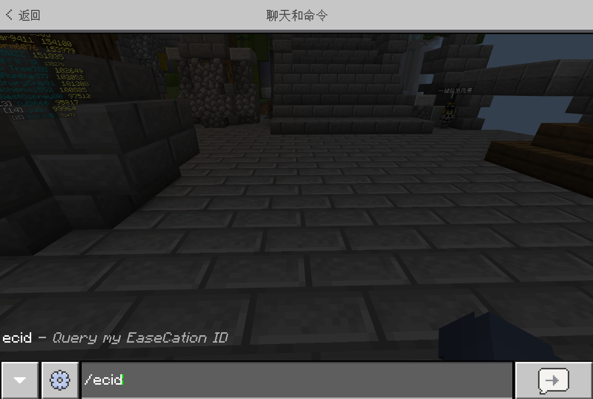

# 账号体系介绍

EaseCation 服务器账号体系介绍

作者：（玩家协管团队）快捷年后、py

版本号：V3.0

修订日期：2020年12月26日

通俗易懂的解释

完整解释

## 一、ECID相关

### 什么是ECID?

ECID是EC单独的账号系统，所有玩家的游戏数据都存储在对应的ECID下，包括直接使用网易我的世界中国版账号进入EaseCation的玩家（下称网易账号）。多个外部账号（如网易账号、微软Xbox账号）可以同时绑定至一个ECID，但同时绑定的外部账号中只能有一个账号在线，多个ECID无法同时绑定一个外部账号。**ECID为EaseCation服务器内唯一的账号系统，先前“NickID”的概念已经被废除，取而代之的是全新的ECID账号体系。**

### 使用网易账号进服，ECID是什么？

一般情况下，我们会创建一个以netease开头的ECID，并把网易账号绑定在该ECID下。netease后面的字符串为该用户的XUID，由我的世界中国版客户端决定。对外显示的名称为网易账号的用户名。

### 使用微软Xbox账号进服，ECID是什么？

使用微软Xbox进入国际区时，我们会自动注册一个与Xbox账户名相同的ECID，把Xbox账号绑定在该ECID下，对外显示的名称为该ECID，后续当微软Xbox账户名修改时，该ECID**不会**随之改变。

### 使用/out单独注册一个ECID，有什么用？

用/out单独注册一个ECID时，相当于新建了一个**EC独立账号**，把当前外部账号（网易账号、微软Xbox账号）绑定到该ECID上，从而实现多账号绑定功能。

需要注意的是，注册一个新的**EC独立账号**，原账号的数据并不会迁移，也就是说新注册的账号是0级、0EC币、0钻石且没有任何其它物品的，也没有任何战绩的。

### 手动注册的ECID绑定后如何才能改绑/解绑？

* 网易中国版的解绑/换绑方法：在绑定手动注册的ECID之后，再次在聊天栏输入/out或者/logout，进入到登录服，之后请您点击中间的第二个木按钮，即可恢复到默认中国版ECID的登录状态；点左边第一个按钮，即可重新绑定手动注册的其它ECID。
* Xbox的解绑/换绑方法：手动注册的ECID绑定Xbox账户之后，原有ECID将被覆盖，只能进行改绑，不能进行解绑，如需改绑请输入/out或者/logout，进入到登录服，点击左边第一个按钮，即可重新绑定手动注册的其它ECID。

### 如何查询自己的ECID？

**（1） 打开聊天栏，输入指令**_**/ecid**_

**（2）按下聊天栏的发送按钮，发送这条指令**

**（3）弹出的GUI窗口中的“你的ECID”后的一串字符即为你当前正在使用的ECID**。

\*比如小编正在使用的ECID是去登录服务器注册的自定义ECID，这里查询出来的就是“UglyGirl”。

\*而如果当前正在使用的是网易中国版登录的账号，则查询出来的是由网易账号默认生成的带netease的**15位**ECID哦~

**☆（注意，由网易账号默认生成的ECID是包括“netease”的，并不仅仅是后八位字符串！）**

例：下图中该玩家的ECID是“netease5844cac4”，而非“5844cac4”。

**（4）把它记录下来，用到需要它的地方吧！**

（当您被被人工误处罚或系统误处罚后，如需申诉则需要在记录单准确填写自己的ECID才能顺利解封）

### 如何查询他人正在使用的ECID？

* 目前暂时不支持玩家查询其他人正在使用的ECID，如有需要，可以关注微信公众号（EaseCationNet）并发送“人工”来处理。

### 如何注册EC独立账号，以及绑定至网易账号？

1. 上文已经讲到，注册一个EC独立账号可以把当前外部账号（网易账号、微软Xbox账号）绑定到该ECID上，从而实现多账号绑定功能。
2. 注册EC独立账号，首先需要您在EC服务器内输入**/logout**或者**/out**退出登录并进入登录服。

1. 在弹出以下的GUI窗口后，再次点击“已了解有关说明，登出并进入登录服”，稍等数秒后你将自动传送至登录服务器。

1. 进入登录服后，点击面前最右边的按钮进入注册界面。

**\*\*点击这个木按钮注册\*\***

**\*\*登录服务器\*\***

1. 在注册界面输入你想注册的ID和密码即可完成注册。

### 使用EC独立账号的优点

1. 你在登录服手动注册时的用户名就是你的ECID，你输入ECID时不再需要输入一长串无规律字符（由网易账号默认生成的ECID），只需要输入这个自己注册的ID即可，方便快捷。

\*当您出现误判误封需要填写申诉记录单时，需要您提供正确的ECID才能执行解封/解禁等操作，此时您只需要直接输入这个EC独立账号即可。

\*我们在服外举行的一些小规模的活动、有奖调研等，在给玩家发放奖励时也需要通过ECID才能找到对应的玩家，当您向我们提交了ECID之后我们才能给您派奖。

\*包括UP主/主播权限的给予又或者是玩家协管权限的发放也都需要ECID，使用EC独立账号与网易账号默认生成的ECID相比，更易牢记，不再需要担心因为输错而没有收到对应的权限啦~

1. 国际版账号与中国版账号之间数据相互独立，如果中国版账号不慎遗失，你可以更换新的中国版账号进入EC并绑定原来的ECID，之前的所有游戏数据都**将会被保留，不会丢失**。

### 常见误区

1. EC独立账号不是指使用“MineCraft for Windows10”、白名单等进服时的账号，更不是单指**游玩EC国际服/测试服**时的账号才是EC独立账号。
2. 绑定手动注册的ECID账号使用，进入EC大厅服仍然提示“中国版XXX 进入了本大厅”（XXX代指网易账号用户名）。
3. EC独立账号注册之后，请务必牢记密码，忘记密码将可能导致账号无法找回；当你修改了你手动注册的ECID的密码之后，该ECID已有的绑定不会自动退出登录，所以小伙伴们在游玩时尽量不要把自己的账号借给不信任的朋友哦，小心他们拿着你的号把你的账号的资产挥霍一空或者拿着你的号开挂被协管丢进小黑屋哦~
4. 网易账号或者Xbox账号绑定至EC独立账号后，原有的账号数据**不会**迁移到EC独立账号。

## 二、“匹配中国版”问题相关

普通玩家能接触到匹配中国版相关功能只有家园服中的拉黑玩家和给予玩家权限、好友系统中的添加好友功能，组队系统会自动根据你输入的字符中有无中文字符判断该内容是否为**EC独立账号**。

无论是好友系统中添加好友的匹配中国版功能，又或者是家园主给予玩家权限/拉黑玩家时选择是否匹配中国版，匹配中国版的作用就是把你输入的内容作为玩家名查找对应的玩家，如若不打开此功能查找玩家，系统会把你输入的内容作为**ECID**来查找对应玩家。

对于普通玩家而言，想要添加其他玩家好友或给予玩家权限/拉黑玩家都必须先知道该玩家的账号类型是什么，如果是网易账号，可以直接输入他的网易账号用户名并选择匹配中国版功能进行操作；如果是**EC独立账号**，则必须输入他的ECID且不打开匹配中国版功能进行操作。

