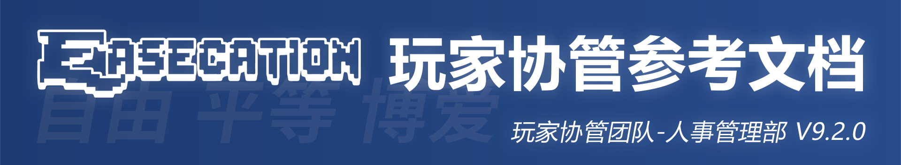
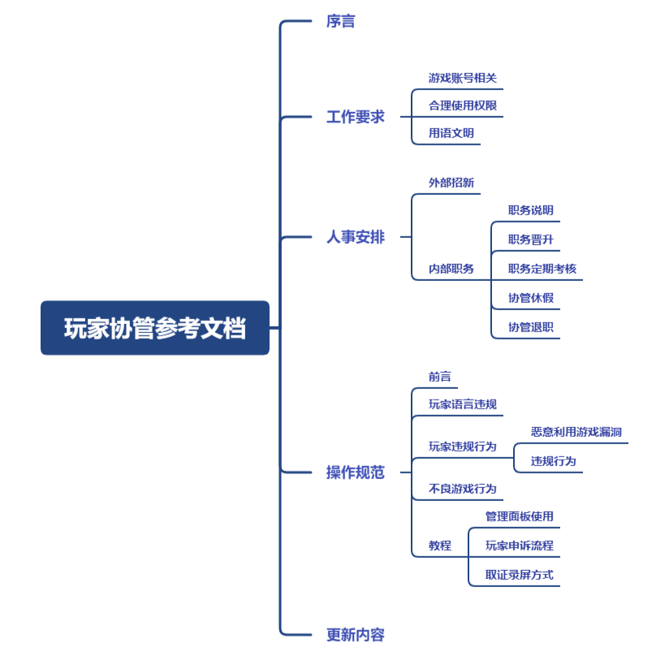

# 玩家协管参考文档

## 玩家协管参考文档

版本号：V9.3.0

编制部门：玩家协管团队 - 人事管理部

编制人员：boybook、py、HBJ、清风DerWin

更新时间：2021年1月30日

审批人：boybook

## 第一部分 序言

1.1 价值观。我们的价值观是“自由、平等、博爱”，我们会将该价值观落实到具体行动中。

自由（Liberté）。对于玩家来说，玩家可以在不违规的情况下自由地游戏，不受玩家协管的威胁、压迫。玩家拥有举报协管、提出修改参考文档的权利。玩家对于处罚决定拥有申诉的权利。对于协管来说，拥有发起修改文档公投的权利，拥有对玩家协管团队提出建议的权利。玩家与协管相辅相成，协管保障玩家游戏体验，玩家监督协管工作过程。自由不是为所欲为的，必要的限制是对自由的保护。

平等（Égalité）。对于玩家来说，全体玩家平等地受本文档约束。一切违规行为都平等地给予处罚。协管不能包庇玩家，或者是威胁玩家。因此，协管一切惩罚不能变成报复性、暴力性惩罚，我们推行“法”治，而非人治。对于协管（不包括管理员及以上职位），本文档要求的原则为“法无明文规定不处罚”。若处理时出现争议，应在协管工作群内发起投票，参考投票结果制定处罚方式。对于协管来说，每位协管拥有平等的投票权，对于协管内部事物，人人拥有表决的权利。协管内部也决不能形成官僚风气，我们应该推崇人人平等的观念。

博爱（Fraternité）。尊重每一位玩家、每一位协管。当协管解答玩家问题时，应尊重玩家，耐心解答；当玩家与协管沟通时，也应该设身处地换位思考，同样尊重对方。在招新方面，正式协管应该耐心教导实习协管，努力让他们转正。

尽管以上几点可能过于理想化，在践行的时候难免出现问题，但这仍然是我们努力的方向，为了践行以上价值观，我们撰写了本文档，旨在规范玩家协管的操作，设立工作要求，制定人事安排，将玩家协管团队效率最大化，将权力关进制度的牢笼里。

1.2 适用范围。当玩家成为协管时，则视为同意本文档。同时同意将来可能发行、更新的文档，我们会在协管工作群和玩家群通知更新内容。

本文档对玩家协管团队撰写的其它规定类公开文档具有同样约束力。原则上，其他规则类文档不得与本文档关于“玩家违规”的定义相抵触。玩家协管团队撰写的规则类公开文档有《EaseCation 新媒体运营部参考文档》、《EaseCation 群聊管理规定》、《EaseCation 志愿者团队参考文档》和《EaseCation 争议规则二次定义》。

1.3 咨询和建议。玩家协管团队创立于2018年10月7日，本文档是玩家协管处理玩家违规的根本依据，若对本文档有任何疑问、建议，欢迎向我们咨询、提出有建设性的意见，请前往微信公众号：EaseCationNet，并发送“反馈”。

1.4 解释权。本文档内一切条例的解释权归人事管理部所有。

1.5 授权协议。我们愿意本着“博爱”精神，将我们的工作成果共享给所有人。我们采用CC0授权协议，即无条件分享给任何人使用，不强制要求署名。

授权协议的适用范围包括：本文档、玩家协管团队撰写的规则类公开文档以及美工图片、玩家协管团队对外问卷文案、玩家协管团队招新考试试卷和各类杂项文案。注意，EaseCation的商标不适用于本条例。

## 第二部分 工作要求

\*协管的“工作要求”并不局限于以下条款，且协管的日常行为应当符合普世价值观，并不是做文档现有条例没有规定的事就一定不是违规的；相反，协管文档的更新就是为了使文档内容适应现阶段的工作需要。当一位协管的工作出现问题，但文档中没有对应条款与之相对应时，应该首先在协管工作群发起投票，参照投票结果评价该行为是否正确、得当，如果不得当，再近一步制订处理、处罚方式。

### 2.1 游戏账号相关

2.1.1 无论何种形式，不得借出拥有管理权（权限等级为实习协管及以上）的账号。若查明的，取消管理权限并封禁账号两周。 若申请权限前已借出的，请及时修改密码或更换为未借出账号。特殊情况下，若被允许，则不处理，一切后果由借出者和借者负责。

2.1.2 不得以任何形式与玩家进行权限交易。若查明的，取消管理权限、无限期封禁所有权限账号，并拉入玩家协管招新黑名单，黑名单里的所有被拉黑的人都将永远无法再次参加招新考试和担任实习协管及以上的职位。

2.1.3 不允许一个人拥有多个权限账号。若发现，立即撤销权限；使用EC独立账号的玩家协管，请尽量选择稳定绑定在一个网易账号上，如发现多个账号同时绑定，并且在未经允许情况下，账号本人出借其中一个或者数个网易账号，已经查明的，按照2.1.1条例处理。

### 2.2 合理使用权限

2.2.1 不以任何形式用权限恐吓玩家、威胁玩家、或者是包庇玩家。一经发现，则取消管理权限，并无限期封禁游戏账号。 

2.2.2 必须严格按照“操作规范”进行管理。若发现处理方法与参考文档发生出入，可酌情作出以下处理：

* 警告一次
* 实习协管延长一个月实习期
* 正式协管贬职为实习协管
* 撤销权限单次除名
* 撤销权限并拉入黑名单

\*当处罚方式存在争议时，应在协管工作群内发起投票，参考投票结果决定处罚方式。

2.2.3 清楚你的权限等级。管理员≠玩家协管≠实习玩家协管，当玩家询问你的身份时，请说出真实身份。请勿主动强调自己的身份。

2.2.4 禁止滥用职权。若有玩家举报玩家协管滥用职权，若查明的，处理如下：

* 正式协管贬职为实习协管，最高可直接取消资格。
* 实习协管延长一个月实习期，最高可直接取消资格。

\*滥用职权指的是具有实习协管及以上职位者，利用职位与权限便利，做出与《参考文档》规范相出入或者相悖的行为，包括但不限于处置方法不符合规范（例如一般言论违规，但将其处罚入小黑屋）、刻意针对重判玩家违规、利用权限恐吓与包庇玩家等。

2.2.5 注意避嫌。拥有实习玩家协管及以上职位者，若在正常参与EaseCation小游戏过程中遇到针对自身的挖苦、嘲笑、讽刺、辱骂等行为，应先退出房间以避嫌。随后，可酌情针对其违规行为按照“言论违规”部分进行合理处理。不可在此期间与玩家产生争执，亦不可利用权限刻意重判玩家或者对玩家产生任何打击报复行为，违者按照2.2.4条例处理。

2.2.6 管理员面板禁止填写讽刺、辱骂字词。操作理由填写的是玩家具体的违规行为，而不是违规言论的具体内容，并不是把玩家说过的话复述一次填入操作理由。若查实协管故意使用管理员操作嘲讽、辱骂或者中伤其它玩家的，立即对该协管作解雇处理，情节严重者，作永久除名处理。

### 2.3 用语文明

\*用语文明的适用范围是你作为玩家协管/管理员的身份与EaseCation服务器玩家的交谈中，而并非是单方面指协管/管理员在服务器中的言论。

2.3.1 万事和为先。禁止讽刺挖苦、恶意诋毁、攻击、侮辱谩骂任何与EC有关的个人与组织。

2.3.2 规范表达习惯。请使用简洁表达，勿重复单条信息或把句子拆开发送。请使用正常、友善的语气与玩家交流。具体请参考下方说明。

* 请勿使用反问的语气来质问对方。
* 不猜测对方的社会职位，年龄，性别等。如：你是小学生吗？
* 不人身攻击、强扣帽子，如：岩浆狗、挂逼。
* 不故意重复某条信息

2.3.3 保护个人信息。作为协管（包括但不限于正式协管、实习协管、休假协管、管理员、负责人），不论在任何时间、地点、情境下，不得与任何组织与个人合作，故意参与到任何与泄露玩家个人信息、隐私等有关的活动中或者以“披露玩家个人信息”为由恐吓威胁其它玩家。已查明的，立即撤销该协管权限并作解雇处理，情节严重者，将写进玩家协管表的“黑名单”表格中，并对其游戏账号进行无限期封禁。

2.3.4 处罚方式。作为协管，若违反以上“用语文明”的条例，可酌情作出以下处理：

* 警告一次
* 实习协管延长一个月实习期
* 正式协管贬职为实习协管
* 撤销权限单次除名
* 撤销权限并拉入黑名单

\*当处罚方式存在争议时，应在协管工作群内发起投票，参考投票结果决定处罚方式。

### 2.4 协管内部事务保密制度

无论何时何地，不得将协管工作群群聊中的任何聊天记录及截图转发至除在职正式协管及以上职位者、协管、志愿者工作群群聊及群聊中的成员以外的任何区域（包括但不限于除协管、志愿者团队外的其它部门、玩家群、其它玩家及其它玩家开设的私人群聊等）。如遇特殊情况必须要转发，应先征求协管团队负责人意见，待其同意之后再行转发。

\*协管工作群的定义是：实习协管工作群与正式协管工作群的统称。

特殊地，当已征得协管团队负责人同意，需要对聊天记录进行转发时，应该对群内的聊天记录进行“脱敏”操作：

1. 如果需要对聊天记录进行截图时，应该对聊天记录涉及到的群名称、群成员的头像与昵称完全裁剪掉或者打码之后再行转发。
2. 如果需要对聊天记录进行转发时，只允许逐条转发，不允许合并转发。
3. 涉及到其它协管的个人隐私信息（该定义与4.2.5条例的“a条”中对“玩家身份信息”的定义相同）或者涉及到服务器内其它玩家的ECID与账号信息、玩家协管招新通知、协管对玩家操作的操作者等不适宜公开的信息，不管是否征得协管团队负责人同意，均不允许转发至上述条款所禁止的区域。

\*若在职协管违反上述规定，对协管在职人员造成任何负面影响（包括但不限于风评、形象受损，协管个人隐私泄露，人身安全受到威胁，或者更严重的后果）的，依据受负面影响的协管的要求，视情节与影响程度，经协管团队进行投票或综合评估之后，对违反规定的协管制定处罚（包括但不限于警告、打回实习、解雇、永久除名等）。

### 2.5 协管永久除名（黑名单）制度

2.5.1 定义。协管永久除名（黑名单）制度是指协管团队在职或曾在职的人员，因重大违规被协管团队撤销权限、写入玩家协管名单的“黑名单”之后，永不支持重新担任玩家协管团队实习协管及以上职位，永不可拥有玩家协管团队发放的实习玩家协管及更高权限的一项惩罚制度。

2.5.2 适用范围。玩家协管团队在职人员或者曾在职人员（退休、解雇人员）。

2.5.3 违规形式。

1. 违反《参考文档》规定，做出《参考文档》中写明的，应作永久除名或者写入协管名单的“黑名单”表格处理的行为。
2. 侵害其它玩家隐私，不论服内服外。
3. 做出不符合普世价值观的行为，对于情节恶劣者，经协管团队商讨、投票后，可写入黑名单。
4. 以任何形式侵害EaseCation服务器、玩家、协管团队或者协管在职人员等的合法权益的，对于情节恶劣者，经协管团队商讨、投票后，可写入黑名单。

## 第三部分 人事安排

### 3.1 外部招新

#### 3.1.1 招新流程

EaseCation服务器的玩家协管实行定期招募制。正常情况下，我们将在除学校考试月（12月、1月、6月）之外的其它时间段，每季度（每三个月）开展一次协管招募。现在我们开放了玩家协管的招募，如您要报名下一轮的玩家协管招新考试，请进入“EaseCation”官网报名或者直接点击以下链接提交您的个人信息，我们将会在下一轮招募之前通过您预留的信息联系您，详情请进入报名页面查看。

* EaseCation 玩家协管团队招新信息登记表：[https://www.wjx.cn/jq/63376198.aspx](https://www.wjx.cn/jq/63376198.aspx)

#### 3.1.2 录取规则

实习协管的录用采用分数与综合素质全方位考量的方法，招新考试的分数仅作为参考，并不是片面的按分数高低录取。本着对每一位协管负责的原则，协管团队更加重视对玩家各方面综合素质的考查，在经过全方位考查之后，录取优胜者。

玩家参与招新考试、提交答卷，则视为对上述条款的充分理解与认可，并同意之后发布的更新内容。如若不同意，则应该停止参与招新考试或停止作答。同时我们为每位玩家提供撤销报名的渠道，您可以发送邮件至service@easecation.net.cn，邮件标题不限，内容为提供您报名时填写的玩家名与邮箱。在收到邮件之后，系统不会直接回信，但我们将会从招新信息登记表中删除您的报名信息，之后您将不会收到来自玩家协管团队的招新通知信息。

### 3.2 内部职务

#### 3.2.1 职务说明

3.2.1.1 协管分为“玩家管理组”和“玩家服务组”两个部门。“玩家管理组”和“玩家服务组”的主要职务如下：

<table>
  <thead>
    <tr>
      <th style="text-align:left">&#x7EC4;&#x522B;</th>
      <th style="text-align:left">&#x804C;&#x52A1;</th>
      <th style="text-align:left">&#x6743;&#x9650;&#x3001;&#x79F0;&#x53F7;</th>
    </tr>
  </thead>
  <tbody>
    <tr>
      <td style="text-align:left">&#x73A9;&#x5BB6;&#x7BA1;&#x7406;&#x7EC4;</td>
      <td style="text-align:left">
        
&#x5305;&#x62EC;&#x4F46;&#x4E0D;&#x9650;&#x4E8E;&#xFF1A;

        <ul>
          <li>&#x7BA1;&#x7406;&#x6E38;&#x620F;&#x7EBF;&#x4E0A;&#x516C;&#x5C4F;</li>
          <li>&#x5904;&#x7406;&#x6E38;&#x620F;&#x5916;&#x6302;</li>
          <li>&#x5904;&#x7406;&#x6E38;&#x620F;&#x5185;&#x975E;&#x6CD5;&#x56E2;&#x961F;&#x5408;&#x4F5C;</li>
          <li>&#x5904;&#x7406;&#x5229;&#x7528;&#x6E38;&#x620F;&#x6F0F;&#x6D1E;&#x7834;&#x574F;&#x6E38;&#x620F;&#x4E16;&#x754C;&#x516C;&#x5E73;</li>
          <li>&#x5F71;&#x54CD;&#x5176;&#x5B83;&#x73A9;&#x5BB6;&#x6B63;&#x5E38;&#x6E38;&#x620F;&#x4F53;&#x9A8C;&#x7B49;&#x7684;&#x884C;&#x4E3A;</li>
          <li>&#x5F15;&#x5BFC;&#x8BEF;&#x5224;&#x8BEF;&#x5C01;&#x73A9;&#x5BB6;&#x586B;&#x5199;&#x95EE;&#x5377;&#x6216;&#x81F3;&#x7BA1;&#x7406;&#x5458;&#x5904;&#x7533;&#x8BC9;</li>
        </ul>
      </td>
      <td style="text-align:left">
        
&#x62E5;&#x6709;&#x670D;&#x52A1;&#x5668;&#x5185;&#x201C;&#x73A9;&#x5BB6;&#x534F;&#x7BA1;&#x201D;&#x6743;&#x9650;&#x3002;

        
&#x62E5;&#x6709;&#x670D;&#x52A1;&#x5668;&#x5185;&#x201C;&#x73A9;&#x5BB6;&#x7BA1;&#x7406;&#x7EC4;&#x201D;&#x79F0;&#x53F7;&#x3002;

      </td>
    </tr>
    <tr>
      <td style="text-align:left">&#x73A9;&#x5BB6;&#x670D;&#x52A1;&#x7EC4;</td>
      <td style="text-align:left">
        
&#x5305;&#x62EC;&#x4F46;&#x4E0D;&#x9650;&#x4E8E;&#xFF1A;

        <ul>
          <li>&#x4E3A;&#x73A9;&#x5BB6;&#x89E3;&#x7B54;&#x670D;&#x52A1;&#x5668;&#x5185;&#x5916;&#x65E5;&#x5E38;&#x4E8B;&#x52A1;&#x7684;&#x95EE;&#x9898;</li>
          <li>&#x5C06;&#x670D;&#x52A1;&#x5668;BUG&#x4E0E;&#x5F02;&#x5E38;&#x60C5;&#x51B5;&#x53CA;&#x65F6;&#x53CD;&#x9988;&#x5230;&#x5F00;&#x53D1;&#x7EC4;</li>
          <li>&#x6536;&#x96C6;&#x5E76;&#x7EDF;&#x4E00;&#x6C47;&#x603B;&#x73A9;&#x5BB6;&#x5BF9;&#x670D;&#x52A1;&#x5668;&#x7684;&#x610F;&#x89C1;&#x3001;&#x5EFA;&#x8BAE;</li>
          <li>&#x5F15;&#x5BFC;&#x73A9;&#x5BB6;&#x81F3;&#x7BA1;&#x7406;&#x5458;&#x5904;&#x6216;&#x8005;&#x53BB;&#x6307;&#x5B9A;&#x6E20;&#x9053;&#x7533;&#x8BC9;</li>
        </ul>
      </td>
      <td style="text-align:left">
        
&#x62E5;&#x6709;&#x670D;&#x52A1;&#x5668;&#x5185;&#x201C;&#x73A9;&#x5BB6;&#x534F;&#x7BA1;&#x201D;&#x6743;&#x9650;&#x3002;

        
&#x62E5;&#x6709;&#x670D;&#x52A1;&#x5668;&#x5185;&#x201C;&#x73A9;&#x5BB6;&#x670D;&#x52A1;&#x7EC4;&#x201D;&#x79F0;&#x53F7;&#x3002;

      </td>
    </tr>
  </tbody>
</table>

3.2.1.2 小组分配机制。当担任正式协管后，将会参与职务分配，正式协管可自行报名“玩家管理组”或“玩家服务组”，但最终职务由相关人员讨论后决定。所有在职协管都可以选择兼任两个组的职务，但是只能选择专注于其中的一个小组，协管奖励将按照对应组别统计操作量，每个月可以进行一次小组调换。

3.2.1.3 协管奖励发放：

1. 玩家管理组（以服务器秩序管理为主）：
2. 一般情况下，协管月钻石奖励为800钻石，每月发放对应组别“玩家管理组”的称号30天。如个人当月在协管团队内部有突出贡献，经相关负责人讨论之后可以酌情增加该协管的当月钻石奖励，但最多不超过200钻石。
3. 实习协管转正之后的第一个月只重置权限，无钻石奖励、无对应组别专属称号奖励。
4. 正式协管组在职人员，当月操作量低于全体正式协管操作量的平均数50%以内，可获得400钻石与“玩家管理组”的称号，低于全体正式协管操作量的平均数50%及以上，只有“玩家管理组”的称号，无钻石奖励。（统计周期：上月25日到本月25日）
5. 玩家服务组（以微信公众号的客户服务为主）：按业绩统计。
6. 其它
7. 每三个月进行一次优秀协管评选，根据个人在协管内部的贡献与个人的操作量/服务量等，选出最优秀的2~3位协管，每人发放“荣耀协管组”称号3个月。
8. 入职满三个月的正式协管，每个月多补助200钻石的工资奖励，此奖励不受操作/服务量的影响。

#### 3.2.2 职务晋升

3.2.2.1 实习协管实习期。入职的实习协管试用期为四周，并在试用期的第四周陆续进行入正工作，实习协管试用期内每日进行工作总结。实习协管组每周撤销不定人数的考评排行末尾者，作解雇处理。实习协管入正采用择优的原则，考评排行末尾者将会视具体情况酌情采取延长实习期或者作解雇处理。每次实习人数由招新考试之后具体安排，不做固定。

3.2.2.2 正式协管试用期。入正成为正式协管后，试用期为3个月，每两周进行一次正式协管考评，每个月定时重置协管权限。三个月之后可以申请成为长期的正式协管，将权限到期时间发放至无限期，但休假或者退职后仍需撤销相关权限。

3.2.2.3 绩效考评。实习协管、正式协管考评标准以绩效作为主要参考，但不完全以绩效为准，还需要结合个人平时行为规范，如：

* 聊天态度。作为协管，不能够在交流的过程中（包括但不限于，在社交媒体或于服务器内）使用过激语言或进行不恰当表达。
* 处理违规行为时的态度。
* 处理时是否恰当合理（为了追求处理数量而故意判重、重复处理等类似行为）。
* 是否与审核员（或更高权限拥有者等）有情感与物质交易（如：送礼物、说好话等违规行为）。若查明此类情况后将给予警告处理，严重者（对考评结果产生了不公平影响的）除名处理。

3.2.2.4 晋升管理员。若正式协管申请晋升管理员，则需由超级管理员据个人绩效、在职时间、个人在协管团队内主动承担的责任、个人在团队的贡献等综合考量之后审批申请。申请格式：

| 收件人 | helper@easecation.net |
| :--- | :--- |
| 标题 | 管理员职位申请书 |
| 正文 | ID、玩家名、申请理由、联系方式等 |

#### 3.2.3 职务定期考核

正式协管组每两周进行业绩考核，由玩家管理组负责人组织进行。考察内容包括操作量、操作规范程度、是否有玩家投诉在职人员、在对应组别的表现，活跃情况、在协管团队大群的表现，活跃情况等。视情况将操作量最低且表现最差的1~3名的正式协管给予业绩提醒，打回实习或者转为退职协管处理，重新实习的时间根据实际情况（例如是否处于开学季等）再做具体安排，实习期间不再参与正式协管的职务变动与评估。具体的执行方法为：

1. 若第一次处于操作量、活跃度倒数第1~3位，则给予业绩提醒或者打回实习协管处理。
2. 重新实习期间操作量仍长时间远低于其余实习协管操作量的平均数，则撤销权限转为退职协管。
3. 个人的操作量考核中，一季度内累计三次被打回实习，则强制休假或者撤销权限转为退职协管。

#### 3.2.4 协管休假

关于协管休假的定义是：正式协管在职人员因学业或者其它客观因素长时间无法工作，向协管团队申请暂时撤销其协管身份，但在一定时间之后可以恢复职位的一项制度。

正式协管可以向玩管组负责人申请“休假”，暂停工作期间，无协管权限、无协管奖励，但恢复工作时可以恢复正式协管权限，不需要重新参加招新考试或者重新实习。具体事项安排如下：

* 申请“休假”之后，至少持续45天，45天内无法重新担任协管职务。45天之后则可以向协管团队负责人申请复职。
* 每位正式协管每个自然年仅可申请两次“休假”。
* 休假期限不能无限期延长，若连续休假超过3个月未复职则自动转为退职协管人员。
* 休假期间无协管权限，无协管工资奖励及对应组别的称号，且复职后不予补发奖励。
* 未和协管组相关负责人提请休假，但超过1个月没有任何操作量或者操作量极低、没有在协管团队内部负责任何工作，则强制进入休假状态，超过规定的休假时间自动退职。若在休假期内申请复职，则需要重新实习两周以上，协管组负责人根据其实习期的表现决定该协管是否要重新入正，若在重新实习期间表现仍然较差则作解雇处理。
* 休假协管原则上不需要退出协管工作群，但被强制休假的协管除外，被强制休假的协管协管团队负责人可以经讨论之后将其暂时移出在职协管工作群，待其复职时重新邀请其加入。

#### 3.2.5 协管退职

关于协管退职的定义是：协管已经完成了自己身体力行的事务之后，或被上级强制要求退职后，上级收回其协管权限。除特殊要求外，该协管仍然可以在协管团队内部建言献策，但不再需要参与服务器日常事务的管理。具体事项安排如下：

* 上级收回该位协管的协管权限，若该协管在职期间无违规现象，则发放退职礼包（退职礼包需要正式协管在职满三个月且通过退休申请方可发放）。
* 在职协管人员在退职前需要在钉钉提交退休申请，通过之后正式进入退休状态，退休申请≠退休礼包申请。
* 退职协管原则上不需要退出玩家协管团队工作群，除非经相关人员讨论后强制要求该退职协管退出玩家协管团队工作群。
* 自退职起协管每月钻石奖励与对应组别的称号不再发放，退休当月也不发放奖励。
* 退职协管不允许随时复职，请勿向相关负责人直接索要权限，如需复职则需要与其它玩家一道参与下一轮的协管招新考试。

## 第四部分 操作规范

### 4.1 前言

4.1.1 实习协管和正式协管权限内容

| 权限 | 警告 | 禁言 | 踢人 | 小黑屋 | 关闭游戏账号 |
| :--- | :--- | :--- | :--- | :--- | :--- |
| 实习协管 | 可用 | 最高6小时 | 可用 | 不可用 | 不可用 |
| 正式协管 | 可用 | 最高12小时 | 可用 | 可用 | 不可用 |
| 管理员 | 可用 | 最高12小时 | 可用 | 可用 | 可用 |

\*实习协管必须先执行警告，警告之后才能执行禁言/踢出操作，如果中途切换了世界，则需要重新执行警告。

4.1.2 取证原则。协管进行小黑屋操作时必须截取证据（可录制视频），言语违规需存储聊天记录，若玩家询问时无相应证据，处理如下：

* 实习协管警告一次，第二次撤职。
* 正式协管警告一次，第二次贬职为实习协管。 

4.1.3 警告原则。实习协管和正式协管在禁言前需警告一次，正式协管在处理非法团队合作前需警告一次。（协管必须使用警告系统，若发现使用公屏聊天栏或小喇叭警告、暴露操作者，我们会给予严厉惩罚），正式协管将外挂操作至小黑屋无需警告。

\*警告原因填写：这个时候请使用官方、严肃、表意清晰的语言。不可以用任何颜文字或者表情（如“\#滑稽”）。且客观公正，不可主观臆断。

关于警告原因的示例：

若玩家发送了一句：你是傻逼。

警告原因填写：辱骂他人 （注：只填写原因，不填写“请勿”等否定词，系统已经帮你制作了警告模板）。

4.1.4 使用协管渠道沟通。协管之间需要沟通请使用“/hlaba+文字内容”。

4.1.5 法不溯及既往。对于一些争议规则，新增条例只能约束将来行为，不能用新增条例约束过去的行为。

### 4.2 玩家语言违规

4.2.1 刷屏或过长消息。刷屏每超过五条叠加禁言两小时，以此类推。例如刷屏七条，禁言两小时；刷屏二十条，禁言八小时。 计算公式：下取整 \( 条数 / 5 \) \* 2。当一段话（单次）发表过长消息（超过40字）第一次警告，第二次禁言（一小时）。

4.2.2 违规内容。发送包含违规内容的言论（见下表对违规内容的举例定义），第一条警告，第二条开始禁言，每条一小时（若受辱骂方接受辱骂可不处理。特别地，在本情况下，若辱骂行为占用了公共资源，仍需按照“违规内容”处理），大于五条按照4.2.1条例刷屏处理。特别注意，辱骂只与该行为本身有关，与辱骂对象和辱骂内容无关。

<table>
  <thead>
    <tr>
      <th style="text-align:left">&#x7C7B;&#x578B;</th>
      <th style="text-align:left">&#x4E3E;&#x4F8B;</th>
      <th style="text-align:left">&#x5904;&#x7406;&#x65B9;&#x5F0F;</th>
    </tr>
  </thead>
  <tbody>
    <tr>
      <td style="text-align:left">&#x611F;&#x53F9;&#x8BCD;&#x8BED;</td>
      <td style="text-align:left">&#x201C;woc&#xFF08;&#x5367;&#x69FD;&#xFF09;&#x201D;&#xFF0C;&#x201C;&#x725B;&#x903C;(&#x6279;)&#x201D;&#x3002;</td>
      <td
      style="text-align:left">&#x4E0D;&#x4F5C;&#x5904;&#x7406;</td>
    </tr>
    <tr>
      <td style="text-align:left">&#x5632;&#x8BBD;&#x8D2C;&#x4F4E;</td>
      <td style="text-align:left">
        <ul>
          <li>&#x201C;&#x54E6;&#x8C41;&#xFF0C;&#x90A3;&#x4F60;&#x771F;&#x7684;&#x597D;&#x68D2;&#x68D2;&#x54E6;~&#xFF01;&#x201D;&#x201C;&#x5728;&#xFF1F;&#x4F60;&#x5C31;&#x662F;EaseCationPVP&#x5927;&#x795E;&#xFF1F;&#x201D;&#x7B49;&#x660E;&#x663E;&#x5E26;&#x6709;&#x5632;&#x8BBD;&#x8BED;&#x6C14;&#x7684;&#x8BED;&#x53E5;&#x3002;</li>
        </ul>
        
*&#x82E5;&#x88AB;&#x63CF;&#x8FF0;&#x5BF9;&#x8C61;&#x7684;&#x5BA2;&#x89C2;&#x4E8B;&#x5B9E;&#x663E;&#x7136;&#x7B26;&#x5408;&#x53D1;&#x8868;&#x7684;&#x8BED;&#x53E5;&#x5219;&#x4E0D;&#x7B97;&#x4F5C;&#x4E3A;&#x5632;&#x8BBD;&#xFF0C;&#x4E5F;&#x5C31;&#x662F;&#x8BF4;&#x6CA1;&#x6709;&#x523B;&#x610F;&#x62AC;&#x9AD8;&amp;&#x8D2C;&#x4F4E;&#x4ED6;&#x4EBA;&#x3002;

        <ul>
          <li>&#x201C;&#x4F60;&#x5988;&#x6B7B;&#x4E86;&#x201D;&#xFF0C;&#x201C;&#x6211;D&#x4E16;&#x754C;&#x5E26;&#x795E;&#x201D;&#xFF0C;&#x201C;PVP&#x5E26;&#x795E;&#x513F;&#x201D;&#xFF0C;&#x7B49;&#x8868;&#x8FF0;&#x4E3A;&#x62BD;&#x8C61;&#xFF0C;&#x4E00;&#x822C;&#x5E26;&#x6709;&#x660E;&#x663E;&#x7684;&#x5632;&#x8BBD;&amp;&#x4EBA;&#x8EAB;&#x653B;&#x51FB;&#x6C14;&#x606F;&#x3002;</li>
        </ul>
      </td>
      <td style="text-align:left">&#x5E38;&#x89C4;&#x5904;&#x7406;</td>
    </tr>
    <tr>
      <td style="text-align:left">&#x975E;&#x4EBA;&#x8EAB;&#x653B;&#x51FB;&#x62BD;&#x8C61;</td>
      <td style="text-align:left">&#x201C;&#x5F73;&#x4E8D;8&#x201D;&#x201C;&#x9E2D;&#x201D;&#x201C;&#x6211;&#x4F5B;&#x201D;&#x3002;</td>
      <td
      style="text-align:left">&#x4E0D;&#x4F5C;&#x5904;&#x7406;</td>
    </tr>
    <tr>
      <td style="text-align:left">&#x8FDD;&#x6CD5;&#x8A00;&#x8BBA;</td>
      <td style="text-align:left">&#x8FDD;&#x53CD;&#x300A;&#x4E2D;&#x534E;&#x4EBA;&#x6C11;&#x5171;&#x548C;&#x56FD;&#x5BAA;&#x6CD5;&#x300B;&#x6216;&#x4E0D;&#x7B26;&#x5408;&#x300A;&#x793E;&#x4F1A;&#x4E3B;&#x4E49;&#x6838;&#x5FC3;&#x4EF7;&#x503C;&#x89C2;&#x300B;&#x7684;&#x8A00;&#x8BBA;&#x3002;</td>
      <td
      style="text-align:left">&#x5E38;&#x89C4;&#x5904;&#x7406;</td>
    </tr>
    <tr>
      <td style="text-align:left">&#x4E25;&#x91CD;&#x8FDD;&#x6CD5;&#x8A00;&#x8BBA;</td>
      <td style="text-align:left">&#x53CD;&#x515A;&#x53CD;&#x5171;&#x53CD;&#x4EBA;&#x6C11;&#xFF0C;&#x53CA;&#x8BCB;&#x6BC1;&#x9769;&#x547D;&#x82F1;&#x96C4;&#x5F62;&#x8C61;&#x7B49;&#x7684;&#x8A00;&#x8BBA;&#x3002;</td>
      <td
      style="text-align:left">&#x5173;&#x95ED;&#x6E38;&#x620F;&#x8D26;&#x53F7;</td>
    </tr>
    <tr>
      <td style="text-align:left">&#x9493;&#x9C7C;&#x5F15;&#x6218;</td>
      <td style="text-align:left">
        
&#x201C;&#x8FF7;&#x4F60;&#x4E16;&#x754C;&#x73A9;&#x5BB6;&#x540A;&#x6253;&#x6211;&#x7684;&#x4E16;&#x754C;&#x73A9;&#x5BB6;&#x201D;&#x3001;&#x201C;&#x8FF7;&#x4F60;&#x4E16;&#x754C;&#x624D;&#x662F;&#x6B63;&#x7248;&#xFF0C;&#x6211;&#x7684;&#x4E16;&#x754C;&#x6284;&#x88AD;&#x8FF7;&#x4F60;&#x4E16;&#x754C;&#x201D;&#x3001;&#x201C;&#x73A9;&#x6211;&#x7684;&#x4E16;&#x754C;&#x7684;&#x90FD;&#x662F;&#x82DF;&#x201D;&#x3002;

        
*&#x5224;&#x65AD;&#x662F;&#x5426;&#x4E3A;&#x9493;&#x9C7C;&#x5F15;&#x6218;&#x9700;&#x8981;&#x7ED3;&#x5408;&#x8BED;&#x5883;&#xFF0C;&#x5982;&#x679C;&#x5F53;&#x4E8B;&#x4EBA;&#x4E0D;&#x5B58;&#x5728;&#x4E3B;&#x89C2;&#x6545;&#x610F;&#x6027;&#x5219;&#x4E0D;&#x9700;&#x8981;&#x4F5C;&#x4EFB;&#x4F55;&#x5904;&#x7406;&#x3002;

      </td>
      <td style="text-align:left">&#x5E38;&#x89C4;&#x5904;&#x7406;</td>
    </tr>
    <tr>
      <td style="text-align:left">&#x5E7F;&#x544A;</td>
      <td style="text-align:left">
        
&#x6563;&#x5E03;&#x975E;&#x300A;&#x6211;&#x7684;&#x4E16;&#x754C;&#x300B;&#x6E38;&#x620F;&#x5185;&#x5BB9;&#x5E7F;&#x544A;

        
*&#x672C;&#x7C7B;&#x578B;&#x4E0D;&#x5305;&#x62EC;&#x6211;&#x7684;&#x4E16;&#x754C;&#x516C;&#x4F1A;&#x53CA;&#x56E2;&#x961F;&#x5E7F;&#x544A;

      </td>
      <td style="text-align:left">&#x5E38;&#x89C4;&#x5904;&#x7406;</td>
    </tr>
    <tr>
      <td style="text-align:left">&#x6076;&#x610F;&#x8BEF;&#x5BFC;</td>
      <td style="text-align:left">
        
&#x201C;&#x8F93;&#x5165;/out&#x53EF;&#x4EE5;&#x83B7;&#x5F97;500EC&#x94BB;&#x77F3;&#x201D;&#x3001;&#x201C;&#x8F93;&#x5165;/test&#x5373;&#x53EF;&#x83B7;&#x5F97;&#x5927;&#x793C;&#x5305;&#x4E00;&#x4EFD;&#x201D;&#x3001;&#x201C;&#x8C03;&#x6574;&#x89C6;&#x91CE;&#x8DDD;&#x79BB;&#x7684;&#x6307;&#x4EE4;&#x96BE;&#x9053;&#x4E0D;&#x662F;/out&#x5417;&#xFF1F;&#x201D;&#x3001;&#x201C;&#x8F93;&#x5165;
          /bugle parkour666 &#x53EF;&#x4EE5;&#x83B7;&#x5F97;&#x8DD1;&#x9177;&#x5929;&#x5802;&#x98DE;&#x884C;&#x52A0;&#x901F;&#x6548;&#x679C;&#x201D;&#x7B49;&#x660E;&#x663E;&#x8FDD;&#x80CC;&#x5BA2;&#x89C2;&#x4E8B;&#x5B9E;&#x7684;&#x8A00;&#x8BBA;&#x3002;

        
*&#x5224;&#x65AD;&#x662F;&#x5426;&#x4E3A;&#x6076;&#x610F;&#x8BEF;&#x5BFC;&#x9700;&#x8981;&#x7ED3;&#x5408;&#x8BED;&#x5883;&#xFF0C;&#x5982;&#x679C;&#x5F53;&#x4E8B;&#x4EBA;&#x4E0D;&#x5B58;&#x5728;&#x4E3B;&#x89C2;&#x6545;&#x610F;&#x6027;&#x5219;&#x4E0D;&#x9700;&#x8981;&#x4F5C;&#x4EFB;&#x4F55;&#x5904;&#x7406;&#x3002;

      </td>
      <td style="text-align:left">&#x5E38;&#x89C4;&#x5904;&#x7406;</td>
    </tr>
    <tr>
      <td style="text-align:left">&#x6C61;&#x79FD;&#x5185;&#x5BB9;</td>
      <td style="text-align:left">&#x89C1;4.2.6&#x6761;&#x4F8B;&#x7684;&#x5B8C;&#x6574;&#x5B9A;&#x4E49;&#x53CA;&#x5904;&#x7F5A;</td>
      <td
      style="text-align:left"></td>
    </tr>
    <tr>
      <td style="text-align:left">&#x6CC4;&#x9732;&#x9690;&#x79C1;</td>
      <td style="text-align:left">&#x89C1;4.2.5&#x6761;&#x4F8B;&#x7684;&#x5B8C;&#x6574;&#x5B9A;&#x4E49;&#x53CA;&#x5904;&#x7F5A;</td>
      <td
      style="text-align:left"></td>
    </tr>
    <tr>
      <td style="text-align:left">&#x6EE5;&#x7528;&#x6743;&#x529B;</td>
      <td style="text-align:left">&#x8BE5;&#x884C;&#x4E3A;&#x4E0D;&#x5C40;&#x9650;&#x4E8E;&#x8BED;&#x8A00;&#x5C42;&#x9762;&#xFF0C;&#x89C1;4.3.3&#x6A21;&#x5757;&#x7684;&#x5B8C;&#x6574;&#x5B9A;&#x4E49;&#x53CA;&#x5904;&#x7F5A;</td>
      <td
      style="text-align:left"></td>
    </tr>
  </tbody>
</table>

\*违规内容的文字定义：辱骂，人身攻击，嘲讽，抽象（需结合语境），挖苦，未经允许泄漏他人隐私，保密信息，广告，造谣（例如虚构协管或者服务器管理人员身份煽动闹事、恐吓其它玩家等），色情，反动，违反社会主义核心价值观等。在没有辱骂对象的情况下，看影响决定惩罚。

\*管理员面板现已上线了跨服禁言功能。玩家协管在对存在言论违规的玩家进行操作时可以通过输入玩家名并匹配中国版，或者从发言记录中直接选定目标玩家，执行禁言操作，无需再传送到指定大厅/房间后再进行禁言。

4.2.3 特殊处罚。对于多次引战、钓鱼、扰乱服务器正常秩序的玩家（例如单次违规无法构成禁言的标准，但是该玩家在一定时间段内多次违规），正式协管在处理时可以不执行警告，按照文档对“言论违规”的说明执行相应时长禁言操作即可。对于严重不良者可以酌情进行操作小黑屋、短时封禁等操作。

4.2.4 特殊处理。目前已知不能禁言的区域：深井大乱斗游戏大厅、所有小游戏的准备间、正处于游戏状态的游戏房间，在这些游戏区域处理存在言论违规行为（小喇叭除外）的玩家时，请优先使用踢出操作，如遇情节特别严重者可以根据4.2.3条例酌情处理或者联系管理员处理。

4.2.5 EaseCation重视对玩家个人信息的保护。

1. 在服务器内故意泄漏玩家身份信息（包括但不限于身份证信息、出生日期、住址、居住地、学校班级、手机号等）的，叠加小黑屋两次处理，并截图取证。情节严重者，关闭游戏账号并截图取证。

\*特别地，判断是否为故意泄漏玩家身份信息需要结合实际情况，根据实际情况作判断。例如：打着公布自己身份信息的幌子，实则泄露他人信息的，仍应该按照本条处理。

1. 宣传泄露其它玩家身份信息的方式、手段的，或者提供非法查询、获取其它玩家身份信息的渠道的，关闭游戏账号并截图取证。
2. 恶意威胁其它玩家（例如：信不信我把你户籍出了、XXX已经被我出了）的，第一次禁言12小时，第二次操作至小黑屋处理，并截图取证。
3. 在服务器公屏寻求、索取非法获取玩家个人身份信息的方式或者手段的（例如：谁可以帮我出一个人的HJ），取证后，每次禁言12小时，实习协管则只需要执行警告，如警告之后仍没有任何改善禁言6小时即可。
4. 通过泄露、传播玩家身份信息谋取非法收益或者获利的，关闭游戏账号并截图取证。

\*注：此条的适用范围为玩家在服务器的言论。

4.2.6 污秽内容违规。

例外情况：正常范围内的有关肢体亲密接触的言论，如“抱”“亲”等，都算作正常情况，或者是朋友之间开的玩笑等，属于一种合法的言论，其一并不影响EaseCation服务器的玩家群体形象，其二这些词汇表达了玩家之间亲密的情感，属于正常的表达，不令人反感与厌恶。出现时，这类情况无需处理。

\*在此例外情况中，如果出现“骚扰”的情景，应按照4.2.6.1条例处理。

4.2.6.1 软色情

第一类 性玩笑：朋友之间开的玩笑，但玩笑内容涉及到“性”，其目的仅仅是为了调节气氛，其结果是使聊天氛围更加活跃愉快。对于本情况，取证后，执行警告；若警告之后仍继续发表相关言论，执行禁言6小时。

第二类 分享污秽内容：表现为在服内分享污秽内容，包括但不限于小说片段，视频平台网址。对于本情况，取证后，执行警告；若警告之后仍继续发表相关言论，执行禁言6小时。

第三类 性骚扰：突然地与某人搭讪，并对其发表关于性暗示的言论，其目的是对他人隐私进行有意的侵犯或者无意的恶性低级玩笑。对于本情况，取证后，执行警告；若警告之后仍继续发表相关言论，执行禁言12小时或执行小黑屋一次，实习协管禁言6小时并报告正式协管。

4.2.6.2 硬色情（性暗示）

硬色情指其对话内容中提到了明显的与性器官有关的词汇，令人厌恶、恶心，属于极其严重的污秽内容违规，通常表现为带有明确指向性，恶意的辱骂他人的言论。对于本情况，可以酌情进行30天以下的小黑屋处理，实习协管禁言6小时并报告正式协管。

4.2.6.3 宣传淫秽广告

在服内宣传污秽广告的，进行关闭游戏账号处理。

\*应按照情况区分“宣传淫秽广告”与“分享淫秽内容”（4.2.6.1条例 第三类）。

### 4.3 玩家违规行为

#### 4.3.1 恶意利用游戏漏洞

恶意利用游戏漏洞指利用方块错误、程序漏洞、排行榜漏洞等非正规渠道获得游戏利益。（其中利用排行榜漏洞典型例子就是在BUHC系列游戏中大号击杀小号，刷排行榜的胜场、循环购买特权等级利用返还的钻石数，刷钻石增值数周榜等的行为）

实习协管暂不处理，若发现该情况需要保存视频、截图相关证据上报至正式协管处理。

正式协管处理该情况时，酌情选择警告、踢出、操作至小黑屋等处理方式。

\*特别地，对于已经查明的，存在恶意利用排行榜漏洞进行刷榜的玩家，每次执行一个月的小黑屋的处罚。若操作至小黑屋之后仍没有任何改善或者持续违规，对游戏公平造成恶劣影响的，可以视情节与影响程度执行时长更长的小黑屋处罚或者联系管理员进行限时封禁。

\*确定玩家存在恶意刷榜的违规行为，可通过截图/录屏取证来证明，亦可联系数据库管理员调取该玩家相关游戏数据来核实，但不可以片面地通过排行榜上的数据值大小来判断。如玩家询问时拿不出具有说服力的证据，按照2.2.4条例中的“滥用职权”处理。

#### 4.3.2 违规行为

4.3.2.1 常规违规行为。正式协管按照下表处理常规违规行为。若无特殊说明，实习协管只需将其上报至正式协管处理，若正式协管未及时加入房间处理作弊者，实习协管可将其警告后踢回至大厅。

<table>
  <thead>
    <tr>
      <th style="text-align:left">&#x884C;&#x4E3A;&#x7C7B;&#x578B;</th>
      <th style="text-align:left">&#x5904;&#x7406;&#x65B9;&#x5F0F;</th>
    </tr>
  </thead>
  <tbody>
    <tr>
      <td style="text-align:left">
        
&#x98DE;&#x884C;&#x5916;&#x6302;

        
4.3.2.1.1

      </td>
      <td style="text-align:left">&#x64CD;&#x4F5C;&#x81F3;&#x5C0F;&#x9ED1;&#x5C4B;&#x5E76;&#x5F55;&#x5C4F;&#x53D6;&#x8BC1;</td>
    </tr>
    <tr>
      <td style="text-align:left">
        
&#x9690;&#x8EAB;&#x5916;&#x6302;

        
4.3.2.1.2

      </td>
      <td style="text-align:left">
        
&#x64CD;&#x4F5C;&#x81F3;&#x5C0F;&#x9ED1;&#x5C4B;&#x5E76;&#x5F55;&#x5C4F;&#x53D6;&#x8BC1;

        
*&#x82E5;&#x6545;&#x610F;&#x5229;&#x7528;&#x670D;&#x52A1;&#x5668;BUG&#xFF0C;&#x4F7F;&#x7528;&#x53EF;&#x4EE5;&#x8FBE;&#x5230;&#x9690;&#x8EAB;&#x7684;&#x76AE;&#x80A4;&#x53C2;&#x4E0E;&#x6E38;&#x620F;&#x7684;&#xFF0C;
          &#x73A9;&#x5BB6;&#x534F;&#x7BA1;&#x5728;&#x5904;&#x7406;&#x65F6;&#xFF0C;&#x7B2C;&#x4E00;&#x6B21;&#x914C;&#x60C5;&#x9009;&#x62E9;&#x8B66;&#x544A;&#x6216;&#x8005;&#x8E22;&#x51FA;&#x670D;&#x52A1;&#x5668;&#x5E76;&#x5F55;&#x5C4F;&#x53D6;&#x8BC1;&#xFF0C;&#x540C;&#x65F6;&#x5728;&#x64CD;&#x4F5C;&#x7406;&#x7531;&#x4E2D;&#x63D0;&#x9192;&#x8BE5;&#x73A9;&#x5BB6;&#x5207;&#x6362;&#x56DE;&#x6B63;&#x5E38;&#x76AE;&#x80A4;&#x3002;&#x82E5;&#x9690;&#x8EAB;&#x73A9;&#x5BB6;&#x7ECF;&#x8B66;&#x544A;&#x6216;&#x8005;&#x8E22;&#x51FA;&#x540E;&#x6CA1;&#x6709;&#x4EFB;&#x4F55;&#x6539;&#x5584;&#xFF0C;&#x6216;&#x8005;&#x4F9D;&#x7136;&#x8FD4;&#x56DE;&#x8BE5;&#x6E38;&#x620F;&#x533A;&#x57DF;&#x5BF9;&#x5176;&#x5B83;&#x73A9;&#x5BB6;&#x9020;&#x6210;&#x6301;&#x7EED;&#x5F71;&#x54CD;&#x7684;&#xFF0C;&#x4ECE;&#x7B2C;&#x4E8C;&#x6B21;&#x5F00;&#x59CB;&#xFF0C;&#x64CD;&#x4F5C;&#x81F3;&#x5C0F;&#x9ED1;&#x5C4B;&#x5E76;&#x89C6;&#x9891;&#x53D6;&#x8BC1;&#x3002;&#x5B9E;&#x4E60;&#x534F;&#x7BA1;&#x5728;&#x5904;&#x7406;&#x65F6;&#x53EA;&#x9700;&#x8981;&#x914C;&#x60C5;&#x9009;&#x62E9;&#x8B66;&#x544A;&#x6216;&#x8005;&#x8E22;&#x51FA;&#x6E38;&#x620F;&#x623F;&#x95F4;&#x5373;&#x53EF;&#xFF0C;&#x5E76;&#x5C06;&#x8FDD;&#x89C4;&#x73A9;&#x5BB6;&#x7684;&#x73A9;&#x5BB6;&#x540D;&#x3001;&#x53D6;&#x8BC1;&#x7B49;&#x79FB;&#x4EA4;&#x6B63;&#x5F0F;&#x534F;&#x7BA1;&#x5904;&#x7406;&#x3002;

      </td>
    </tr>
    <tr>
      <td style="text-align:left">
        
&#x52A0;&#x901F;&#x5916;&#x6302;

        
4.3.2.1.3

      </td>
      <td style="text-align:left">&#x64CD;&#x4F5C;&#x81F3;&#x5C0F;&#x9ED1;&#x5C4B;&#x5E76;&#x5F55;&#x5C4F;&#x53D6;&#x8BC1;</td>
    </tr>
    <tr>
      <td style="text-align:left">
        
&#x81EA;&#x7784;&#x5916;&#x6302;

        
4.3.2.1.4

      </td>
      <td style="text-align:left">
        
&#x64CD;&#x4F5C;&#x81F3;&#x5C0F;&#x9ED1;&#x5C4B;&#x5E76;&#x5F55;&#x5C4F;&#x53D6;&#x8BC1;

        
*&#x4E00;&#x822C;&#x5730;&#xFF0C;&#x81EA;&#x7784;&#x5916;&#x6302;&#x5224;&#x65AD;&#x65B9;&#x5F0F;&#x7684;&#x6700;&#x597D;&#x65B9;&#x6CD5;&#x662F;&#x5224;&#x65AD;&#x76EE;&#x6807;&#x73A9;&#x5BB6;&#x89C6;&#x89D2;&#x662F;&#x5426;&#x5FEB;&#x901F;&#x6216;&#x8005;&#x9501;&#x5B9A;&#x5E73;&#x6ED1;&#x79FB;&#x52A8;&#xFF0C;&#x5E76;&#x4E14;&#x81EA;&#x7784;&#x6302;&#x5728;&#x6253;&#x4EBA;&#x7684;&#x65F6;&#x5019;&#x89C6;&#x89D2;&#x4F1A;&#x968F;&#x7740;&#x51FB;&#x9000;&#x4E00;&#x4E0A;&#x4E00;&#x4E0B;&#x7279;&#x5F81;&#x5341;&#x5206;&#x660E;&#x663E;&#x3002;&#x5728;&#x6700;&#x65B0;&#x7248;&#x672C;&#x4E2D;&#xFF0C;WAC
          Pro&#x66F4;&#x65B0;&#x4E86;/r&#x547D;&#x4EE4;&#xFF0C;&#x8F93;&#x5165;&#x540E;&#x4F1A;&#x6709;GUI&#x9762;&#x677F;&#xFF0C;&#x5148;&#x9009;&#x5B9A;&#x7591;&#x4F3C;&#x8FDD;&#x89C4;&#x73A9;&#x5BB6;&#xFF0C;&#x4E4B;&#x540E;&#x9009;&#x62E9;&#x4EFB;&#x4E00;&#x9009;&#x9879;&#xFF0C;&#x6570;&#x79D2;&#x540E;&#x53EF;&#x5BF9;&#x64CD;&#x4F5C;&#x76EE;&#x6807;&#x8EAB;&#x8FB9;&#x53EC;&#x5524;&#x673A;&#x5668;&#x4EBA;&#x3002;

      </td>
    </tr>
    <tr>
      <td style="text-align:left">
        
&#x6740;&#x622E;&#x5149;&#x73AF;

        
4.3.2.1.5

      </td>
      <td style="text-align:left">
        
&#x64CD;&#x4F5C;&#x81F3;&#x5C0F;&#x9ED1;&#x5C4B;&#x5E76;&#x5F55;&#x5C4F;&#x53D6;&#x8BC1;

        
*&#x6740;&#x622E;&#x5149;&#x73AF;&#x6307;&#x81EA;&#x52A8;&#x653B;&#x51FB;&#x5176;&#x5B83;&#x73A9;&#x5BB6;&#xFF0C;&#x5178;&#x578B;&#x7684;&#x7279;&#x5F81;&#x4E3A;&#x653B;&#x51FB;&#x73A9;&#x5BB6;&#x65F6;&#x624B;&#x6301;&#x7684;&#x6B66;&#x5668;&#x4E0D;&#x52A8;

      </td>
    </tr>
    <tr>
      <td style="text-align:left">
        
&#x900F;&#x89C6;

        
&#xFF08;&#x5305;&#x62EC;&#x4F46;&#x4E0D;&#x9650;&#x4E8E;&#x5B9E;&#x4F53;&#x900F;&#x89C6;&#x3001;&#x77FF;&#x7269;&#x900F;&#x89C6;&#x3001;&#x7BB1;&#x5B50;&#x900F;&#x89C6;&#x7B49;&#xFF09;

        
4.3.2.1.6

      </td>
      <td style="text-align:left">
        <ol>
          <li>&#x73A9;&#x5BB6;&#x79C1;&#x4E0B;&#x4F7F;&#x7528;&#x900F;&#x89C6;&#xFF1A;&#x65E0;&#x6CD5;&#x5224;&#x65AD;&#xFF0C;&#x4E0D;&#x4F5C;&#x5904;&#x7406;&#xFF0C;&#x4F46;&#x5E76;&#x4E0D;&#x4EE3;&#x8868;&#x8BE5;&#x8F85;&#x52A9;&#x4E3A;&#x5408;&#x6CD5;&#x7684;&#x3002;</li>
          <li>&#x5728;&#x516C;&#x5C4F;&#x4E0A;&#x70AB;&#x8000;&#x81EA;&#x5DF1;&#x4F7F;&#x7528;&#x4E86;&#x201C;&#x900F;&#x89C6;&#x201D;&#xFF1A;&#x5E94;&#x6309;&#x7167;&#x201C;&#x73A9;&#x5BB6;&#x8BED;&#x8A00;&#x8FDD;&#x89C4;&#x201D;4.2.2&#x6761;&#x4F8B;&#x7684;&#x9493;&#x9C7C;&#x5F15;&#x6218;&#x5904;&#x7406;&#x3002;</li>
          <li>&#x8D29;&#x5356;&#x900F;&#x89C6;&#x76F8;&#x5173;&#x4F5C;&#x5F0A;&#x5BA2;&#x6237;&#x7AEF;&#x83B7;&#x5229;&#xFF1A;&#x5E94;&#x6309;&#x7167;&#x201C;&#x73A9;&#x5BB6;&#x8FDD;&#x89C4;&#x884C;&#x4E3A;&#x201D;4.3.2.3&#x6761;&#x4F8B;&#x7684;&#x5BA3;&#x4F20;&#x4F5C;&#x5F0A;&#x7AEF;&#x5904;&#x7406;&#xFF0C;&#x5173;&#x95ED;&#x6E38;&#x620F;&#x8D26;&#x53F7;&#x3002;</li>
          <li>&#x6709;&#x73A9;&#x5BB6;&#x7B2C;&#x4E00;&#x89C6;&#x89D2;&#x4F7F;&#x7528;&#x900F;&#x89C6;&#x7684;&#x89C6;&#x9891;&#x4E14;&#x53EF;&#x4EE5;&#x770B;&#x6E05;&#x76EE;&#x6807;&#x73A9;&#x5BB6;&#x73A9;&#x5BB6;&#x540D;&#xFF0C;&#x4F46;&#x89C6;&#x9891;&#x6765;&#x6E90;&#x975E;&#x76F4;&#x64AD;&#x5E73;&#x53F0;&#x6216;&#x89C6;&#x9891;&#x5E73;&#x53F0;&#xFF1A;</li>
        </ol>
        <ul>
          <li>&#x82E5;&#x4F7F;&#x7528;&#x900F;&#x89C6;&#x6750;&#x8D28;&#x6CA1;&#x6709;&#x7834;&#x574F;&#x5F53;&#x524D;&#x6E38;&#x73A9;&#x7684;&#x6E38;&#x620F;&#x7684;&#x516C;&#x5E73;&#xFF0C;&#x4E0D;&#x4F5C;&#x5904;&#x7406;&#x3002;</li>
          <li>&#x82E5;&#x4F7F;&#x7528;&#x900F;&#x89C6;&#x6750;&#x8D28;&#x7834;&#x574F;&#x4E86;&#x5F53;&#x524D;&#x6E38;&#x73A9;&#x7684;&#x6E38;&#x620F;&#x7684;&#x516C;&#x5E73;&#xFF0C;&#x89C6;&#x60C5;&#x8282;&#x4E0E;&#x5F71;&#x54CD;&#x7A0B;&#x5EA6;&#x9009;&#x62E9;&#x201C;&#x8B66;&#x544A;&#x201D;&#x6216;&#x8005;&#x201C;&#x64CD;&#x4F5C;&#x81F3;&#x5C0F;&#x9ED1;&#x5C4B;&#x4E00;&#x6B21;&#x201D;&#x7684;&#x5904;&#x7F5A;&#x3002;</li>
        </ul>
        <ol>
          <li>&#x5728;&#x89C6;&#x9891;&#x5E73;&#x53F0;&#x4E0A;&#x4F20;&#x89C6;&#x9891;&#x3001;&#x76F4;&#x64AD;&#x5E73;&#x53F0;&#x76F4;&#x64AD;&#x4F7F;&#x7528;&#x900F;&#x89C6;&#x6750;&#x8D28;&#x53C2;&#x4E0E;&#x6E38;&#x620F;&#x4E14;&#x53EF;&#x4EE5;&#x770B;&#x6E05;&#x76EE;&#x6807;&#x73A9;&#x5BB6;&#x73A9;&#x5BB6;&#x540D;&#xFF0C;&#x6267;&#x884C;&#x5C0F;&#x9ED1;&#x5C4B;30&#x5929;&#xFF0C;&#x60C5;&#x8282;&#x4E25;&#x91CD;&#x8005;&#xFF0C;&#x5173;&#x95ED;&#x6E38;&#x620F;&#x8D26;&#x53F7;&#x3002;</li>
        </ol>
      </td>
    </tr>
    <tr>
      <td style="text-align:left">
        
&#x901F;&#x6398;

        
4.3.2.1.7

      </td>
      <td style="text-align:left">
        
&#x64CD;&#x4F5C;&#x81F3;&#x5C0F;&#x9ED1;&#x5C4B;&#x5E76;&#x5F55;&#x5C4F;&#x53D6;&#x8BC1;

        
*&#x901F;&#x6398;&#x6307;&#x65E0;&#x9700;&#x6316;&#x6398;&#x65F6;&#x957F;&#x5373;&#x53EF;&#x7834;&#x574F;&#x65B9;&#x5757;

      </td>
    </tr>
    <tr>
      <td style="text-align:left">
        
&#x7A7F;&#x5899;&#x5916;&#x6302;

        
4.3.2.1.8

      </td>
      <td style="text-align:left">
        
&#x64CD;&#x4F5C;&#x81F3;&#x5C0F;&#x9ED1;&#x5C4B;&#x5E76;&#x5F55;&#x5C4F;&#x53D6;&#x8BC1;

        
*&#x6CE8;&#x610F;&#xFF1A;&#x6B64;&#x5904;&#x201C;&#x7A7F;&#x5899;&#x201D;&#x6307;&#x201C;&#x7A7F;&#x5899;&#x5916;&#x6302;&#x201D;&#xFF0C;&#x4E0D;&#x5305;&#x62EC;&#x201C;&#x5361;&#x65B9;&#x5757;BUG&#x7A7F;&#x5899;&#x201D;

      </td>
    </tr>
    <tr>
      <td style="text-align:left">
        
&#x521B;&#x80CC;

        
&#xFF08;&#x521B;&#x9020;&#x80CC;&#x5305;&#xFF09;

        
4.3.2.1.9

      </td>
      <td style="text-align:left">
        
&#x64CD;&#x4F5C;&#x81F3;&#x5C0F;&#x9ED1;&#x5C4B;&#x5E76;&#x5F55;&#x5C4F;&#x53D6;&#x8BC1;&#xFF08;&#x9700;&#x8981;&#x5F55;&#x5230;&#x73A9;&#x5BB6;&#x624B;&#x6301;&#x8FDD;&#x89C4;&#x7269;&#x54C1;&#x5E76;&#x653E;&#x7F6E;&#x7684;&#x4E24;&#x4E2A;&#x73AF;&#x8282;&#x624D;&#x53EF;&#x5904;&#x7406;&#xFF0C;&#x4E0D;&#x533A;&#x5206;&#x662F;&#x5426;&#x4E3A;&#x540C;&#x4E00;&#x6E38;&#x620F;&#x623F;&#x95F4;&#x5185;&#x5176;&#x5B83;&#x73A9;&#x5BB6;&#x7ED9;&#x4E88;&#xFF0C;&#x53EA;&#x60E9;&#x7F5A;&#x8FDD;&#x89C4;&#x7269;&#x54C1;&#x653E;&#x7F6E;&#x8005;&#x3002;&#xFF09;

        
*&#x6CE8;&#x610F;&#xFF1A;&#x6B64;&#x6761;&#x4EC5;&#x9002;&#x7528;&#x4E8E;&#x5BB6;&#x56ED;&#x670D;&#x52A1;&#x5668;&#x4EE5;&#x5916;&#x7684;&#x6E38;&#x620F;&#x533A;&#x57DF;

        
&#x786E;&#x5B9A;&#x4E00;&#x4F4D;&#x73A9;&#x5BB6;&#x4F7F;&#x7528;&#x4E86;&#x201C;&#x521B;&#x80CC;&#x201D;&#xFF0C;&#x5176;&#x62E5;&#x6709;&#x7684;&#x975E;&#x6CD5;&#x7269;&#x54C1;&#x9700;&#x8981;&#x540C;&#x65F6;&#x6EE1;&#x8DB3;&#x4EE5;&#x4E0B;&#x51E0;&#x4E2A;&#x6761;&#x4EF6;&#xFF1A;

        <ol>
          <li>&#x662F;&#x901A;&#x8FC7;&#x5916;&#x6302;&#x5BA2;&#x6237;&#x7AEF;&#x83B7;&#x5F97;&#x7684;&#x7269;&#x54C1;</li>
          <li>&#x5728;&#x6B64;&#x6E38;&#x620F;&#x3001;&#x5730;&#x56FE;&#x5185;&#x65E0;&#x6CD5;&#x901A;&#x8FC7;&#x5408;&#x6CD5;&#x6E20;&#x9053;&#x83B7;&#x5F97;&#xFF08;&#x4E0D;&#x53EF;&#x8D2D;&#x4E70;&#x3001;&#x4E0D;&#x53EF;&#x4ECE;&#x7BB1;&#x5B50;&#x91CC;&#x83B7;&#x53D6;&#x3001;&#x4E0D;&#x53EF;&#x4ECE;&#x5730;&#x56FE;&#x4E2D;&#x6361;&#x62FE;&#x7B49;&#xFF09;&#x7684;&#x7269;&#x54C1;</li>
          <li>&#x975E;&#x5229;&#x7528;&#x5408;&#x6210;&#x680F;&#x6F0F;&#x6D1E;&#x83B7;&#x5F97;&#x7684;&#x7269;&#x54C1;&#xFF08;&#x4F8B;&#x5982;&#xFF1A;&#x62E5;&#x6709;&#x5E8A;&#x3001;&#x97F3;&#x7B26;&#x76D2;&#x3001;&#x672B;&#x5730;&#x6C34;&#x6676;&#x3001;&#x7F8A;&#x6BDB;&#x3001;&#x76AE;&#x7532;&#x3001;&#x9690;&#x5F62;&#x57FA;&#x5CA9;&#x7B49;&#x7269;&#x54C1;&#x5219;&#x5E94;&#x8BE5;&#x6309;&#x7167;4.3.1&#x6761;&#x4F8B;&#x7684;&#x6076;&#x610F;&#x5229;&#x7528;&#x6E38;&#x620F;&#x6F0F;&#x6D1E;&#x5904;&#x7406;&#x3002;&#xFF09;</li>
          <li>&#x975E;&#x5730;&#x56FE;&#x5EFA;&#x7B51;&#x3001;&#x4FEE;&#x590D;&#x8FC7;&#x7A0B;&#x4E2D;&#x9057;&#x6F0F;&#x5230;&#x5730;&#x56FE;&#x5185;&#x7684;&#x7269;&#x54C1;</li>
        </ol>
      </td>
    </tr>
    <tr>
      <td style="text-align:left">
        
&#x8FDE;&#x70B9;&#x8F85;&#x52A9;

        
4.3.2.1.10

      </td>
      <td style="text-align:left">&#x534F;&#x7BA1;&#x5C42;&#x9762;&#x6682;&#x4E0D;&#x5904;&#x7406;&#xFF0C;&#x4F46;&#x5E76;&#x4E0D;&#x4EE3;&#x8868;&#x8BE5;&#x8F85;&#x52A9;&#x4E3A;&#x5408;&#x6CD5;&#x7684;&#x3002;</td>
    </tr>
    <tr>
      <td style="text-align:left">
        
&#x5237;&#x94BB;&#x77F3;&#x6216;EC&#x5E01;

        
4.3.2.1.11

      </td>
      <td style="text-align:left">&#x4E0A;&#x62A5;&#x81F3;&#x7BA1;&#x7406;&#x5458;&#x5904;&#x7406;&#x3002;</td>
    </tr>
    <tr>
      <td style="text-align:left">
        
&#x975E;&#x6CD5;&#x56E2;&#x961F;&#x5408;&#x4F5C;

        
4.3.2.1.12

      </td>
      <td style="text-align:left">&#x6B63;&#x5F0F;&#x534F;&#x7BA1;&#x8E22;&#x51FA;&#x5E76;&#x5F55;&#x5C4F;&#x53D6;&#x8BC1;&#xFF0C;&#x518D;&#x6B21;&#x51FA;&#x73B0;&#x5408;&#x4F5C;&#x73B0;&#x8C61;&#x64CD;&#x4F5C;&#x81F3;&#x5C0F;&#x9ED1;&#x5C4B;&#x5E76;&#x5F55;&#x5C4F;&#x53D6;&#x8BC1;&#xFF0C;&#x5B9E;&#x4E60;&#x534F;&#x7BA1;&#x6682;&#x4E0D;&#x5904;&#x7406;&#x3002;</td>
    </tr>
  </tbody>
</table>

\*由于BUHC房间已经部署了观战视角，协管处理违规可以直接加入该房间，从当前世界选定玩家并执行下一步操作。

4.3.2.2 非法软件进服。经证实的，使用非法进服软件参与游戏的玩家，操作至小黑屋并视频取证；情节特别严重者（例如在登录服批量注册ECID试图逃避处罚），可以联系管理员进行限时封禁，以便结束其对服务器的持续影响。

\*非法进服软件的定义是：未得到网易或者EC服务器官方允许或授权的情况下，用户私自通过提取、修改、魔改PC版安装包或者程序文件等方式，在常规情况不被允许的操作平台（包括但不限于Windows、MAC OS）上直接获取到可以进服的渠道，从而实现其它操作系统平台与手机版玩家同屏竞技的软件均视为非法进服软件。

4.3.2.3 宣传作弊端。以任何形式宣传作弊端，或者和利用游戏漏洞获取非法利益的，录屏取证后，关闭游戏账号。实习协管将其禁言后，将具体的贩卖外挂信息上报至正式协管或者管理员。

\*作弊端的定义是：外挂、非法进服软件等违规第三方辅助工具。

\*宣传作弊端的定义是：意图散布、贩卖作弊端或者发布获取作弊端的方式、渠道，以及在各大视频平台（例如：哔哩哔哩）上发布使用作弊端参与游戏的视频等违规行为。

\*公屏仅炫耀自己有外挂，主观上没有传播或贩卖行为，应按照“玩家语言违规”4.2.2条例的钓鱼引战处理。

4.3.2.4 家园世界的违规行为。

1. 非法获得物品。一经发现，清除相关物品。情节恶劣的，由管理员锁定违规家园，清退所有好友权限，酌情对家园主采取封禁7至15天的处罚。情节严重者将违规行为上报网易。实习协管和正式协管可以先取证并同时将家园卸载。
2. 违禁物品（指家园区建筑物品，方块等）人民币交易。录屏取证后，对售卖物品的玩家执行关闭游戏账号。
3. 常规物品（指家园区建筑物品，方块等）人民币交易。录屏取证后，对售卖物品的玩家执行黑屋15天的处罚。

注：本条中，只要涉及到使用人民币购买，不论交易的是什么物品（指建筑物品，方块等），均属于“玩家违规行为”。

\*使用建筑物品（方块等）互相交换不属于“人民币交易”的范围，但如果交易的物品为非法获得的物品或违禁品，则应该按照“非法获得物品”处理。

4.3.2.5 异常皮肤模型。

对于通过改包等手段修改原有皮肤模型的玩家，若修改后的皮肤仅起到美化作用（例如装载披风、其它3D、4D小装饰等），则不属于违规行为，玩家协管不需要处理。

但若刻意增大或者缩小皮肤模型，使得修改后的皮肤模型在其它玩家靠近时，阻挡了玩家的视野，或者使其它玩家无法找到该游戏角色的碰撞箱位置等，均属于“玩家违规行为”。

玩家协管在处理此类违规时，第一次可以酌情选择“警告”或者“踢出”，同时在操作理由中提醒该玩家切换回正常皮肤。从第二次开始，操作至小黑屋并视频取证。如不能判定是否构成违规，则需要先将玩家名、取证等发送到正式协管工作群进行讨论，讨论之后再酌情处理。

\*隐身皮肤暂不划归到以上范畴之内。

\*在我的世界中国版的“外观管理”功能中对皮肤体型的修改不属于违规行为。

4.3.2.6 待确定的违规行为。对于不能确定的玩家违规行为，正式协管在处理时应该首先选择警告操作，然后将相关视频或者截图留证之后发到在职协管工作群，待确定之后再决定是否需要按照协管文档追加对应处罚。对于实习协管，则必须在处理之前先行询问组长或者其它正式协管，待确认之后再决定是否要处罚。

#### 4.3.3 滥用权力

4.3.3.1 使用真实权力恐吓玩家。

本条例所述情况体现于玩家与协管串通，玩家使用协管的权限、在协管的名义下威胁其他玩家。此情况中，协管知情并同意玩家使用他（她）的权力。

出现上述情况时，管理员需要结合2.2.1条例和2.2.4条例共同衡量对协管和玩家的处罚。玩家层面，管理员执行黑屋30天的处罚。

4.3.3.2 使用虚假权力恐吓玩家。

本条例所述情况体现于玩家利用虚假、谎称的权力威胁其他玩家。具体行为包括但不限于冒充管理人员，谎称拥有公权力或谎称“有后台关系”并进行威胁。此情况与4.3.3.1条例区别，该情况下玩家实质上并没有真实权力，协管不知情玩家使用他（她）的权力。

出现上述情况时，正式协管对违规玩家执行黑屋30天的处罚。

4.3.3.3 谎称拥有公权力。

本条例所述情况体现于玩家谎称自己拥有公权力，但是没有威胁他人的行为。正式协管对违规玩家执行禁言12小时的处罚。

\*威胁他人的行为不包括对违反本文档的行为进行警告。若玩家谎称自己拥有公权力，但是对违反本文档的行为作出了态度正确的处罚，应该适用4.3.3.3条例

### 4.4 不良游戏行为

\*恶意举报：由于VOTE投票已被移除，玩家举报信息仅在HELPER频道展示，对同服上的其它玩家影响很小，所以，在一般情况下，恶意举报可不必再处理。

但特别地，利用“玩家举报”功能在HELPER频道恶意刷屏或者辱骂、中伤EaseCation管理人员或者存在其它严重不良行为的，可以酌情选择警告、踢出、小黑屋、短时封禁等处罚。

\*消极比赛：做出对己方队伍有害的行为，包括但不限于破坏队友脚下方块、围堵出生点、“密室杀手”游戏中通过其它可用的聊天频道泄露其它玩家身份的行为等。

注：协管在处理“消极比赛”这一违规时须录屏取证，有充分的证据证明目标玩家有消极的行为时才可处理，实习协管与正式协管在处理时均需要先执行警告，如无改善则将其踢出至大厅。

### 4.5 教程

#### 4.5.1 管理面板使用

1. 输入/admin打开GUI窗口。
2. 第一个按钮是WAnticheat记录查看器，点击进入可以查看最近两分钟内的警告记录，红字是高危玩家列表，打开可以查看高危玩家最后所在位置和两分钟内触发次数，点击高危玩家可以传送至最新位置。
3. 第二个按钮是选择玩家\(系统会自动列出最近选择过的玩家，点按WAC上的违规信息传送至嫌疑玩家时，则会在面板上自动列出该玩家以供操作。可从同世界玩家选择，也可手动输入；提供匹配中国版玩家ID功能\)。选择玩家后会出现可操作按钮\(包含警告、禁言、踢出、小黑屋；注：实习协管只显示警告，先执行警告后才会显示其它操作，若中途切换了世界则需要重新执行警告。\)。然后选择违规类型，填写违规内容（请参考4.1.3条例）。
4. 使用/ecid可以查询自己或者他人的ECID。
5. 协管频道可接收玩家举报信息和WAnticheat反作弊系统的警告信息提示。

#### 4.5.2 玩家申诉流程

1. 玩家需要提供进入服务器时被封禁或被关小黑屋时的页面截图或是被禁言的提示。 （小黑屋解封需要视频证据，若是WAC自动黑屋则只需要提供被踢出时的全屏聊天栏截图。）
2. 提交至微信公众号（EaseCationNet）的“误判申诉”记录单。
3. 提交之后工作人员应当在7个休息日内给予答复。 
4. 我们只受理7个自然日内发生的误判误封申诉请求，超过7个自然日（即处罚时间与申诉时间相差168小时以上）没有提起申诉则代表您认可处罚的结果且对处罚没有异议，提起7个自然日外的申诉请求将会被自动拒绝，不再支持重新复核。
5. 若申诉失败，请不要再次申诉，我们一般会对您的情况给出具体的解释。
6. 若申诉成功，且对您的处罚来自于玩家协管手动操作，我们将按照相关条例处理对该名玩家执行小黑屋/封禁处罚的玩家协管。
7. 玩家申诉或反馈，请关注EaseCation微信公众号（EaseCationNet），我们提供以下的功能供玩家使用。

* 误判申诉
* 意见反馈
* 举报玩家
* 举报协管

#### 4.5.3 取证录屏方式

1. iOS：可使用自带录屏软件（需iOS11及以上系统版本）。 
2. Android：可使用自带录屏软件、Rec Screen Recorder。 
3. Windows：可使用Xbox录屏、AMD驱动录屏、Bandicam录屏、OBS录屏。 

## 第五部分 更新内容

历史编制人员：boybook、py、HBJ、WetABQ、清风DerWin、srmfian、句号、星际。感谢他们对本文档的贡献。

<table>
  <thead>
    <tr>
      <th style="text-align:left">&#x7248;&#x672C;&#x53F7;</th>
      <th style="text-align:left">&#x66F4;&#x65B0;&#x5185;&#x5BB9;</th>
    </tr>
  </thead>
  <tbody>
    <tr>
      <td style="text-align:left">v9.2.0</td>
      <td style="text-align:left">&#x65B0;&#x5B9A;&#x4E49;&#x201C;4.3.3 &#x6EE5;&#x7528;&#x6743;&#x529B;&#x201D;&#x6A21;&#x5757;&#xFF0C;&#x91CD;&#x65B0;&#x4FEE;&#x6539;&#x5F15;&#x7528;&#x6761;&#x4F8B;&#x683C;&#x5F0F;&#xFF0C;&#x66F4;&#x6539;&#x201C;4.2.2
        &#x8FDD;&#x89C4;&#x5185;&#x5BB9;&#x201D;&#x7684;&#x4E3E;&#x4F8B;&#xFF0C;&#x4FEE;&#x6539;&#x90E8;&#x5206;&#x7EC6;&#x8282;&#x3002;</td>
    </tr>
    <tr>
      <td style="text-align:left">v9.1.0</td>
      <td style="text-align:left">&#x65B0;&#x5B9A;&#x4E49;&#x201C;2.2.6 &#x7BA1;&#x7406;&#x5458;&#x9762;&#x677F;&#x7981;&#x6B62;&#x586B;&#x5199;&#x8BBD;&#x523A;&#x3001;&#x8FB1;&#x9A82;&#x5B57;&#x8BCD;&#x201D;&#x3001;&#x201C;2.5
        &#x534F;&#x7BA1;&#x6C38;&#x4E45;&#x9664;&#x540D;&#x5236;&#x5EA6;&#x201D;&#x3001;&#x201C;3.1.2
        &#x5F55;&#x53D6;&#x89C4;&#x5219;&#x201D;&#xFF0C;&#x91CD;&#x65B0;&#x5B9A;&#x4E49;&#x201C;3.1.1
        &#x62DB;&#x65B0;&#x6D41;&#x7A0B;&#x201D;&#xFF0C;&#x5E76;&#x9488;&#x5BF9;&#x4E0A;&#x8FF0;&#x6A21;&#x5757;&#x5236;&#x8BA2;&#x4E00;&#x7CFB;&#x5217;&#x89C4;&#x7AE0;&#x5236;&#x5EA6;&#x3002;</td>
    </tr>
    <tr>
      <td style="text-align:left">v9.0.0</td>
      <td style="text-align:left">&#x5728;&#x534F;&#x7BA1;&#x5DE5;&#x4F5C;&#x8981;&#x6C42;&#x4E2D;&#x6B63;&#x5F0F;&#x5236;&#x8BA2;&#x201C;2.4&#x201D;&#x6A21;&#x5757;&#xFF0C;&#x5373;&#x201C;&#x534F;&#x7BA1;&#x5185;&#x90E8;&#x4E8B;&#x52A1;&#x4FDD;&#x5BC6;&#x5236;&#x5EA6;&#x201D;&#xFF0C;&#x660E;&#x786E;&#x4E00;&#x7CFB;&#x5217;&#x65B0;&#x7684;&#x5DE5;&#x4F5C;&#x8981;&#x6C42;&#x548C;&#x8FDD;&#x53CD;&#x5DE5;&#x4F5C;&#x8981;&#x6C42;&#x7684;&#x5904;&#x7406;&#x65B9;&#x5F0F;&#xFF0C;&#x786E;&#x4FDD;&#x534F;&#x7BA1;&#x56E2;&#x961F;&#x80FD;&#x591F;&#x72EC;&#x7ACB;&#x5224;&#x65AD;&#x8FDD;&#x89C4;&#xFF0C;&#x5168;&#x9762;&#x4FDD;&#x62A4;&#x534F;&#x7BA1;&#x9690;&#x79C1;&#xFF0C;&#x4FDD;&#x969C;&#x534F;&#x7BA1;&#x56E2;&#x961F;&#x7684;&#x7A33;&#x5B9A;&#x8FD0;&#x884C;&#x3002;</td>
    </tr>
    <tr>
      <td style="text-align:left">v8.9.5</td>
      <td style="text-align:left">&#x5728;&#x201C;4.2.5&#x201D;&#x6761;&#x4F8B;&#x4E2D;&#x65B0;&#x5B9A;&#x4E49;&#x4E00;&#x6761;&#x5173;&#x4E8E;&#x201C;&#x6CC4;&#x9732;&#x73A9;&#x5BB6;&#x9690;&#x79C1;&#x201D;&#x7684;&#x884C;&#x4E3A;&#xFF0C;&#x5E76;&#x660E;&#x786E;&#x5904;&#x7406;&#x65B9;&#x5F0F;&#xFF0C;&#x4FEE;&#x6539;&#x73A9;&#x5BB6;&#x534F;&#x7BA1;&#x53C2;&#x8003;&#x6587;&#x6863;banner&#x56FE;&#x3002;</td>
    </tr>
    <tr>
      <td style="text-align:left">v8.9.0</td>
      <td style="text-align:left">&#x6839;&#x636E;&#x534F;&#x7BA1;&#x56E2;&#x961F;&#x5B9E;&#x9645;&#x60C5;&#x51B5;&#xFF0C;&#x4E0E;&#x65F6;&#x4FF1;&#x8FDB;&#xFF0C;&#x4FEE;&#x6539;&#x201C;3.2.2.1&#x201D;&#x6761;&#x4F8B;&#x4E2D;&#x5173;&#x4E8E;&#x201C;&#x534F;&#x7BA1;&#x5B9E;&#x4E60;&#x671F;&#x201D;&#x7684;&#x5185;&#x5BB9;&#x53CA;&#x201C;3.2.2.2&#x201D;&#x6761;&#x4F8B;&#x4E2D;&#x5173;&#x4E8E;&#x201C;&#x6B63;&#x5F0F;&#x534F;&#x7BA1;&#x6743;&#x9650;&#x201D;&#x7684;&#x5185;&#x5BB9;&#x3002;</td>
    </tr>
    <tr>
      <td style="text-align:left">v8.8.1</td>
      <td style="text-align:left">&#x5199;&#x660E;&#x534F;&#x7BA1;&#x5904;&#x7406;&#x201C;&#x4E0D;&#x826F;&#x6E38;&#x620F;&#x884C;&#x4E3A;&#x201D;&#x65F6;&#x9700;&#x5F55;&#x5C4F;&#x53D6;&#x8BC1;&#xFF0C;&#x6709;&#x5145;&#x5206;&#x7684;&#x8BC1;&#x636E;&#x4E4B;&#x540E;&#x518D;&#x5904;&#x7406;&#x7684;&#x539F;&#x5219;&#x3002;</td>
    </tr>
    <tr>
      <td style="text-align:left">v8.8.0</td>
      <td style="text-align:left">&#x5BF9;&#x201C;&#x6076;&#x610F;&#x5229;&#x7528;&#x6E38;&#x620F;&#x6F0F;&#x6D1E;&#x201D;&#x4E2D;&#x7684;&#x201C;&#x6076;&#x610F;&#x5237;&#x699C;&#x201D;&#x884C;&#x4E3A;&#x65B0;&#x589E;&#x4E00;&#x6761;&#x5904;&#x7406;&#x89C4;&#x8303;&#xFF0C;&#x5C06;&#x201C;&#x5BC6;&#x5BA4;&#x6740;&#x624B;&#x6E38;&#x620F;&#x4E2D;&#x901A;&#x8FC7;&#x5176;&#x5B83;&#x53EF;&#x7528;&#x7684;&#x804A;&#x5929;&#x9891;&#x9053;&#x6CC4;&#x9732;&#x5176;&#x5B83;&#x73A9;&#x5BB6;&#x8EAB;&#x4EFD;&#x201D;&#x7684;&#x884C;&#x4E3A;&#x5199;&#x8FDB;&#x201C;&#x4E0D;&#x826F;&#x6E38;&#x620F;&#x884C;&#x4E3A;&#x201D;&#x7684;&#x201C;&#x6D88;&#x6781;&#x6BD4;&#x8D5B;&#x201D;&#x8303;&#x7574;&#x4E2D;&#x3002;</td>
    </tr>
    <tr>
      <td style="text-align:left">v8.7.0</td>
      <td style="text-align:left">&#x201C;4.3&#x6761;&#x4F8B;&#x201D;&#x4E2D;&#x65B0;&#x589E;&#x4E00;&#x6761;&#x521B;&#x80CC;&#xFF08;&#x521B;&#x9020;&#x80CC;&#x5305;&#xFF09;&#x7684;&#x73A9;&#x5BB6;&#x8FDD;&#x89C4;&#x884C;&#x4E3A;&#xFF0C;&#x9488;&#x5BF9;&#x6B64;&#x7C7B;&#x8FDD;&#x89C4;&#xFF0C;&#x660E;&#x786E;&#x201C;&#x64CD;&#x4F5C;&#x81F3;&#x5C0F;&#x9ED1;&#x5C4B;&#x5E76;&#x5F55;&#x5C4F;&#x53D6;&#x8BC1;&#x201D;&#x7684;&#x5904;&#x7406;&#x65B9;&#x5F0F;&#x3002;</td>
    </tr>
    <tr>
      <td style="text-align:left">v8.6.0</td>
      <td style="text-align:left">&#x66F4;&#x65B0;&#x201C;&#x6545;&#x610F;&#x6CC4;&#x9732;&#x73A9;&#x5BB6;&#x4FE1;&#x606F;&#x201D;&#x7684;&#x5B9A;&#x4E49;&#x5E76;&#x65B0;&#x589E;&#x4E00;&#x6761;&#x6279;&#x6CE8;&#x5185;&#x5BB9;&#xFF1B;&#x4FEE;&#x6539;&#x201C;&#x8FDE;&#x70B9;&#x8F85;&#x52A9;&#x201D;&#x7684;&#x5904;&#x7406;&#x65B9;&#x5F0F;&#xFF1B;&#x65B0;&#x589E;&#x53D1;&#x5E03;&#x201C;&#x4E25;&#x91CD;&#x8FDD;&#x6CD5;&#x8A00;&#x8BBA;&#x201D;&#x6267;&#x884C;&#x6C38;&#x4E45;&#x9ED1;&#x5C4B;&#x7684;&#x6761;&#x4F8B;&#x3002;</td>
    </tr>
    <tr>
      <td style="text-align:left">v8.5.0</td>
      <td style="text-align:left">&#x66F4;&#x65B0;1.2&#x6761;&#x4F8B;&#xFF0C;&#x660E;&#x786E;&#x300A;&#x53C2;&#x8003;&#x6587;&#x6863;&#x300B;&#x5BF9;&#x5B50;&#x6587;&#x6863;&#x7684;&#x7EA6;&#x675F;&#x5173;&#x7CFB;&#xFF1B;&#x66F4;&#x65B0;4.1.5&#x6761;&#x4F8B;&#x6CD5;&#x4E0D;&#x6EAF;&#x53CA;&#x65E2;&#x5F80;&#x539F;&#x5219;&#xFF1B;&#x65B0;&#x589E;1.5&#x6761;&#x4F8B;&#x672C;&#x6587;&#x6863;&#x5171;&#x4EAB;&#x8BB8;&#x53EF;&#x6388;&#x6743;&#x3002;</td>
    </tr>
    <tr>
      <td style="text-align:left">v8.4.0</td>
      <td style="text-align:left">&#x201C;&#x73A9;&#x5BB6;&#x8FDD;&#x89C4;&#x884C;&#x4E3A;&#x201D;&#x4E2D;&#x65B0;&#x589E;&#x900F;&#x89C6;&#x3001;&#x901F;&#x6398;&#x3001;&#x7A7F;&#x5899;&#x4E09;&#x9879;&#xFF0C;&#x73A9;&#x5BB6;&#x534F;&#x7BA1;&#x5DE5;&#x4F5C;&#x8981;&#x6C42;&#x4E2D;&#x65B0;&#x589E;&#x4E00;&#x6761;&#x201C;&#x884C;&#x4E3A;&#x9700;&#x8981;&#x7B26;&#x5408;&#x666E;&#x4E16;&#x4EF7;&#x503C;&#x89C2;&#x3001;&#x5DE5;&#x4F5C;&#x95EE;&#x9898;&#x51FA;&#x73B0;&#x95EE;&#x9898;&#x6295;&#x7968;&#x51B3;&#x5B9A;&#x5904;&#x7406;&#x65B9;&#x6CD5;&#x201D;&#x7684;&#x6279;&#x6CE8;&#x3002;</td>
    </tr>
    <tr>
      <td style="text-align:left">v8.3.0</td>
      <td style="text-align:left">&#x91CD;&#x65B0;&#x5B9A;&#x4E49;&#x201C;&#x5BB6;&#x56ED;&#x4E16;&#x754C;&#x7684;&#x8FDD;&#x89C4;&#x884C;&#x4E3A;&#x201D;&#xFF0C;&#x5C06;&#x5BB6;&#x56ED;&#x533A;&#x5E38;&#x89C4;&#x7269;&#x54C1;&#xFF08;&#x6307;&#x5EFA;&#x7B51;&#x65B9;&#x5757;&#x7B49;&#x7269;&#x54C1;&#xFF09;&#x4EBA;&#x6C11;&#x5E01;&#x4EA4;&#x6613;&#x7684;&#x884C;&#x4E3A;&#x6B63;&#x5F0F;&#x5199;&#x5165;&#x201C;&#x73A9;&#x5BB6;&#x8FDD;&#x89C4;&#x884C;&#x4E3A;&#x201D;&#xFF0C;&#x5E76;&#x5236;&#x8BA2;&#x76F8;&#x5173;&#x5904;&#x7F5A;&#x65B9;&#x6848;&#x3002;</td>
    </tr>
    <tr>
      <td style="text-align:left">v8.2.1</td>
      <td style="text-align:left">&#x65B0;&#x589E;&#x4E00;&#x6761;&#x201C;&#x7533;&#x8BC9;&#x53D7;&#x7406;&#x671F;&#x9650;&#x201D;&#x7684;&#x89C4;&#x5B9A;&#xFF0C;&#x5904;&#x7F5A;&#x6267;&#x884C;&#x65F6;&#x95F4;&#x4E0E;&#x7533;&#x8BC9;&#x65F6;&#x95F4;&#x8D85;&#x8FC7;7&#x4E2A;&#x81EA;&#x7136;&#x65E5;&#x7684;&#x7533;&#x8BC9;&#x8BF7;&#x6C42;&#x4E0D;&#x518D;&#x88AB;&#x53D7;&#x7406;&#xFF1B;&#x4F18;&#x5316;&#x90E8;&#x5206;&#x4E0D;&#x5408;&#x7406;&#x7684;&#x8868;&#x8FF0;&#x3002;</td>
    </tr>
    <tr>
      <td style="text-align:left">v8.2.0</td>
      <td style="text-align:left">&#x5C06;&#x5BB6;&#x56ED;&#x8FDD;&#x7981;&#x54C1;&#x4EA4;&#x6613;&#x7B49;&#x5171;&#x8BA1;5&#x5904;&#x4E25;&#x91CD;&#x4E0D;&#x826F;&#x884C;&#x4E3A;&#x7684;&#x5904;&#x7F5A;&#x65B9;&#x5F0F;&#x4FEE;&#x6539;&#x4E3A;&#x201C;&#x6267;&#x884C;&#x6C38;&#x4E45;&#x9ED1;&#x5C4B;&#x201D;&#xFF1B;&#x4FEE;&#x6539;&#x8FC7;&#x65F6;&#x7684;&#x201C;&#x6076;&#x610F;&#x4E3E;&#x62A5;&#x201D;&#x5185;&#x5BB9;&#xFF1B;&#x65B0;&#x589E;&#x6076;&#x610F;&#x5237;&#x699C;&#x7684;&#x5904;&#x7406;&#x65B9;&#x5F0F;&#x3002;</td>
    </tr>
    <tr>
      <td style="text-align:left">v8.1.0</td>
      <td style="text-align:left">&#x65B0;&#x589E;&#x4E24;&#x6761;&#x201C;&#x6076;&#x610F;&#x6CC4;&#x9732;&#x73A9;&#x5BB6;&#x4E2A;&#x4EBA;&#x4FE1;&#x606F;&#x201D;&#x884C;&#x4E3A;&#x7684;&#x5904;&#x7F5A;&#x65B9;&#x6848;&#x3002;</td>
    </tr>
    <tr>
      <td style="text-align:left">v8.0.0</td>
      <td style="text-align:left">
        
&#x300A;&#x73A9;&#x5BB6;&#x534F;&#x7BA1;&#x53C2;&#x8003;&#x6587;&#x6863;&#x300B;&#x66F4;&#x65B0;&#x81F3;8.0.0&#x7248;&#x672C;&#xFF0C;&#x6211;&#x4EEC;&#x91CD;&#x65B0;&#x5236;&#x5B9A;&#x7F16;&#x53F7;&#x7CFB;&#x7EDF;&#xFF1B;&#x5BF9;&#x5168;&#x6587;&#x7CFB;&#x7EDF;&#x6027;&#x4FEE;&#x6539;&#xFF0C;&#x589E;&#x5F3A;&#x53EF;&#x8BFB;&#x6027;&#xFF1B;&#x4FEE;&#x6539;&#x5E8F;&#x8A00;&#x90E8;&#x5206;&#xFF0C;&#x660E;&#x786E;&#x73A9;&#x5BB6;&#x534F;&#x7BA1;&#x56E2;&#x961F;&#x4EF7;&#x503C;&#x89C2;&#x4EE5;&#x53CA;&#x539F;&#x5219;&#xFF1B;&#x4FEE;&#x6539;&#x4EBA;&#x4E8B;&#x5B89;&#x6392;&#x4E2D;&#x7684;&#x7EC6;&#x8282;&#x95EE;&#x9898;&#xFF1B;&#x91CD;&#x65B0;&#x6392;&#x7248;&#x90E8;&#x5206;&#x5185;&#x5BB9;&#x3002;

        
&#x672C;&#x6B21;&#x4FEE;&#x6539;&#x91CD;&#x65B0;&#x5B9A;&#x4E49;&#x4E86;&#x90E8;&#x5206;&#x540D;&#x8BCD;&#xFF0C;&#x589E;&#x52A0;&#x4E25;&#x8C28;&#x7A0B;&#x5EA6;&#x3002;&#x4E3A;7&#x6708;&#x4E2D;&#x4E0B;&#x65EC;&#x7684;&#x62DB;&#x65B0;&#x505A;&#x51C6;&#x5907;&#x3002;

      </td>
    </tr>
    <tr>
      <td style="text-align:left">v7.9.3</td>
      <td style="text-align:left">&#x5C06;&#x201C;&#x4F7F;&#x7528;&#x53EF;&#x4EE5;&#x8FBE;&#x5230;&#x9690;&#x8EAB;&#x7684;&#x76AE;&#x80A4;&#x53C2;&#x4E0E;&#x6E38;&#x620F;&#x7684;&#x884C;&#x4E3A;&#x201D;&#x7EB3;&#x5165;&#x201C;&#x73A9;&#x5BB6;&#x4F5C;&#x5F0A;&#x884C;&#x4E3A;&#x201D;&#x4E2D;&#x201C;&#x4E0D;&#x826F;&#x884C;&#x4E3A;&#x201D;&#x7684;&#x8303;&#x7574;&#xFF0C;&#x5E76;&#x5236;&#x5B9A;&#x4E86;&#x5BF9;&#x5E94;&#x7684;&#x5904;&#x7406;&#x65B9;&#x5F0F;&#xFF1B;&#x79FB;&#x9664;&#x6587;&#x6863;&#x4E2D;&#x8FC7;&#x65F6;&#x7684;VOTE&#x6295;&#x7968;&#x5185;&#x5BB9;&#x3002;</td>
    </tr>
    <tr>
      <td style="text-align:left">v7.9.2</td>
      <td style="text-align:left">&#x5728;&#x201C;&#x4E0D;&#x826F;&#x884C;&#x4E3A;&#x5904;&#x7406;&#x201D;&#x4E2D;&#x65B0;&#x589E;&#x4E00;&#x6761;&#x5BF9;&#x4F7F;&#x7528;&#x201C;&#x8FDD;&#x89C4;&#x76AE;&#x80A4;&#x201D;&#x7684;&#x73A9;&#x5BB6;&#x7684;&#x5904;&#x7406;&#x65B9;&#x6CD5;&#x3002;</td>
    </tr>
    <tr>
      <td style="text-align:left">v7.9.1</td>
      <td style="text-align:left">&#x65B0;&#x589E;&#x89C4;&#x5B9A;&#xFF1A;&#x4F5C;&#x4E3A;&#x73A9;&#x5BB6;&#x534F;&#x7BA1;&#x4E0D;&#x5F97;&#x53C2;&#x4E0E;&#x5230;&#x6CC4;&#x9732;&#x73A9;&#x5BB6;&#x4E2A;&#x4EBA;&#x4FE1;&#x606F;&#x4E0E;&#x9690;&#x79C1;&#x7684;&#x6D3B;&#x52A8;&#x4E2D;&#xFF0C;&#x540C;&#x65F6;&#x5236;&#x8BA2;&#x4E86;&#x8FDD;&#x53CD;&#x89C4;&#x5B9A;&#x7684;&#x5904;&#x7406;&#x529E;&#x6CD5;&#x3002;
        &#x5E76;&#x5BF9;&#x534F;&#x7BA1;&#x4F11;&#x5047;&#x671F;&#x95F4;&#x7684;&#x4E8B;&#x9879;&#x8FDB;&#x4E00;&#x6B65;&#x4F5C;&#x51FA;&#x89C4;&#x5B9A;&#x3002;</td>
    </tr>
    <tr>
      <td style="text-align:left">v7.9.0</td>
      <td style="text-align:left">EaseCation&#x91CD;&#x89C6;&#x5BF9;&#x73A9;&#x5BB6;&#x4E2A;&#x4EBA;&#x4FE1;&#x606F;&#x7684;&#x4FDD;&#x62A4;&#xFF0C;&#x6211;&#x4EEC;&#x6B63;&#x5F0F;&#x628A;&#x5728;&#x670D;&#x52A1;&#x5668;&#x5185;&#x6CC4;&#x9732;&#x73A9;&#x5BB6;&#x4E2A;&#x4EBA;&#x8EAB;&#x4EFD;&#x4FE1;&#x606F;&#x7684;&#x884C;&#x4E3A;&#x5217;&#x5165;&#x73A9;&#x5BB6;&#x8A00;&#x8BBA;&#x8FDD;&#x89C4;&#x7684;&#x8303;&#x7574;&#xFF0C;&#x5E76;&#x660E;&#x786E;&#x4E86;&#x5904;&#x7406;&#x7684;&#x65B9;&#x5F0F;&#x3002;</td>
    </tr>
    <tr>
      <td style="text-align:left">v7.8.1</td>
      <td style="text-align:left">&#x6B63;&#x5F0F;&#x5C06;&#x201C;&#x6076;&#x610F;&#x8BEF;&#x5BFC;&#x73A9;&#x5BB6;&#x201D;&#x4E0E;&#x201C;&#x516C;&#x5C4F;&#x9493;&#x9C7C;&#x5F15;&#x6218;&#x201D;&#x7684;&#x884C;&#x4E3A;&#x5199;&#x8FDB;&#x201C;&#x73A9;&#x5BB6;&#x8BED;&#x8A00;&#x8FDD;&#x89C4;&#x201D;&#x7684;&#x8303;&#x7574;&#x5185;&#xFF0C;&#x5E76;&#x660E;&#x786E;&#x4E86;&#x5904;&#x7406;&#x65B9;&#x5F0F;&#x3002;</td>
    </tr>
    <tr>
      <td style="text-align:left">v7.8.0</td>
      <td style="text-align:left">&#x589E;&#x52A0;&#x4E00;&#x6761;&#x5BF9;&#x9690;&#x8EAB;&#x5916;&#x6302;&#x7684;&#x5904;&#x7406;&#x65B9;&#x6CD5;&#xFF0C;&#x5728;&#x201C;&#x534F;&#x7BA1;&#x4F11;&#x5047;&#x201D;&#x4E2D;&#x65B0;&#x589E;&#x4E00;&#x6761;&#x957F;&#x65F6;&#x95F4;&#x65E0;&#x64CD;&#x4F5C;&#x91CF;&#x5F3A;&#x5236;&#x4F11;&#x5047;&#x7684;&#x89C4;&#x5B9A;&#xFF0C;&#x4FEE;&#x6B63;&#x201C;&#x5C01;&#x7981;&#x7CFB;&#x7EDF;&#x4F7F;&#x7528;&#x201D;&#x4E2D;&#x7684;&#x90E8;&#x5206;&#x5185;&#x5BB9;&#x3002;</td>
    </tr>
    <tr>
      <td style="text-align:left">v7.7.0</td>
      <td style="text-align:left">&#x4E0D;&#x826F;&#x884C;&#x4E3A;&#x65B0;&#x589E;&#x201C;&#x6076;&#x610F;&#x4E3E;&#x62A5;&#x4E0E;&#x6D88;&#x6781;&#x6BD4;&#x8D5B;&#x201D;&#x3001;&#x65B0;&#x589E;&#x9EC4;&#x8272;&#x9AD8;&#x538B;&#x7EBF;&#x6C38;&#x4E45;&#x9ED1;&#x5C4B;&#x3002;</td>
    </tr>
    <tr>
      <td style="text-align:left">v7.6.0</td>
      <td style="text-align:left">&#x5C06;&#x4F7F;&#x7528;&#x975E;&#x6CD5;&#x8FDB;&#x670D;&#x8F6F;&#x4EF6;&#x7684;&#x884C;&#x4E3A;&#x660E;&#x786E;&#x5212;&#x5206;&#x5230;&#x201C;&#x73A9;&#x5BB6;&#x4F5C;&#x5F0A;&#x884C;&#x4E3A;&#x201D;&#x4E2D;&#xFF0C;&#x89C4;&#x5B9A;&#x4E86;&#x73A9;&#x5BB6;&#x534F;&#x7BA1;&#x4E0E;&#x7BA1;&#x7406;&#x5458;&#x5904;&#x7406;&#x4F7F;&#x7528;&#x975E;&#x6CD5;&#x8FDB;&#x670D;&#x8F6F;&#x4EF6;&#x53C2;&#x4E0E;&#x6E38;&#x620F;&#x7684;&#x73A9;&#x5BB6;&#x7684;&#x65B9;&#x6CD5;&#x3002;</td>
    </tr>
    <tr>
      <td style="text-align:left">v7.5.0</td>
      <td style="text-align:left">&#x660E;&#x786E;&#x534F;&#x7BA1;&#x8FDD;&#x53CD;&#x7528;&#x8BED;&#x6587;&#x660E;&#x7684;&#x5904;&#x7F5A;&#x65B9;&#x5F0F;&#xFF0C;&#x66F4;&#x65B0;&#x9000;&#x804C;&#x540E;&#x7684;&#x76F8;&#x5173;&#x5904;&#x7406;&#x65B9;&#x5F0F;&#x3002;</td>
    </tr>
    <tr>
      <td style="text-align:left">v7.4.1</td>
      <td style="text-align:left">&#x65B0;&#x589E;&#x6709;&#x5173;&#x5BB6;&#x56ED;&#x670D;&#x5237;&#x7269;&#x54C1;&#x7684;&#x8BE6;&#x7EC6;&#x89C4;&#x5B9A;&#x3002;</td>
    </tr>
    <tr>
      <td style="text-align:left">v7.4.0</td>
      <td style="text-align:left">&#x5BF9;&#x534F;&#x7BA1;&#x6BCF;&#x6708;&#x5DE5;&#x8D44;&#x5956;&#x52B1;&#x505A;&#x51FA;&#x4E86;&#x660E;&#x786E;&#x89C4;&#x5B9A;&#xFF0C;&#x201C;&#x73A9;&#x5BB6;&#x8BED;&#x8A00;&#x8FDD;&#x89C4;&#x201D;&#x4E2D;&#x65B0;&#x589E;&#x4E00;&#x6761;&#x5904;&#x7406;&#x65B9;&#x6CD5;&#xFF0C;&#x660E;&#x786E;&#x201C;&#x8FDE;&#x70B9;&#x8F85;&#x52A9;&#x201D;&#x6682;&#x4E0D;&#x5904;&#x7406;&#x5E76;&#x4E0D;&#x4EE3;&#x8868;&#x6B64;&#x8F85;&#x52A9;&#x662F;&#x5408;&#x6CD5;&#x8F85;&#x52A9;&#x3002;</td>
    </tr>
    <tr>
      <td style="text-align:left">v7.3.0</td>
      <td style="text-align:left">&#x8FDB;&#x4E00;&#x6B65;&#x660E;&#x786E;&#x8A00;&#x8BBA;&#x8FDD;&#x89C4;&#x4E0E;&#x6076;&#x610F;&#x6295;&#x7968;&#x7684;&#x5904;&#x7406;&#x65B9;&#x6CD5;&#xFF0C;&#x533A;&#x522B;&#x9690;&#x8EAB;&#x5916;&#x6302;&#x4E0E;&#x9690;&#x8EAB;bug&#xFF0C;&#x5E76;&#x5C06;&#x5904;&#x7406;&#x65B9;&#x6CD5;&#x5199;&#x8FDB;&#x6587;&#x6863;&#x3002;</td>
    </tr>
    <tr>
      <td style="text-align:left">v7.2.0</td>
      <td style="text-align:left">&#x5C06;&#x201C;&#x8D29;&#x5356;&#x5916;&#x6302;&#x201D;&#x4FEE;&#x6539;&#x4E3A;&#x201C;&#x5BA3;&#x4F20;&#x4F5C;&#x5F0A;&#x7AEF;&#x201D;&#x3001;&#x65B0;&#x589E;&#x5B9A;&#x4E49;&#x201C;&#x4F5C;&#x5F0A;&#x7AEF;&#x201D;&#x3001;&#x65B0;&#x589E;&#x884C;&#x4E3A;&#x5B9A;&#x4E49;&#x201C;&#x5BA3;&#x4F20;&#x4F5C;&#x5F0A;&#x7AEF;&#x201D;&#x3001;&#x65B0;&#x589E;&#x5B9A;&#x4E49;&#x201C;&#x975E;&#x6CD5;&#x8FDB;&#x670D;&#x8F6F;&#x4EF6;&#x201D;&#x3002;</td>
    </tr>
    <tr>
      <td style="text-align:left">v7.1.0</td>
      <td style="text-align:left">&#x66F4;&#x65B0;&#x5BF9;&#x4E8E;&#x8D29;&#x5356;&#x5916;&#x6302;&#x7684;&#x4E25;&#x5389;&#x60E9;&#x7F5A;&#x5236;&#x5EA6;&#x3002;&#x589E;&#x52A0;&#x201C;&#x60E9;&#x7F5A;&#x4E0D;&#x80FD;&#x53D8;&#x6210;&#x62A5;&#x590D;&#x6027;&#x60E9;&#x7F5A;&#x201D;&#x6761;&#x4F8B;&#x3002;</td>
    </tr>
    <tr>
      <td style="text-align:left">v7.0.0</td>
      <td style="text-align:left">&#x6253;&#x7834;&#x65E7;&#x683C;&#x5F0F;&#xFF0C;&#x534F;&#x7BA1;&#x6587;&#x6863;&#x683C;&#x5F0F;&#x91CD;&#x65B0;&#x90E8;&#x7F72;&#xFF0C;&#x66F4;&#x6539;&#x540E;&#x7684;&#x6587;&#x6863;&#x683C;&#x5F0F;&#x66F4;&#x4E3A;&#x6E05;&#x6670;&#xFF0C;&#x76F8;&#x5173;&#x63CF;&#x8FF0;&#x66F4;&#x52A0;&#x5B8C;&#x5584;&#x3002;&#x540C;&#x65F6;&#x5728;&#x201C;&#x5185;&#x90E8;&#x804C;&#x52A1;&#x201D;&#x6A21;&#x5757;&#x589E;&#x52A0;&#x4E86;&#x73A9;&#x5BB6;&#x534F;&#x7BA1;&#x4F11;&#x5047;&#x7684;&#x5177;&#x4F53;&#x89C4;&#x5B9A;&#xFF0C;&#x8BF7;&#x5404;&#x4F4D;&#x5728;&#x804C;&#x4EBA;&#x5458;&#x53CA;&#x65F6;&#x4E86;&#x89E3;&#x3002;</td>
    </tr>
    <tr>
      <td style="text-align:left">v6.3.0</td>
      <td style="text-align:left">&#x589E;&#x52A0;&#x4E86;&#x534F;&#x7BA1;&#x5B9A;&#x671F;&#x8003;&#x6838;&#x7684;&#x5177;&#x4F53;&#x65B9;&#x6848;&#xFF0C;&#x5728;&#x534F;&#x7BA1;&#x62DB;&#x65B0;&#x65E5;&#x7A0B;&#x4E0A;&#x505A;&#x4E86;&#x91CD;&#x5927;&#x8C03;&#x6574;&#x3002;</td>
    </tr>
    <tr>
      <td style="text-align:left">v6.2.0</td>
      <td style="text-align:left">&#x660E;&#x786E;&#x4E86;&#x5B9E;&#x4E60;&#x534F;&#x7BA1;&#x5728;&#x5404;&#x79CD;&#x60C5;&#x5883;&#x4E0B;&#x7684;&#x5177;&#x4F53;&#x6267;&#x6CD5;&#x6D41;&#x7A0B;&#xFF0C;&#x660E;&#x786E;&#x4E86;&#x5229;&#x7528;&#x6E38;&#x620F;&#x6F0F;&#x6D1E;&#x7684;&#x5177;&#x4F53;&#x884C;&#x4E3A;&#xFF0C;&#x7EA0;&#x6B63;&#x6392;&#x7248;&#x95EE;&#x9898;&#x3001;&#x63CF;&#x8FF0;&#x4E0E;&#x5185;&#x5BB9;&#x4E0D;&#x7B26;&#x4E4B;&#x5904;&#xFF0C;&#x91CD;&#x65B0;&#x5C06;&#x6B63;&#x5F0F;&#x534F;&#x7BA1;&#x7684;&#x5B9A;&#x671F;&#x8003;&#x6838;&#x65B9;&#x5F0F;&#x5199;&#x8FDB;&#x6587;&#x6863;&#xFF0C;&#x7763;&#x4FC3;&#x5728;&#x804C;&#x4EBA;&#x5458;&#x62D2;&#x7EDD;&#x201C;&#x5495;&#x5495;&#x5495;&#x201D;&#x3002;</td>
    </tr>
    <tr>
      <td style="text-align:left">v6.1.0</td>
      <td style="text-align:left">&#x589E;&#x52A0;&#x4E86;&#x4E00;&#x6761;&#x73A9;&#x5BB6;&#x534F;&#x7BA1;&#x7684;&#x5DE5;&#x4F5C;&#x8981;&#x6C42;&#xFF0C;&#x89C4;&#x5B9A;&#x4E86;&#x5728;&#x804C;&#x4EBA;&#x5458;&#x5728;&#x5904;&#x7406;&#x73A9;&#x5BB6;&#x9488;&#x5BF9;&#x534F;&#x7BA1;&#x81EA;&#x8EAB;&#x7684;&#x8A00;&#x8BBA;&#x8FDD;&#x89C4;&#x7684;&#x5904;&#x7406;&#x65B9;&#x6CD5;&#x3002;</td>
    </tr>
    <tr>
      <td style="text-align:left">v6.0.1</td>
      <td style="text-align:left">&#x4FEE;&#x6539;&#x4E86;&#x90E8;&#x5206;&#x6392;&#x7248;&#x4E0D;&#x5408;&#x7406;&#x4E4B;&#x5904;&#x3001;&#x4FEE;&#x6B63;&#x4E86;&#x5927;&#x91CF;&#x9519;&#x522B;&#x5B57;&#xFF0C;&#x4F18;&#x5316;&#x9605;&#x8BFB;&#x4F53;&#x9A8C;&#x3002;</td>
    </tr>
    <tr>
      <td style="text-align:left">v6.0.0</td>
      <td style="text-align:left">&#x589E;&#x6DFB;&#x7279;&#x6B8A;&#x60C5;&#x51B5;&#x7684;&#x5904;&#x7406;&#x65B9;&#x5F0F;&#x3001;&#x6B63;&#x5F0F;&#x534F;&#x7BA1;&#x664B;&#x5347;&#x673A;&#x5236;&#xFF1B;&#x8865;&#x5145;&#x8BF4;&#x660E;&#x5B9E;&#x4E60;&#x534F;&#x7BA1;&#x6240;&#x62E5;&#x6709;&#x7684;&#x6743;&#x9650;&#xFF1B;&#x5C06;&#x534F;&#x7BA1;&#x5206;&#x4E3A;&#x201C;&#x73A9;&#x5BB6;&#x7BA1;&#x7406;&#x7EC4;&#x201D;&#x4E0E;&#x201C;&#x73A9;&#x5BB6;&#x670D;&#x52A1;&#x7EC4;&#x201D;&#xFF1B;&#x65B0;&#x589E;&#x6076;&#x610F;&#x5229;&#x7528;&#x6E38;&#x620F;&#x6F0F;&#x6D1E;&#x7684;&#x5904;&#x7406;&#x65B9;&#x5F0F;&#xFF1B;&#x589E;&#x52A0;&#x4E00;&#x6761;&#x73A9;&#x5BB6;&#x7533;&#x8BC9;&#x6D41;&#x7A0B;&#x3002;</td>
    </tr>
    <tr>
      <td style="text-align:left">v5.2.0</td>
      <td style="text-align:left">&#x589E;&#x52A0;&#x201C;&#x5206;&#x7EC4;&#x804C;&#x8D23;&#xFF08;&#x8BD5;&#x884C;&#xFF09;&#x201D;&#x677F;&#x5757;&#xFF0C;&#x589E;&#x6DFB;&#x201D;&#x4E0D;&#x826F;&#x884C;&#x4E3A;&#x201C;&#x5B9A;&#x4E49;&#x3002;</td>
    </tr>
    <tr>
      <td style="text-align:left">v5.1.1</td>
      <td style="text-align:left">&#x6DA6;&#x8272;&#x6587;&#x5B57;&#xFF0C;&#x51CF;&#x5C11;&#x5197;&#x4F59;&#xFF0C;&#x6539;&#x53D8;&#x8BF4;&#x8F9E;&#xFF0C;&#x7EDF;&#x4E00;&#x6807;&#x70B9;&#xFF0C;&#x89C4;&#x6574;&#x6392;&#x7248;&#x3002;</td>
    </tr>
    <tr>
      <td style="text-align:left">v5.1.0</td>
      <td style="text-align:left">&#x6DFB;&#x52A0;&#x5173;&#x4E8E;&#x975E;&#x6CD5;&#x7EC4;&#x961F;&#x7684;&#x5904;&#x7406;&#x63CF;&#x8FF0;&#xFF0C;&#x5BF9;&#x4E00;&#x4E9B;&#x64CD;&#x4F5C;&#x7EC6;&#x8282;&#x8FDB;&#x884C;&#x4FEE;&#x6539;&#x3002;</td>
    </tr>
    <tr>
      <td style="text-align:left">v5.0.0</td>
      <td style="text-align:left">&#x66F4;&#x6539;/admin&#x64CD;&#x4F5C;&#x65B9;&#x5F0F;&#xFF0C;&#x589E;&#x52A0;&#x73A9;&#x5BB6;&#x670D;&#x52A1;&#x4E2D;&#x5FC3;&#x53CD;&#x9988;&#x6E20;&#x9053;&#x3002;</td>
    </tr>
    <tr>
      <td style="text-align:left">v4.0.1 [BETA]</td>
      <td style="text-align:left">&#x8FDB;&#x884C;&#x7EC6;&#x8282;&#x66F4;&#x6539;&#xFF0C;&#x91CD;&#x65B0;&#x5236;&#x5B9A;&#x804C;&#x4F4D;&#x664B;&#x5347;&#x6807;&#x51C6;&#x3002;</td>
    </tr>
    <tr>
      <td style="text-align:left">v3.1</td>
      <td style="text-align:left">&#x804C;&#x4F4D;&#x664B;&#x5347;&#x4E2D;&#x7684;&#x8003;&#x8BC4;&#x4F9D;&#x636E;&#x66F4;&#x6539;&#xFF0C;&#x62D2;&#x7EDD;&#x4EBA;&#x60C5;&#x4EA4;&#x6613;&#xFF0C;&#x4ECE;&#x6211;&#x505A;&#x8D77;&#xFF01;</td>
    </tr>
    <tr>
      <td style="text-align:left">v1.1</td>
      <td style="text-align:left">&#x66F4;&#x6539;&#x4E86;&#x6587;&#x6863;&#x6392;&#x7248;&#xFF0C;&#x6DFB;&#x52A0;&#x5E8F;&#x8A00;&#xFF0C;&#x5BF9;&#x8A00;&#x8BED;&#x8FDD;&#x89C4;&#x7684;&#x62D3;&#x5C55;&#x5305;&#x62EC;&#x4F46;&#x4E0D;&#x9650;&#x4E8E;&#xFF08;&#x5B9A;&#x4E49;&#x201C;&#x8FDD;&#x89C4;&#x5185;&#x5BB9;&#x201D;&#x4E0E;&#x589E;&#x52A0;&#x5BF9;&#x957F;&#x53E5;&#x7684;&#x9650;&#x5236;&#xFF09;</td>
    </tr>
  </tbody>
</table>

