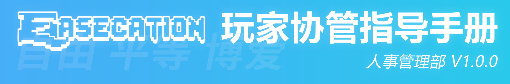

# 玩家协管指导手册




## 玩家协管指导手册

版本号：V1.0.0

编制部门：玩家协管团队 - 人事管理部

更新时间：2021年1月30日

文档属性：玩家协管团队文档 - 仅供内部使用

审批人：André

## 重要提醒

本文档仅供玩家协管团队内部使用，请勿将本文的链接地址或文档中的任意内容以生成副本、复制文本、截图等任何形式外传至除协管团队外的个人或组织，否则视为违规行为，我们将视情节与影响程度对违规协管作出处罚。

## 第一部分 序言

本文档旨在介绍实习协管及玩家协管职位的职责、进一步规范玩家协管的操作，我们强调协管实习期是一个学习的过程，通过一个月的协管实习，相信你最终会成为一名合格的玩家协管。本文档的部分内容对所有协管都有参考价值。

本文档属于玩家协管团队的内部文档，从内容上来讲，是对《玩家协管参考文档》的有益补充；对实习协管自身来讲，是规范实习协管各方面操作、行为、思想态度价值观等的总章程。

当本文档的有关规定与《玩家协管参考文档》存在明显不同或概念混淆时，以《玩家协管参考文档》发布的内容为准，本文档最终解释权归EaseCation玩家协管团队所有。

* 点此查看[EaseCation 玩家协管参考文档](https://docs.qq.com/doc/DWnJyS2hCU1JxSEZ3)

## 第二部分 核心思想

### 2.1 自由、平等、博爱价值观

具体内容见《玩家协管参考文档》，这里不再赘述。

### 2.2 “装孙子”基本原则

“装孙子”虽在玩家协管参考文档上没有写明，但这也是玩家协管团队工作的基本原则之一。

也许你打开这篇文档时，初次看到这个词会觉得很滑稽。但是事实上，玩家协管一直属于高危职业，在我们处理违规玩家的过程中，可能不经意之间就会处罚到某些恶俗玩家或者爱搞事的玩家头上，这些玩家被处罚后，经常会通过一些非常规的方式、手段等对协管或协管团队频繁发起骚扰，甚至打着出协管户籍的幌子滋事。

这固然不代表我们一定会向这些恶势力低头，去不分青红皂白地迎合他们、解封他们，这不符合协管团队的价值观。但我们可以选择冷处理、不处理或者引导他们去微信公众号这种不暴露交流者敏感信息的平台去沟通，“装孙子”在这里就是指协管个人秉承“不私下与之对线”的原则，避免事态升级或者矛盾被进一步激化。

另一方面，在玩家被误判误封或者因某些其它缘故引发对协管个人、协管团队、服务器等的嘲讽、谩骂，但玩家诉求属于合理范畴内时，我们应该心态平和地与之沟通，说明缘由、事情的来龙去脉等，为之解决问题，而不能把对玩家的不满全部甚至变本加厉地还回去，否则会损伤协管个人以至于协管团队的整体形象。

\*注：此条（即：第三段的内容）建立在上一段末尾“不与之私下对线”的大原则下。

最后，玩家协管团队明令禁止协管在职人员带头搞事，激化EC各部门间、实习协管与正式协管间或协管团队与玩家间的矛盾，这一点虽然在玩家协管参考文档中没有明确规定，但却是协管团队所憎恶的。如若协管在职人员违反本条规定，我们将会视情节与影响程度，对该协管进行不限于警告、打回实习、解雇、永久除名并拉黑等的惩罚。

### 2.3 分清“网络”与“现实”的界限

现实的生活永远是多姿多彩的，你可以到外面，观赏大自然的美景；游戏世界是虚拟的，因为游戏世界只不过是一个一个代码制造出来的，永远不会结束。

我们不能让网络游戏中的社交占据个人社交生活的全部。片面偏重于“人——机”对话式的网上虚拟交往，势必导致人际关系杠杆的失衡，只会导致个人的人际关系冷漠、人际距离疏远、人际情感萎缩，进而导致新的人际关系障碍，这将会是一个恶性循环。忽视真实可信的人际关系，亦不利于青少年的成长。

所以，我们建议实习协管在上线工作的同时，能够适时，适当地放下你的手机、平板或者电脑，更多地去现实生活里走一走，玩一玩，多与现实生活中的人交往，我们并不会强制要求实习协管必须做到每天上线或随叫随到。

同时，协管工作亦不能当做个人学习、工作生活的全部。处于学生时代的你，唯有通过学习思想道德知识与科学文化知识才能不断完善自身，用有限的时间做更多对自己有价值、有意义的事，才是对自己负责，“只争朝夕，不负韶华”。

我们不建议初三、高三的玩家参加协管招新。我们遵循“学业第一”原则，本着“博爱”精神，允许实习协管因学业问题暂时退出，学业第一，不要过度沉迷于游戏。

#### 2.3.1 工作日不强制上线工作

在工作日，玩家协管团队不强制各位协管上线工作。我们不希望协管在有事的情况下上线工作，所以我们摒弃排班制，给协管更自由、灵活的时间。

\*注：但在试用（实习）期间不够勤快则是不利于入正的哦！

#### 2.3.2 协管个人时间分配

我们建议协管以学习为主，在空闲的时间上线进行工作，现实世界永远比网络世界更加丰富多彩，请合理安排上网时间。

同时，实习玩家协管应该在实习期结合自己的实际情况，安排好自己在协管团队的学习规划。玩家协管团队的工作所涉及到的方面广、需要学习的内容多，建议实习协管逐步消化适应。

### 2.4 对“唯利是图”思想说不

协管工作是一份责任，请不要带着不正当的目的来加入协管团队。

#### 2.4.1 协管工作与“奖励”绝不是对等的概念

我们经常听到其它玩家说的一句话是，“协管奖励还没有我肝榜获得的奖励多，那我为什么还要考协管呢？”，但其实玩家协管团队并不是片面地靠奖励留住协管，现阶段的协管奖励对协管个人来说，可以说是微不足道，真正促使玩家协管留在玩家协管团队工作的，是协管个人内化于心的责任感；而从实际情况来看，协管奖励也确实比不上服内肝榜获得的奖励，如果你考协管是为了奖励而来，那协管团队恐怕会让你失望。故要想做好协管这份工作，首先必须具有责任意识，当上了协管，就要承担起协管的责任，做好协管的本职工作。

#### 2.4.2 正常情况不授予在职协管白名单

白名单仅供内部测试人员测试、知名主播宣传服务器使用，玩家协管团队所有在职协管均不具有服务器的白名单。在协管团队日后的运营过程中，如非特殊需要，我们仍不会授予在职协管白名单，请使用“我的世界中国版”进入服务器处理协管有关事务，杜绝“搞特殊”的现象出现。

同时，请不要以“只有电脑基岩/win10版MineCraft，没有手机可供使用”这样荒诞可笑的说辞来向协管团队申请白名单，如确实只能在PC平台工作请下载[模拟器](https://www.baidu.com/s?wd=%26%2327169%3B%26%2325311%3B%26%2322120%3B)使用。绝大部分协管工作都需要具有安卓/IOS设备，请各位协管自行解决处理设备有关问题。 

#### 2.4.3 唯有踏实肯干才能获得他人的认可

我们鼓励协管在职人员多承担协管日常事务，通过时间的检验来获得大家的认可，而不应该有“我进协管的目的就是我要成为管理员/超级管理员”诸如此类的错误观念。要做“行的巨人”，而不能仅仅当一个“言的巨人，行的矮子”，这样将会不利于在协管团队中树立良好的个人形象。

## 第三部分 权限等级与晋升制度

玩家协管团队现阶段虽仅有从实习协管转正成为正式协管的制度，但这绝不代表一位玩家协管毕生的道路只能是“从入正到入土”，我们鼓励协管在职人员主动承担责任，多在协管工作群内发表自己的观点、看法，这样不仅利于自身的成长，而且更容易得到大家的认可，对职位晋升也是有百利而无一害的。

从不成文的构想到成文的规章制度需要经过一个漫长的过程，更需要经过实践的检验。在2020年12月，我们首次提出了关于协管晋升制度的设想，并在此基础上制订了晋升的标准。我们相信这一制度将会在不远的未来成为现实，届时我们将放开协管晋升的通道，使得实习协管可以从入正开始，通过自己的努力，成为管理员，甚至是超级管理员。

EaseCation玩家协管团队成员目前可具备的权限为从实习玩家协管到超级管理员的权限组，不同权限等级可使用的操作类型有所不同，对于相同类型的操作，可执行的时长也是不同的，下表为各权限等级可执行的操作类型及时长的概览。


\*注：以上表格中的“解封”，指的是“解除小黑屋”与“解除封禁\(BAN\)”，执行解封操作，封禁和小黑屋会被同时撤销。同时，处于被封禁状态下的玩家，对其进行小黑屋操作是无效的。

\*注：对于实习协管，执行禁言、踢出操作时，需要先执行警告，警告过后才能执行禁言与踢出操作。如在同服上有其它协管已选定该玩家进入到操作界面，或者实习协管通过WAC上列出的疑似违规玩家进入房间后，默认的警告环节会失效，主面板上会直接列出这位玩家为备选，直接点击即进入到下一步的操作，但我们是不允许实习协管不警告直接操作玩家的，在操作日志上，实习协管执行禁言或者踢出之前必须有与之配套的警告操作，否则视为操作失误。

## 第四部分 责任与义务

### 4.1 玩家协管团队的整体工作

\*注：以下工作属于协管团队整体工作，不代表每位协管都要完成所有工作。

EaseCation玩家协管团队是负责服务器管理和玩家服务的综合性团队，不仅仅负责服务器管理。无论是从工作量还是从重要性来看，玩家服务工作往往是占比较大的。

服务器管理工作：服务器秩序的管理、解答服内玩家问题等等

玩家服务工作：按照工作量从高到低排序

1. 文案撰写。包括服务器公告、文档教程（《EaseCation 服务器账号体系介绍》等）、解释说明类文档（《EaseCation 争议规则二次定义》等）、规则类文档（《EaseCation 志愿者参考文档》等）。
2. 客服会话。微信公众号的客服服务是由玩家协管团队负责。
3. 管理下属团队。玩家协管团队负责管理EaseCation志愿者团队和EaseCation新媒体运营部。
4. 表单处理。申诉、举报、反馈等各种表单的后台处理。
5. 收集意见。收集并整理玩家意见（阶段性调研等）并登记游戏BUG。
6. 漏洞维修。不定期维修部分地图BUG。

\*注：服务器的BUG维修不是玩家协管团队的本职工作，我们只负责一些我们力所能及的地图BUG。

1. 官号运营。B站、微信公众号等的官号运营。

值得注意的是，玩家协管团队的工作并不是一成不变的，会随着服务器的发展以及玩家的需求等不定期增减。从2020年3月协管改革以来，玩家协管团队越来越重视玩家服务工作，先后增添了微信公众号协管招募报名、客服功能、违规玩家/协管举报、服务器反馈/意见表单、志愿者招募报名，以及组建了EaseCation志愿者团队，并编写了《EaseCation 志愿者参考文档》、《EaseCation 新媒体运营部参考文档》等规则文案，以及解释说明类文案《EaseCation 争议规则参考文档》......玩家服务工作在协管团队的工作中占比越来越大的同时，除服内管理外的各方面能力也显得越来越重要。

### 4.2 玩家协管的义务与责任

玩家协管需要完成自己的基本工作。玩家管理组的基本工作是服务器秩序管理，玩家服务组的基本工作是微信公众号的客户服务。

同时，作为玩家协管，必须清楚自己是玩家协管团队的一份子。玩家协管团队的工作范围广、内容多，除了基本工作外，我们还有大量的玩家服务工作需要共同完成。玩家协管自己应该多承担协管团队的工作、多参与协管团队的集体工作，包括但不限于主动撰写力所能及的文案、参与管理志愿者团队与新媒体运营部、各种表单的后台处理、玩家意见的收集、部分地图漏洞的维修等等。

权力是实现责任的手段和工具，而责任的落实是运用权力的目的。权力的行使必须承担相应的责任。对于玩家协管而言，有权必有责，用权受监督，要落实在明确责任和主动接受监督上面。主动接受监督也是玩家协管的基本义务与责任。

### 4.3 实习协管的义务与责任

对于刚刚加入玩家协管团队的实习协管来说，玩家协管团队的工作是陌生的。在一个月的实习期里，不断熟悉玩家协管团队的工作和工作流程，提高自身素质是首要任务，争取使自己成为一名合格的玩家协管。

作为一名合格的玩家协管，服务器管理能力是必备的。实习协管需在一个月的实习期内完全掌握服务器的管理知识，在此基础上，更要重视提升自身的知识储备、能力水平与综合素质。

我们鼓励实习玩家协管在自身能力允许的情况下，积极分担正式玩家协管的工作，比如撰写各类文案、收集玩家意见、服务器漏洞等，也鼓励实习玩家协管积极参与到玩家协管团队的集体性工作中。

## 第五部分 管理员操作基础知识

注：由于网易中国版版本更新，服务器反作弊检测近期出现了大量（绝大部分为moving.highjump）误判，请勿过分依赖WAC反作弊检测到的违规玩家，反而应多留心玩家举报，/admin面板上的高危玩家往往都是误判（但也有少部分是真正的作弊玩家）。

玩家协管最基础的工作是服务器内日常秩序的管理，最基本的基本功是熟悉操作玩家的方法，你需要了解如何执行操作才是有效操作。

### 5.1 /admin面板的相关逻辑与具体的操作方法


▲如图片上的文字太小无法看清，请将图片另存到本地之后再打开查看！▲

### 5.2 “匹配中国版”功能的作用


### 5.3 “匹配中国版”同时显示多位玩家的情况处理

当你在管理员面板输入某一位玩家的玩家名，打开“匹配中国版”功能查找玩家时，有时不免会遇到同时查找到多位中国版玩家的情况，例如下图所示。或许你此时稍感困惑，但这其实并不是服务器或者管理员操作面板的BUG，产生这一情况的相关逻辑及处理方法可以参照以下内容。


#### 5.3.1 同时显示多位玩家的逻辑缘由


#### 5.3.2 处理方案

我们建议协管遇到此情况时传送到违规玩家所在大厅/房间，从当前世界列表中选定该玩家后进行处理。

### 5.4 协管五大指令


▲如图片上的文字太小无法看清，请将图片另存到本地之后再打开查看！▲

### 5.5 HELPER频道

HELPER频道是服务器内为建筑师及以上权限等级设立的特殊频道，目前建筑师及以上权限组玩家可接收/发送HELPER喇叭消息，同时HELPER频道还可接收玩家举报（被举报玩家的玩家名及ECID，举报玩家的玩家名、勾选的违规类型及输入的举报理由【举报理由为选填，如玩家没有输入则不展示】）信息、管理员及以上职位者解封其它玩家的操作（解封执行者，被解封玩家的玩家名及ECID、解封理由）信息。

#### 5.5.1 HELPER喇叭的使用

HELPER喇叭为免费使用，使用时不会扣除钻石。与普通小喇叭消息相比，无超过20字开始收取钻石的限制，加颜色、粗体、斜体、下划线均不需要支付钻石，无替换词限制，不会被服务器内设定的替换词规则转换。具体的发送方法有以下四种，任选其一使用即可。分别为：

* /helperbugle \[文字\]
* /helperbuglet \[文字\]
* /helperlaba \[文字\]
* /hlaba \[文字\]

#### 5.5.2 重要提醒

HELPER频道的所有消息本质上属于小喇叭消息，接收HELPER频道消息需要在“EaseCation服务器设置”中打开“接收小喇叭消息”选项并点击确定，否则将只能收到WAnticheat反作弊系统的警告信息，其它信息会无法接收。

* 打开方法：


↓


↓


## 第六部分 实习协管

### 6.1 实习生活

#### 6.1.1 实习流程

**6.1.1.1 实习期限**

实习协管的实习期是四周（一个月），正常情况下，我们会在第四周的固定一天展开实习协管的入正工作，但这并不代表留到最后的实习协管或者试用满一个月的实习协管都能够入正。实习协管入正采用择优的原则，最终考评排行末尾者将会视具体情况酌情采取延长实习期或者作解雇处理。

\*注：延长实习期即“继续实习”，继续实习的期限不超过四周（1个月），协管总实习期限不超过2个月，如若2个月后实习协管个人综合表现仍然不佳，我们将作解雇处理。

同时，我们会在协管实习期间全面展开综合考评，每周进行1-2次实习协管评价，每次淘汰1-3位考核成绩处于末尾的实习协管。若您在实习协管团队中的全面考核排名末尾，则可能会被提前解雇。

**6.1.1.2实习协管权限相关**

实习协管拥有警告，6小时禁言，踢出的权限，其中禁言和踢出操作执行前需先执行警告。我们不建议您对外炫耀自己的权限，以免遭到不必要的骚扰。同时，不允许私自出借权限账号，否则将取消账号的管理权限并对账号进行封禁。如果遇到特殊情况，原权限账号无法使用或被盗，请及时联系管理员更换权限账号。

**6.1.1.3 实习协管与正式协管配合**

如果服内有正式协管在线，遇到作弊请先使用/hlaba呼叫正式协管前来处理。如果正式协管没有及时到达再警告后将作弊玩家踢回至大厅。协管间交流时请使用/hlaba\(即Helper专用频道）。

#### 6.1.2 素质考核

我们希望，多方面进行转正考核，我们不仅根据您的操作业绩进行转正评选，还依据您的整体综合素质进行考核。该内容可参考《玩家协管参考文档》3.2.2.3条例，原文如下：

```text
3.2.2.3	绩效考评。实习协管、正式协管考评标准以绩效作为主要参考，但不完全以绩效为准，还需要结合个人平时行为规范，如：
聊天态度。作为协管，不能够在交流的过程中（包括但不限于，在社交媒体或于服务器内）使用过激语言或进行不恰当表达。
处理违规行为时的态度。
处理时是否恰当合理（为了追求处理数量而故意判重、重复处理等类似行为）。
是否与审核员（或更高权限拥有者等）有情感与物质交易（如：送礼物、说好话等违规行为）。若查明此类情况后将给予警告处理，严重者（对考评结果产生了不公平影响的）除名处理。
```

素质考核还包括以下内容：

* 言论是否符合《玩家协管参考文档》2.3模块。
* 操作是否符合《玩家协管参考文档》要求。
* 操作理由是否有故意嘲讽或者辱骂的言论。

这里拿几个反面教材出来说事，如若协管在职人员在操作理由中故意填写嘲讽、辱骂内容（不管是否对其它玩家造成了实质性负面影响，形如下图），我们将会按照玩家协管参考文档中的有关规定，立即对该协管作出解雇处理，情节严重者，作永久除名并写入协管黑名单的处理。


* 《玩家协管参考文档》相关规定如下：

```text
2.2.6	管理员面板禁止填写讽刺、辱骂字词。操作理由填写的是玩家具体的违规行为，而不是违规言论的具体内容，并不是把玩家说过的话复述一次填入操作理由。若查实协管故意使用管理员操作嘲讽、辱骂或者中伤其它玩家的，立即对该协管作解雇处理，情节严重者，作永久除名处理。
```

* 其它玩家的评价

必要的时候，玩家协管团队可能会随机抽取几位或者一批玩家，邀请其参与对实习协管的评价；更多的时候，我们会通过在玩家群中发布协管评价问卷的方式，邀请其它玩家评价实习协管。实习协管在玩家中口碑的好坏，同样会深刻地影响到实习协管的入正工作。

除此之外，实习协管在试用期内有无被玩家举报，是否有玩家举报并经复核后情况属实的操作失误（例如：误判等）或滥权（例如：刻意重判等）等的行为，也会直接影响实习协管的入正。

* 来自协管团队的评价

协管个人作为协管团队的一员，应该有团队精神，要凝聚在一起，正如前面所提到的，实习协管不要仅仅去追寻绩效，还要有在团队内的素质，素质是一个人的立人之本，实习协管需要增强自己在团队内的建言献策能力，主动在团队内承担任务，才能得到协管团队对自己有利的评价。

### 6.2 操作规范

#### 6.2.1 操作理由

注意：

1. 所有操作都必须输入操作理由，不输入理由直接执行操作则视为该实习协管操作失误！目前已知“踢出操作”可以不输入操作理由直接执行踢出，但我们明令禁止实习协管不输入操作理由直接踢出玩家！
2. 操作理由请全部书写中文版式，勿填写英文操作理由（例如：fly、speed等），否则视为操作失误；在确认操作之前务必再三确认输入的操作理由中是否混入了其它无关内容，是否有错别字等，否则视为操作失误。
3. 如若同一玩家使用多种违规辅助参与游戏，只写最明显的一种违规理由，请不要在操作理由上同时书写多种理由，否则视为操作失误。

**6.2.1.1 言论违规**

<table>
  <thead>
    <tr>
      <th style="text-align:left">&#x4E3E;&#x4F8B;&#xFF08;&#x4E00;&#x884C;&#x4EE3;&#x8868;&#x4E00;&#x53E5;&#xFF09;</th>
      <th
      style="text-align:left">&#x8FDD;&#x89C4;&#x7C7B;&#x578B;</th>
        <th style="text-align:left">&#x5BF9;&#x5E94;&#x53C2;&#x8003;&#x6587;&#x6863;&#x6761;&#x4F8B;</th>
        <th
        style="text-align:left">&#x5E94;&#x586B;&#x64CD;&#x4F5C;&#x7406;&#x7531;</th>
    </tr>
  </thead>
  <tbody>
    <tr>
      <td style="text-align:left">
        <p>&#x201C;&#x6765;XX&#x516C;&#x4F1A;&#x201D;</p>
        <p>&#x201C;&#x6765;XX&#x516C;&#x4F1A;&#x201D;</p>
        <p>&#x2026;&#x2026;</p>
        <p>&#xFF08;&#x91CD;&#x590D;5&#x904D;&#x4EE5;&#x4E0A;&#xFF09;</p>
      </td>
      <td style="text-align:left">&#x5237;&#x5C4F;</td>
      <td style="text-align:left">4.2.1 &#x5237;&#x5C4F;&#x6216;&#x8FC7;&#x957F;&#x6D88;&#x606F;</td>
      <td
      style="text-align:left">&#x5237;&#x5C4F;</td>
    </tr>
    <tr>
      <td style="text-align:left">&#x54C8;&#x54C8;&#x54C8;&#x54C8;&#x54C8;&#x54C8;&#x54C8;&#x54C8;&#x54C8;&#x54C8;&#x54C8;&#x54C8;&#x54C8;&#x54C8;&#x54C8;&#x54C8;&#x54C8;&#x54C8;&#x54C8;&#x54C8;&#x54C8;&#x54C8;&#x54C8;&#x54C8;&#x54C8;&#x54C8;&#x54C8;&#x54C8;&#x54C8;&#x54C8;&#x54C8;&#x54C8;&#x54C8;&#x54C8;&#x54C8;&#x54C8;&#x54C8;&#x54C8;&#x54C8;&#x54C8;&#x54C8;&#x54C8;&#x54C8;&#x54C8;&#x54C8;&#x54C8;&#x54C8;&#x54C8;&#x54C8;&#x54C8;&#xFF08;&#x8D85;&#x8FC7;40&#x5B57;&#xFF09;</td>
      <td
      style="text-align:left">&#x8FC7;&#x957F;&#x6D88;&#x606F;</td>
        <td style="text-align:left">4.2.1 &#x5237;&#x5C4F;&#x6216;&#x8FC7;&#x957F;&#x6D88;&#x606F;</td>
        <td
        style="text-align:left">
          <p>&#x5237;&#x5C4F;</p>
          <p>&#x8BF7;&#x4E0D;&#x8981;&#x4E66;&#x5199;&#x7C7B;&#x4F3C;&#x4E8E;&#x201C;&#x53D1;&#x5E03;&#x8FC7;&#x957F;&#x4FE1;&#x606F;&#x201D;&#x8FD9;&#x6837;&#x7684;&#x64CD;&#x4F5C;&#x7406;&#x7531;</p>
          </td>
    </tr>
    <tr>
      <td style="text-align:left">&#x4F60;&#x5988;&#x6B7B;&#x4E86;</td>
      <td style="text-align:left">&#x5632;&#x8BBD;&#x8D2C;&#x4F4E;</td>
      <td style="text-align:left">4.2.2 &#x8FDD;&#x89C4;&#x5185;&#x5BB9;&#xFF08;&#x5632;&#x8BBD;&#x8D2C;&#x4F4E;&#x7C7B;&#xFF09;</td>
      <td
      style="text-align:left">
        <p>&#x8FB1;&#x9A82;&#x6216;&#x8FB1;&#x9A82;&#x4ED6;&#x4EBA;</p>
        <p>&#xFF08;&#x5632;&#x8BBD;&#x8D2C;&#x4F4E;&#x4E5F;&#x53EF;&#x4EE5;&#xFF0C;&#x4F46;&#x5C3D;&#x53EF;&#x80FD;&#x4E0D;&#x8981;&#x5199;&#x8FD9;&#x79CD;&#x7406;&#x7531;&#x4E3A;&#x4F73;&#xFF09;</p>
        </td>
    </tr>
    <tr>
      <td style="text-align:left">&#x8FF7;&#x4F60;&#x4E16;&#x754C;&#x73A9;&#x5BB6;&#x540A;&#x6253;&#x6211;&#x7684;&#x4E16;&#x754C;&#x73A9;&#x5BB6;</td>
      <td
      style="text-align:left">&#x9493;&#x9C7C;&#x5F15;&#x6218;</td>
        <td style="text-align:left">4.2.2 &#x8FDD;&#x89C4;&#x5185;&#x5BB9;&#xFF08;&#x9493;&#x9C7C;&#x5F15;&#x6218;&#x7C7B;&#xFF09;</td>
        <td
        style="text-align:left">&#x9493;&#x9C7C;&#x5F15;&#x6218;</td>
    </tr>
    <tr>
      <td style="text-align:left">&#xFF08;&#x8FD9;&#x91CC;&#x4E0D;&#x4F5C;&#x4E3E;&#x4F8B;&#xFF0C;&#x8BF7;&#x534F;&#x7BA1;&#x7ED3;&#x5408;&#x5E38;&#x8BC6;&#x4E0E;&#x5B9E;&#x9645;&#x8BED;&#x5883;&#x7075;&#x6D3B;&#x5224;&#x65AD;&#x5373;&#x53EF;&#xFF09;</td>
      <td
      style="text-align:left">&#x8FDD;&#x6CD5;&#x8A00;&#x8BBA;</td>
        <td style="text-align:left">4.2.2 &#x8FDD;&#x89C4;&#x5185;&#x5BB9;&#xFF08;&#x8FDD;&#x6CD5;&#x8A00;&#x8BBA;&#x7C7B;&#xFF09;</td>
        <td
        style="text-align:left">&#x53D1;&#x5E03;&#x8FDD;&#x6CD5;&#x8A00;&#x8BBA;</td>
    </tr>
    <tr>
      <td style="text-align:left">&#x5C0F;&#x59D0;&#x59D0;&#xFF0C;&#x4ECA;&#x665A;&#x6765;&#x4E0A;&#x5E8A;&#x5417;</td>
      <td
      style="text-align:left">&#x6C61;&#x79FD;&#x5185;&#x5BB9;</td>
        <td style="text-align:left">4.2.6.1 &#x8F6F;&#x8272;&#x60C5; &#x7B2C;&#x4E09;&#x7C7B;</td>
        <td style="text-align:left">&#x8272;&#x60C5;&#x6DEB;&#x79FD;/&#x53D1;&#x5E03;&#x8272;&#x60C5;&#x6DEB;&#x79FD;&#x4FE1;&#x606F;</td>
    </tr>
    <tr>
      <td style="text-align:left">&#x4F60;&#x4EEC;&#x77E5;&#x9053;&#x5417;&#xFF0C;p&#x67D0;&#x7F51;&#x7AD9;&#x51FA;&#x73B0;&#x4E86;&#x65B0;&#x7684;****</td>
      <td
      style="text-align:left">&#x6C61;&#x79FD;&#x5185;&#x5BB9;</td>
        <td style="text-align:left">4.2.6.1 &#x8F6F;&#x8272;&#x60C5; &#x7B2C;&#x4E8C;&#x7C7B;</td>
        <td style="text-align:left">&#x8272;&#x60C5;&#x6DEB;&#x79FD;/&#x53D1;&#x5E03;&#x8272;&#x60C5;&#x6DEB;&#x79FD;&#x4FE1;&#x606F;</td>
    </tr>
    <tr>
      <td style="text-align:left">&#xFF08;&#x4E0D;&#x4F5C;&#x4E3E;&#x4F8B;&#xFF0C;&#x4E25;&#x91CD;&#x6C61;&#x79FD;&#x5185;&#x5BB9;&#x8FDD;&#x89C4;&#x7ED3;&#x5408;&#x5B9E;&#x9645;&#x5224;&#x65AD;&#xFF09;</td>
      <td
      style="text-align:left">&#x6C61;&#x79FD;&#x5185;&#x5BB9;</td>
        <td style="text-align:left">4.2.6.1 &#x786C;&#x8272;&#x60C5;</td>
        <td style="text-align:left">&#x8272;&#x60C5;&#x6DEB;&#x79FD;/&#x53D1;&#x5E03;&#x8272;&#x60C5;&#x6DEB;&#x79FD;&#x4FE1;&#x606F;</td>
    </tr>
    <tr>
      <td style="text-align:left">&#x4F60;&#x4ECA;&#x5929;&#x6668;*&#x4E86;&#x5417;</td>
      <td style="text-align:left">&#x6C61;&#x79FD;&#x5185;&#x5BB9;</td>
      <td style="text-align:left">4.2.6.1 &#x8F6F;&#x8272;&#x60C5; &#x7B2C;&#x4E00;&#x7C7B;</td>
      <td style="text-align:left">&#x8272;&#x60C5;&#x6DEB;&#x79FD;/&#x53D1;&#x5E03;&#x8272;&#x60C5;&#x6DEB;&#x79FD;&#x4FE1;&#x606F;</td>
    </tr>
    <tr>
      <td style="text-align:left">&#x6FC0;.&#x60C5;.&#x4E00;.&#x591C;,&#x7434;.&#x745F;.&#x5927;.&#x7247;.+p66666666&#x8D2D;&#x4E70;</td>
      <td
      style="text-align:left">&#x5BA3;&#x4F20;&#x6C61;&#x79FD;&#x5E7F;&#x544A;</td>
        <td style="text-align:left">4.2.6.3 &#x5BA3;&#x4F20;&#x6DEB;&#x79FD;&#x5E7F;&#x544A;</td>
        <td style="text-align:left">
          <p>&#x8272;&#x60C5;&#x6DEB;&#x79FD;/&#x53D1;&#x5E03;&#x8272;&#x60C5;&#x6DEB;&#x79FD;&#x4FE1;&#x606F;</p>
          <p>&#x8BF7;&#x4E0D;&#x8981;&#x5728;&#x64CD;&#x4F5C;&#x7406;&#x7531;&#x4E2D;&#x5E26;&#x7A0B;&#x5EA6;&#x8BCD;&#x6C47;&#xFF0C;&#x4F8B;&#x5982;&#x201C;&#x4E25;&#x91CD;&#x201D;</p>
        </td>
    </tr>
    <tr>
      <td style="text-align:left">&#xFF08;&#x4FAE;&#x8FB1;&#x56FD;&#x5BB6;&#xFF0C;&#x717D;&#x52A8;&#x66B4;&#x529B;&#xFF0C;&#x5BA3;&#x4F20;&#x6C11;&#x65CF;&#x3001;&#x5730;&#x533A;&#x72EC;&#x7ACB;&#x5185;&#x5BB9;&#xFF09;</td>
      <td
      style="text-align:left">&#x4E25;&#x91CD;&#x8FDD;&#x6CD5;</td>
        <td style="text-align:left">4.2.2 &#x8FDD;&#x89C4;&#x5185;&#x5BB9;&#xFF08;&#x4E25;&#x91CD;&#x8FDD;&#x6CD5;&#x8A00;&#x8BBA;&#x7C7B;&#xFF09;</td>
        <td
        style="text-align:left">
          <p>&#x53D1;&#x5E03;&#x8FDD;&#x6CD5;&#x4FE1;&#x606F;</p>
          <p>&#x8BF7;&#x4E0D;&#x8981;&#x5728;&#x64CD;&#x4F5C;&#x7406;&#x7531;&#x4E2D;&#x5E26;&#x7A0B;&#x5EA6;&#x8BCD;&#x6C47;&#xFF0C;&#x4F8B;&#x5982;&#x201C;&#x4E25;&#x91CD;&#x201D;</p>
          </td>
    </tr>
    <tr>
      <td style="text-align:left">&#x8F93;&#x5165;/out&#x53EF;&#x4EE5;&#x83B7;&#x5F97;500EC&#x94BB;&#x77F3;</td>
      <td
      style="text-align:left">&#x6076;&#x610F;&#x8BEF;&#x5BFC;</td>
        <td style="text-align:left">4.2.2 &#x8FDD;&#x89C4;&#x5185;&#x5BB9; &#xFF08;&#x6076;&#x610F;&#x8BEF;&#x5BFC;&#x7C7B;&#xFF09;</td>
        <td
        style="text-align:left">&#x8BEF;&#x5BFC;</td>
    </tr>
    <tr>
      <td style="text-align:left">&#x9690;&#x79D8;&#x7070;&#x884C;&#xFF0C;&#x5F00;&#x5C40;&#x795E;&#x88C5;&#xFF0C;&#x65E0;&#x9650;&#x836F;&#x6C34;&#xFF0C;+pp
        1234567890</td>
      <td style="text-align:left">&#x8D29;&#x5356;&#x5916;&#x6302;</td>
      <td style="text-align:left">4.3.2.3 &#x5BA3;&#x4F20;&#x4F5C;&#x5F0A;&#x7AEF;</td>
      <td style="text-align:left">&#x8D29;&#x5356;&#x5916;&#x6302;/&#x5BA3;&#x4F20;&#x4F5C;&#x5F0A;&#x7AEF;</td>
    </tr>
  </tbody>
</table>

\*注：对于参考文档中明确要求需要执行小黑屋操作的违规言论，实习协管应该先执行警告，警告之后若无改善则按照参考文档规范执行禁言，禁言之后立即将违规玩家的玩家名、违规证据等发送到实习协管工作群并在群内@正式协管进行叠加黑屋处理。

**6.2.1.2 违规辅助**

<table>
  <thead>
    <tr>
      <th style="text-align:left">&#x8FDD;&#x89C4;&#x7C7B;&#x578B;</th>
      <th style="text-align:left">&#x5177;&#x4F53;&#x7279;&#x5F81;</th>
      <th style="text-align:left">&#x5BF9;&#x5E94;&#x53C2;&#x8003;&#x6587;&#x6863;&#x6761;&#x4F8B;</th>
      <th
      style="text-align:left">&#x5E94;&#x586B;&#x64CD;&#x4F5C;&#x7406;&#x7531;</th>
    </tr>
  </thead>
  <tbody>
    <tr>
      <td style="text-align:left">&#x6740;&#x622E;&#xFF08;l&#xF9;&#xFF09;&#x5149;&#x73AF;</td>
      <td style="text-align:left">&#x6253;&#x4EBA;&#x624B;&#x4E0D;&#x52A8;</td>
      <td style="text-align:left">4.3.2.1 &#x5E38;&#x89C4;&#x8FDD;&#x89C4;&#x884C;&#x4E3A;&#xFF08;&#x6740;&#x622E;&#x5149;&#x73AF;&#x7C7B;&#xFF09;</td>
      <td
      style="text-align:left">
        <p>&#x6740;&#x622E;&#x5149;&#x73AF;/&#x6740;&#x622E;&#xFF08;&#x4E0D;&#x8981;&#x6253;&#x9519;&#x522B;&#x5B57;&#xFF09;</p>
        <p>
          
        </p>
        <p>&#x6740;&#x6212;&#xFF08;&#xD7;&#xFF09;&#x6740;&#x6233;&#xFF08;&#xD7;&#xFF09;&#x6740;&#x8650;&#xFF08;&#xD7;&#xFF09;</p>
        </td>
    </tr>
    <tr>
      <td style="text-align:left">&#x52A0;&#x901F;</td>
      <td style="text-align:left">
        <p>&#x5F02;&#x5E38;&#x9AD8;&#x901F;&#x5EA6;&#x8D70;&#x8DEF;</p>
        <p>&#x867D;&#x4E58;&#x5954;&#x5FA1;&#x98CE;&#xFF0C;&#x4E0D;&#x4EE5;&#x75BE;&#x4E5F;&#x3002;</p>
      </td>
      <td style="text-align:left">4.3.2.1 &#x5E38;&#x89C4;&#x8FDD;&#x89C4;&#x884C;&#x4E3A;&#xFF08;&#x52A0;&#x901F;&#x7C7B;&#xFF09;</td>
      <td
      style="text-align:left">&#x52A0;&#x901F;</td>
    </tr>
    <tr>
      <td style="text-align:left">&#x98DE;&#x884C;</td>
      <td style="text-align:left">
        <p>&#x4EBA;&#x5728;&#x5929;&#x4E0A;&#x98DE;</p>
        <p>&#x98D8;&#x98D8;&#x4E4E;&#x5982;&#x9057;&#x4E16;&#x72EC;&#x7ACB;&#xFF0C;&#x7FBD;&#x5316;&#x800C;&#x767B;&#x4ED9;&#x3002;</p>
      </td>
      <td style="text-align:left">4.3.2.1 &#x5E38;&#x89C4;&#x8FDD;&#x89C4;&#x884C;&#x4E3A;&#xFF08;&#x98DE;&#x884C;&#x7C7B;&#xFF09;</td>
      <td
      style="text-align:left">&#x98DE;&#x884C;</td>
    </tr>
    <tr>
      <td style="text-align:left">&#x901F;&#x6398;</td>
      <td style="text-align:left">&#x5FEB;&#x901F;&#x7834;&#x574F;&#x65B9;&#x5757;</td>
      <td style="text-align:left">4.3.2.1 &#x5E38;&#x89C4;&#x8FDD;&#x89C4;&#x884C;&#x4E3A;&#xFF08;&#x901F;&#x6398;&#x7C7B;&#xFF09;</td>
      <td
      style="text-align:left">&#x901F;&#x6398;</td>
    </tr>
    <tr>
      <td style="text-align:left">&#x7A7F;&#x5899;</td>
      <td style="text-align:left">&#x4EBA;&#x5728;&#x5899;&#x91CC;&#xFF0C;&#x81EA;&#x7531;&#x8FDB;&#x51FA;</td>
      <td
      style="text-align:left">4.3.2.1 &#x5E38;&#x89C4;&#x8FDD;&#x89C4;&#x884C;&#x4E3A;&#xFF08;&#x7A7F;&#x5899;&#x5916;&#x6302;&#x7C7B;&#xFF09;</td>
        <td
        style="text-align:left">
          <p>&#x7A7F;&#x5899;&#xFF08;&#x4E0D;&#x8981;&#x5199;&#x9041;&#x5730;&#xFF09;</p>
          <p>&#x53E6;&#x5916;&#x8FD9;&#x91CC;&#x63D0;&#x4E00;&#x4E0B;&#xFF1A;</p>
          <p>&#x67D0;&#x4E9B;&#x9041;&#x5730;&#x662F;&#x56E0;&#x4E3A;&#x73A9;&#x5BB6;&#x7684;&#x533A;&#x5757;&#x52A0;&#x8F7D;&#x95EE;&#x9898;&#x5BFC;&#x81F4;&#x7684;&#xFF0C;&#x5E76;&#x4E0D;&#x4E00;&#x5B9A;&#x5C31;&#x662F;&#x5916;&#x6302;&#xFF0C;&#x82E5;&#x65E0;&#x6CD5;&#x5224;&#x65AD;&#x8BF7;&#x5148;&#x5C06;&#x53D6;&#x8BC1;&#x53D1;&#x81F3;&#x5B9E;&#x4E60;&#x534F;&#x7BA1;&#x5DE5;&#x4F5C;&#x7FA4;&#xFF0C;&#x7ECF;&#x786E;&#x8BA4;&#x4E4B;&#x540E;&#x518D;&#x7531;&#x6B63;&#x5F0F;&#x534F;&#x7BA1;&#x4F5C;&#x64CD;&#x4F5C;&#xFF0C;&#x5B9E;&#x4E60;&#x534F;&#x7BA1;&#x52FF;&#x64C5;&#x81EA;&#x5904;&#x7406;&#x3002;</p>
          </td>
    </tr>
    <tr>
      <td style="text-align:left">&#x9690;&#x8EAB;</td>
      <td style="text-align:left">
        <p>*&#x6CE8;&#xFF1A;&#x540C;&#x65F6;&#x6EE1;&#x8DB3;&#x4EE5;&#x4E0B;&#x6761;&#x4EF6;&#x624D;&#x4E3A;&#x9690;&#x8EAB;&#x5916;&#x6302;&#xFF1A;</p>
        <p>&#x5934;&#x9876;&#x80FD;&#x770B;&#x5230;&#x73A9;&#x5BB6;&#x540D;&#xFF0C;&#x5730;&#x9762;&#x80FD;&#x770B;&#x5230;&#x5F71;&#x5B50;&#xFF08;&#x5706;&#x5F62;&#x9634;&#x5F71;&#xFF09;&#xFF0C;&#x624B;&#x4E2D;&#x6301;&#x6709;&#x7269;&#x54C1;&#x65F6;&#x80FD;&#x770B;&#x5230;&#x7269;&#x54C1;&#xFF0C;&#x7A7F;&#x6234;&#x76D4;&#x7532;&#x65F6;&#x80FD;&#x770B;&#x5230;&#x76D4;&#x7532;&#xFF0C;&#x4EC5;&#x770B;&#x4E0D;&#x5230;&#x76AE;&#x80A4;&#x3002;</p>
      </td>
      <td style="text-align:left">4.3.2.1 &#x5E38;&#x89C4;&#x8FDD;&#x89C4;&#x884C;&#x4E3A;&#xFF08;&#x9690;&#x8EAB;&#x7C7B;&#xFF09;</td>
      <td
      style="text-align:left">&#x9690;&#x8EAB;&#x5916;&#x6302;</td>
    </tr>
    <tr>
      <td style="text-align:left">&#x5361;BUG&#x9690;&#x8EAB;</td>
      <td style="text-align:left">&#x4E0D;&#x6EE1;&#x8DB3;&#x4E0A;&#x8FF0;&#x4EFB;&#x4E00;&#x6761;&#x4EF6;&#x7684;&#x9690;&#x8EAB;&#x5747;&#x4E3A;&#x5361;BUG&#x9690;&#x8EAB;</td>
      <td
      style="text-align:left">4.3.2.1 &#x5E38;&#x89C4;&#x8FDD;&#x89C4;&#x884C;&#x4E3A;&#xFF08;&#x9690;&#x8EAB;&#x7C7B;&#xFF09;</td>
        <td
        style="text-align:left">&#x5361;BUG&#x9690;&#x8EAB;</td>
    </tr>
    <tr>
      <td style="text-align:left">&#x81EA;&#x7784;</td>
      <td style="text-align:left">&#x4F7F;&#x7528;/r&#x6307;&#x4EE4;&#x5728;&#x76EE;&#x6807;&#x73A9;&#x5BB6;&#x8EAB;&#x8FB9;&#x53EC;&#x5524;&#x51FA;&#x673A;&#x5668;&#x4EBA;&#x540E;&#xFF0C;&#x76EE;&#x6807;&#x73A9;&#x5BB6;&#x4F1A;&#x8DDF;&#x968F;&#x7740;&#x673A;&#x5668;&#x4EBA;&#x7684;&#x8F6C;&#x5708;&#x901F;&#x5EA6;&#x5FEB;&#x901F;&#x8F6C;&#x5708;&#x3002;</td>
      <td
      style="text-align:left">4.3.2.1 &#x5E38;&#x89C4;&#x8FDD;&#x89C4;&#x884C;&#x4E3A;&#xFF08;&#x81EA;&#x7784;&#x7C7B;&#xFF09;</td>
        <td
        style="text-align:left">&#x81EA;&#x7784;</td>
    </tr>
  </tbody>
</table>

**6.2.1.3 消极比赛**

| 违规类型 | 具体特征 | 对应参考文档条例 | 应填操作理由 |
| :--- | :--- | :--- | :--- |
| 消极比赛 | 做出对己方队伍有害的行为，包括但不限于破坏队友脚下方块、围堵出生点、“密室杀手”游戏中通过其它可用的聊天频道泄露其它玩家身份的行为等。 | 4.4 不良游戏行为 | 消极游戏/消极比赛 |

**6.2.1.4 合理效果及游戏漏洞**

该表格的内容为游戏中的合理效果以及游戏漏洞，即非作弊行为，出现以下情况时，不需要作出处理。

| 合理效果/游戏漏洞描述 | 游戏房间 | 合理效果名称 | 合理道具 |
| :--- | :--- | :--- | :--- |
| 玩家装载4D皮肤打人时武器不动但手会动 | 任何 | 无 | 4D皮肤 |
| 在激情斗球小游戏中，使用道具玩家会获得高速度及跳跃效果 | 激情斗球 | 加速，跳跃提升 | 羽毛、钻石 |
| 区块加载失败时玩家可能会出现在方块内自由移动的现象 | 任何 | 无 | 无 |
| 在水晶战争”小行星“地图中，玩家会获得高跳效果 | 水晶战争”小行星“ | 跳跃提升 | 无 |
| 一位或多位玩家卡边界/地底/虚空无限回弹，WAC上2分钟内存在该玩家几次至数十次的moving.speed违规警报 | 战墙 | 无 | 无 |

\*注：当实习玩家协管遇到了本手册未定性，且玩家协管参考文档不容易定性的违规，应先录屏取证，之后将证据发到所在实习协管工作群内，待组长讨论完之后，由组长或其他正式协管进行操作。

#### 6.2.1 执行原则

以下为往届实习协管以及正式协管在工作时得出的经验，请实习协管务必仔细研读每一条原则。

**6.2.1.1 取证原则**

玩家协管在服内执行管理员操作时，必须进行取证。处理在大厅、小喇叭、游戏房间内或深井大乱斗游戏大厅内发送违规言论必须截图取证，在处理外挂玩家时必须录屏取证（即使截图里可以明显看出开挂也要录屏）。同时，请将你的取证发送至实习协管小组群内。取证规范上传的数量也会作为考评的依据。

\*注：

1. 截屏取证必须截全屏，请勿采用区域截图或者只截管理员面板“确认操作”界面的内容，只截违规玩家的发言是不可行的。

之所以这样做，是因为之前的协管实习期间普遍存在一个问题，玩家对协管的处理不满，来询问时协管拿不出充足的证据证明该玩家有违规。而截全屏就可以避免这种情况发生，当玩家前来询问，我们可以通过玩家间的对话对过错方和违规程度作出最基本的评判。

1. 录屏取证请裁剪之后再上传群文件，录屏只需要截出外挂玩家作弊的瞬间（但视频中需要看得清玩家名）即可。

请在上传录屏时确保两点：视频长度≤15秒，文件大小≤30MB。一个群的群文件只有10GB的空间，平均下来留给每位实习协管的只有2GB，这个空间需要精打细算使用，同时为了方便小组组长、正式协管检查取证完整性及操作规范性，我们现将对实习协管上传的录屏取证的文件属性作出明确的规定。

**6.2.1.2 组长负责制与取证上传原则**

当玩家通过考核成为实习协管后，请先加入所在的实习协管总群，实习协管负责人会根据新晋协管人数进行小组分配，每组人数平均，小组组长为正式协管或管理员，小组副组长大多为正式协管，请在分小组后立即根据实习协管负责人指示加入对应的小组群进行工作，小组组长负责整组的运行，请遇到需要小黑屋的玩家时，截屏或进行录屏取证，取证后，放到实习协管小组群“群文件”当中的文件夹里面。

* 请各位实习协管注意以下问题：

1. 实习协管的所有操作（警告、禁言、踢出）都需要进行截屏或录屏取证，取证之后请务必及时上传至所在小组群的群文件之中，请养成“随存随传”的好习惯，不要等到设备中内存爆满时，才想起来要上传这件事。我们会依据取证数量、质量及取证上传频率对实习协管的活跃情况做最基本的评估，所以请各位实习协管充分重视上传取证这件事，虽是小事，但并不代表它不重要。
2. 小组群群文件标准：每人一个文件夹，应与正式协管工作群的模式类似或相同。

形如：


关于取证上传，请务必注意：

要点击“群文件”进入到你个人的文件夹之后再上传，这样通过文件夹就可以直接获知里面的文件数量，不需要去一个一个数。

PC版·QQ上传取证方式：


手机版·QQ上传取证方式（以TIM为例）：


而不能是直接点击聊天窗口下的“图片”按钮（手机），或者是把取证直接拖拽到聊天栏（电脑）发出来。如果这样操作，取证都会集中到群文件中的根目录下，统计起来极为不便。为了提高协管团队整体的工作效率，这样粗枝大叶的行为也是不被允许的。

**6.2.1.3 匹配中国版原则**

“匹配中国版”是管理员操作面板上的一个按钮。如果打开，则将输入的内容视为玩家名查找玩家，如果关闭则视为ECID选定玩家（关闭时不管输入什么内容都会进到下一步，不会提示找不到玩家）。除非已知ECID，跨服（即你与违规玩家不在同一个房间或大厅）处理违规玩家，其他情况务必打开“匹配中国版”（“匹配中国版”按钮默认为关闭，操作时请务必注意）如果执行操作时匹配中国版无效（例如玩家在小喇叭发送违规信息，你禁言后依然在发送），这种情况可能是该玩家使用的是独立账号。请进入该玩家所在房间/大厅，从当前世界玩家列表中选定并做进一步处理。

下面举一个简单的例子来解释上面所述内容：

已知玩家“幻紫星眸i”，中国版原始netease开头的ECID为“netease1d8cca70”，独立账号ECID为“UglyGirl”

1. 如若该玩家使用的是我的世界中国版原始netease开头的ECID登录服务器，对其处理时：


1. 如若该玩家绑定了在登录服务器注册的EC独立账号登录服务器，对其处理时：


▲有且仅有以上一种方法，其它操作均为无效▲

* 如果你想了解更多关于ECID的原理，欢迎阅读文档[EaseCation 服务器账号体系介绍](https://docs.qq.com/doc/DVWFCb05ZakRkbnRr)

\*注：上述所有内容适用于管理面板上输入玩家名查找玩家，对于“从历史消息列表中选择”与“从当前世界玩家列表中选择”则无此限制，不管是否打开匹配中国版功能均可以查找到玩家，因为系统中已经为你关联了ECID（“从历史消息列表中选择”默认匹配中国版ECID，对于处理独立账号玩家，仅可通过传送到同房间/大厅才能处理）。

**6.2.1.4 言论违规事后不追责原则**

对于常规处理的言论违规，处罚只能在违规行为进行时进行，事后不再进行处罚。对于需要进行小黑屋处理的言论违规，请截图后发到实习协管小组群群找正式协管进行处理。

**6.2.1.5 跑酷天堂不警告假人原则**

* 实习玩家协管权限组本身不具有操作跑酷天堂成绩的任何权限，如需处理请联系正式协管。

跑酷天堂的排名录像，是每个玩家的历史记录，并不代表此玩家在本时间点仍在游玩。

请注意：当实习协管发现在跑酷天堂的录像里看到违规玩家后，请勿直接警告录像里所在的玩家，而要截取玩家信息（关卡名，玩家名，排名），按照参考文档的指示，把信息发到实习协管小组群，@正式协管进行处理。

**6.2.1.6 “踢出至大厅”原则**

如在游戏房间中发现需要踢出的违规行为，在踢出选项中选择踢出至大厅；如在深井中发现需要踢出的违规行为，在踢出选项中选择踢出至服务器。（admin面板上“踢出”选项默认为关闭，关闭为踢出服务器，打开为踢出至大厅\)

**6.2.1.7 错峰上线原则**

如果房间内有其他正式协管、管理员或超级管理员，请不要自行处理违规玩家，让更高权限者处理。同时，实习协管请不要在同一时间上线，建议错峰上线，以免出现重复处理的情况。

**6.2.1.8 关闭4D装扮原则**

如果协管成员购买4D装扮，请勿在查房时使用，否则4D装扮不会隐身而是出现在玩家视野里（此原则包括但不限于4D装扮等，例如双旦活动的圣诞祝福同样会在查房时显示）

**6.2.1.9 隐私保护原则**

* 未经协管本人许可，禁止将其它协管（即实习协管及以上职位者、玩家协管团队负责人等）的QQ号、手机号等其它联系方式告知除协管团队（即实习协管团队与玩家协管团队）内的个人外的其它玩家或组织
* 为了保障实习协管的隐私安全，我们建议实习协管退出所在的非EC官方组织的群聊
* 为了保障实习协管的隐私安全，请不要在玩家群或其它非EC官方组织的群聊中将群昵称修改为具有协管权限账号的玩家名，群昵称中请勿带有“协管”、“实习协管”、“玩家协管”等字样
* 为了保障实习协管的隐私安全，QQ头像请不要与我的世界中国版头像相同或类似，QQ昵称请不要与我的世界中国版玩家名相同、类似或具有相关联的特征
* 若有实习玩家协管设置了QID（即QQ的自定义号码），请不要设置与EC游戏ID一致

例：玩家协管Scwizard的权限账号ID为“Scwizard”，但这位协管作死将QID也设置为“Scwizard”

▲请勿模仿以上行为▲

* 为了保障实习协管在外不被恶意骚扰，请先删除QQ资料卡（包括但不限于头像、昵称、详细资料、背景图、名片、个签等）上关于MC或EC的文字或图片
* 请实习协管注意，若有需要将实习协管工作群内容转发给非协管群的任何人，需先征求相关负责人同意，再进行转发为了保证不暴露操作者，请勿查房时在房间内发言
* 如果你想了解更多，欢迎查阅[EaseCation 个人隐私保护指南](https://docs.qq.com/doc/DWktKWUpXc0ZLVnZx)

**6.2.1.10 避嫌原则**

参考《玩家协管参考文档》2.2.5条例，原文如下：

```text
2.2.5	注意避嫌。拥有实习玩家协管及以上职位者，若在正常参与EaseCation小游戏过程中遇到针对自身的挖苦、嘲笑、讽刺、辱骂等行为，应先退出房间以避嫌。随后，可酌情针对其违规行为按照“言论违规”部分进行合理处理。不可在此期间与玩家产生争执，亦不可利用权限刻意重判玩家或者对玩家产生任何打击报复行为，违者按照2.2.4条例处理。
```

**6.2.1.11 官方渠道沟通交流原则**

* 禁止服内提醒/警告玩家

请不要在公屏提醒或者警告其它玩家，即使是善意的提醒也是不被允许的，例如：公屏发送“请不要刷屏，会影响其它玩家的游戏体验”，这样不仅会暴露操作，更容易被其它玩家针对或敌视，从而被找麻烦，这对玩家协管团队开展服务器管理工作将会是不利的。

玩家协管作为协管团队中的一员，需要具有团队意识，要认识到个人的行为可能会影响到玩家对一个团队的综合评价，基于此，更应该重视从各方面规范自身行为。

* 玩家对处理/处罚不满

协管应减少通过QQ等社交平台与玩家直接沟通，这其中包括私聊、玩家群与其它非官方群的群聊等。因为大多数情况下玩家情绪激动，你与之对线非但不能解决问题，还会进一步激化玩家与协管个人或协管团队之间的矛盾，这样不利于问题的进一步处理，不利于隐私保护，亦不利于玩家协管团队外塑形象；直接把锅丢给其它协管或者把其它协管的QQ号给玩家更是错上加错的行为。

遇到这种情况时，协管应统一引导玩家使用EaseCation微信公众号（微信号：EaseCationNet）提供的功能解决遇到的问题。


具体又分为以下几种情况：

1. 玩家因误判而被关小黑屋

功能位置：EaseCation微信公众号→中下菜单“玩家服务”→“误判申诉”

\*注：申诉的受理期限是7个休息日内，同时仅受理在7个自然日内（处罚发生时间与申诉时间相差168小时内）发生的误判申诉，超过7个自然日没有提起申诉，则不再支持申诉。协管团队无差别服务所有玩家，没有VIP申诉通道，提交了申诉之后请让玩家耐心等待审核即可。

1. 玩家认为协管刻意重判、滥权或存在其它违规行为，欲举报协管

功能位置：EaseCation微信公众号→右下菜单“举报反馈”→“举报协管”

\*注：协管团队充分重视对玩家协管的管理，我们会确保玩家协管的违规行为都会按照《玩家协管参考文档》及关联文档的条款、规章制度等处理，如有玩家反馈协管的违规行为请先将玩家的取证（不含举报人信息，请使用逐条转发）第一时间发至实习协管工作群并@群管理员。

1. 有其它问题需要人工服务

功能位置：EaseCation微信公众号→点击左下角“键盘”按钮切换到与公众号聊天的模式→在聊天栏发送关键词“天王盖地虎”

**6.2.1.12 低调做人做事原则**

为了保障实习协管操作时的信息不被泄露，我们倡导实习协管做以下几点（即低调做人做事）：

1. 实习协管在处理违规玩家前后，尽量不要在公屏发送信息（包括但不限于公屏发送、小喇叭发送等）。
2. 实习协管的职责是处理违规玩家及解答问题，除解答玩家问题之外，尽量不要在服务器公屏内闲聊，发送信息。 
3. 为了保障实习协管的隐私，我们建议实习协管在处理言论违规玩家时，能跨世界处理的（此处指跨大厅，跨房间），尽量不要在同大厅处理，以免违规玩家发现实习协管并招惹仇恨。
4. 我们禁止实习协管在任何组织，任何地方（包括但不限于服务器内，服务器外的各个个人或组织）去炫耀自己的权限，如果违反，则按照下文6.5条例的“言论违规”大类的“以任何形式炫耀实习协管权限”小条进行处理。

**6.2.1.13 操作面板的小瑕疵**

1. 小喇叭消息无法从管理面板的“从最近发言记录选择”，否则会匹配不到玩家
2. 已知不能禁言的区域：深井大乱斗游戏区域、游戏房间、准备间。如果有在这些区域内的言论违规，请实习协管先警告，若警告无效，请先行踢出，而非禁言。
3. 实习玩家协管权限组无在深井大乱斗\(Pit\)大厅观战的权限，但通过点按“WAnticheat记录查看器”上显示的警报信息进入到深井大厅时，由于会自动传送到违规玩家所在位置，故会自动打开观战模式。退出深井大厅后，若当前面板上再无来自深井大厅的警报记录，则无法重新打开观战模式。

### 6.3 社交与生活

#### 6.3.1 实习协管与公会间的关系处理

1. 作为实习协管，应该重新审视自己所在的公会，如果公会中存在恶俗玩家，我们建议实习协管退出所在公会。如果实习玩家协管今后的工作中，因为所在公会的问题引发不必要的麻烦，一切后果由该协管承担。

\*注：对“恶俗玩家”的定义，协管团队不作明确解释。

1. 玩家协管团队禁止玩家协管使用带有协管权限的账号在服务器公屏或有EaseCation玩家的平台对任何公会或非官方建立的团队进行宣传，招人等操作。

#### 6.3.2 实习协管与其它协管的关系处理

1. 实习协管要听取上级（正式协管及以上职位者）的教导（是教导，不是领导。协管内部应是人人平等的，并不存在绝对意义上的上下级），应主动地向其他协管学习，而不要固执己见、一意孤行，以个人为中心，甚至是听不进其它协管提出的建议。
2. 不要在协管团队内部拉帮结派，组建小团体，而忽视协管团队这个大集体。协管团队是一个大家庭，所有协管都应是有团体精神的，向着统一方向前进的。
3. 实习协管必须端正自身的工作态度，杜绝按自己心情做事的思维方式。在工作中，不应存在“我心情好才听你的，我心情好才做事”的心态。

### 6.4 协管入正、分组与协管奖励

如若实习协管可以顺利通过为期一个月的实习期考核，则可以入正成为正式协管，入正后即可承担更多的协管工作。

协管入正后需要参与职务分配，每位协管可在“玩家管理组”与“玩家服务组”二者之中任选其一，《玩家协管参考文档》对玩家协管的职务分配的介绍如下：


以下表格为协管各组别工作平台的介绍协管工资的具体计算方法：


\*注：上表中对协管的“工作介绍”，仅为协管的基本工作，协管的全部工作详见本文档中的“第四部分”，另：协管入正后的首月只有对应组别的称号\*31天的奖励，无钻石、宠物奖励。

### 6.5 违规处置

<table>
  <thead>
    <tr>
      <th style="text-align:left">&#x8FDD;&#x89C4;&#x6027;&#x8D28;</th>
      <th style="text-align:left">&#x8FDD;&#x89C4;&#x884C;&#x4E3A;</th>
      <th style="text-align:left">&#x5904;&#x7F5A;&#x65B9;&#x5F0F;</th>
    </tr>
  </thead>
  <tbody>
    <tr>
      <td style="text-align:left">&#x64CD;&#x4F5C;&#x8FDD;&#x89C4;</td>
      <td style="text-align:left">&#x516C;&#x5C4F;&#x8B66;&#x544A;</td>
      <td style="text-align:left">&#x7B2C;&#x4E00;&#x6B21;&#x63D0;&#x9192;&#xFF0C;&#x7B2C;&#x4E8C;&#x6B21;&#x8B66;&#x544A;&#xFF0C;&#x7B2C;&#x4E09;&#x6B21;&#x89E3;&#x96C7;</td>
    </tr>
    <tr>
      <td style="text-align:left">&#x64CD;&#x4F5C;&#x5931;&#x8BEF;</td>
      <td style="text-align:left">
        <ol>
          <li>&#x8BEF;&#x5224;&#x73A9;&#x5BB6;&#xFF1A;&#x5B9E;&#x4E60;&#x671F;&#x95F4;&#x7D2F;&#x8BA1;&#x8BEF;&#x5224;3&#x540D;&#x73A9;&#x5BB6;&#x4F5C;&#x89E3;&#x96C7;&#x5904;&#x7406;</li>
        </ol>
        <p>&#xFF08;*&#x6CE8;&#xFF1A;&#x73A9;&#x5BB6;&#x5BF9;&#x534F;&#x7BA1;&#x5904;&#x7406;&#x7ED3;&#x679C;&#x4E0D;&#x6EE1;&#x524D;&#x6765;&#x8BE2;&#x95EE;/&#x7533;&#x8BC9;&#x65F6;&#xFF0C;&#x5982;&#x82E5;&#x62FF;&#x4E0D;&#x51FA;&#x8BC1;&#x636E;&#x6216;&#x8BC1;&#x636E;&#x4E0D;&#x8DB3;&#x5747;&#x89C6;&#x4E3A;&#x8BEF;&#x5224;&#x73A9;&#x5BB6;&#xFF09;</p>
        <ol>
          <li>&#x64CD;&#x4F5C;&#x95EE;&#x9898;&#xFF1A;&#x7D2F;&#x8BA1;&#x51FA;&#x73B0;7&#x5904;&#x4E0D;&#x8FDE;&#x7EED;&#x7684;&#x64CD;&#x4F5C;&#x95EE;&#x9898;&#x4F5C;&#x89E3;&#x96C7;&#x5904;&#x7406;</li>
        </ol>
        <p>&#xFF08;*&#x6CE8;&#xFF1A;&#x64CD;&#x4F5C;&#x95EE;&#x9898;&#x6307;&#x64CD;&#x4F5C;&#x7406;&#x7531;&#x4E0D;&#x89C4;&#x8303;&#x6216;&#x65E0;&#x6548;&#x64CD;&#x4F5C;&#xFF09;</p>
      </td>
      <td style="text-align:left"></td>
    </tr>
    <tr>
      <td style="text-align:left">&#x64CD;&#x4F5C;&#x7406;&#x7531;&#x586B;&#x5199;&#x6D89;&#x53CA;&#x5632;&#x8BBD;&#x3001;&#x8FB1;&#x9A82;&#x7B49;&#x7684;&#x5B57;&#x8BCD;</td>
      <td
      style="text-align:left">&#x7ACB;&#x5373;&#x4F5C;&#x89E3;&#x96C7;&#x5904;&#x7406;&#xFF0C;&#x60C5;&#x8282;&#x4E25;&#x91CD;&#x8005;&#x6C38;&#x4E45;&#x9664;&#x540D;&#x5E76;&#x5199;&#x5165;&#x534F;&#x7BA1;&#x9ED1;&#x540D;&#x5355;&#xFF0C;&#x6E38;&#x620F;&#x8D26;&#x53F7;&#x89C6;&#x60C5;&#x8282;&#x5C01;&#x505C;1&#x6708;-&#x65E0;&#x9650;&#x671F;</td>
        <td
        style="text-align:left"></td>
    </tr>
    <tr>
      <td style="text-align:left">&#x6CC4;&#x9732;&#x5DE5;&#x4F5C;&#x5185;&#x5BB9;</td>
      <td style="text-align:left">&#x672A;&#x7ECF;&#x534F;&#x7BA1;&#x56E2;&#x961F;&#x5141;&#x8BB8;&#xFF0C;&#x79C1;&#x81EA;&#x5916;&#x4F20;&#x5B9E;&#x4E60;&#x534F;&#x7BA1;&#x5DE5;&#x4F5C;&#x7FA4;&#x53CA;&#x5C0F;&#x7EC4;&#x7FA4;&#x7684;&#x804A;&#x5929;&#x5185;&#x5BB9;&#x53CA;&#x5176;&#x5B83;&#x4E0D;&#x9002;&#x5B9C;&#x516C;&#x5F00;&#x7684;&#x5185;&#x5BB9;&#x81F3;&#x4EFB;&#x4F55;&#x9664;&#x5B9E;&#x4E60;&#x534F;&#x7BA1;&#x5DE5;&#x4F5C;&#x7FA4;&#x3001;&#x534F;&#x7BA1;&#x56E2;&#x961F;&#x62E5;&#x6709;&#x5B9E;&#x4E60;&#x534F;&#x7BA1;&#x53CA;&#x4EE5;&#x4E0A;&#x6743;&#x9650;&#x7684;&#x4E2A;&#x4EBA;&#x5916;&#x7684;&#x65E0;&#x5173;&#x533A;&#x57DF;</td>
      <td
      style="text-align:left">&#x7B2C;&#x4E00;&#x6B21;&#x8B66;&#x544A;&#x5E76;&#x89C6;&#x60C5;&#x8282;&#x4E0E;&#x5F71;&#x54CD;&#x7A0B;&#x5EA6;&#x51B3;&#x5B9A;&#x5904;&#x7F5A;&#xFF0C;&#x7B2C;&#x4E8C;&#x6B21;&#x89E3;&#x96C7;</td>
    </tr>
    <tr>
      <td style="text-align:left">&#x5C06;&#x670D;&#x5185;&#x5BF9;&#x8FDD;&#x89C4;&#x73A9;&#x5BB6;&#x6267;&#x884C;&#x64CD;&#x4F5C;&#x7684;&#x64CD;&#x4F5C;&#x8005;&#x5916;&#x4F20;&#x81F3;&#x4EFB;&#x4F55;&#x9664;&#x5B9E;&#x4E60;&#x534F;&#x7BA1;&#x5DE5;&#x4F5C;&#x7FA4;&#x3001;&#x534F;&#x7BA1;&#x56E2;&#x961F;&#x62E5;&#x6709;&#x5B9E;&#x4E60;&#x534F;&#x7BA1;&#x53CA;&#x4EE5;&#x4E0A;&#x6743;&#x9650;&#x7684;&#x4E2A;&#x4EBA;&#x5916;&#x7684;&#x65E0;&#x5173;&#x533A;&#x57DF;</td>
      <td
      style="text-align:left">&#x7B2C;&#x4E00;&#x6B21;&#x8B66;&#x544A;&#x5E76;&#x89C6;&#x60C5;&#x8282;&#x4E0E;&#x5F71;&#x54CD;&#x7A0B;&#x5EA6;&#x51B3;&#x5B9A;&#x5904;&#x7F5A;&#xFF0C;&#x7B2C;&#x4E8C;&#x6B21;&#x89E3;&#x96C7;</td>
        <td
        style="text-align:left"></td>
    </tr>
    <tr>
      <td style="text-align:left">&#x6E38;&#x620F;&#x884C;&#x4E3A;&#x8FDD;&#x89C4;</td>
      <td style="text-align:left">&#x534F;&#x7BA1;&#x6253;&#x699C;&#x3001;&#x51B2;&#x699C;</td>
      <td style="text-align:left">&#x529D;&#x5176;&#x9000;&#x51FA;&#x73A9;&#x5BB6;&#x534F;&#x7BA1;&#x56E2;&#x961F;</td>
    </tr>
    <tr>
      <td style="text-align:left">&#x5F00;&#x6302;&#x3001;&#x4EE5;&#x4EFB;&#x4F55;&#x5F62;&#x5F0F;&#x4F5C;&#x5F0A;&#x6216;&#x8005;&#x5361;BUG&#x8FDB;&#x884C;&#x6E38;&#x620F;&#xFF08;&#x4F8B;&#x5982;&#xFF1A;&#x5361;&#x65B9;&#x5757;&#x3001;&#x5361;&#x89C2;&#x6218;&#x8005;&#x3001;&#x5237;&#x699C;&#x7B49;&#xFF09;</td>
      <td
      style="text-align:left">&#x7ACB;&#x5373;&#x4F5C;&#x89E3;&#x96C7;&#x5904;&#x7406;&#xFF0C;&#x60C5;&#x8282;&#x4E25;&#x91CD;&#x8005;&#x6C38;&#x4E45;&#x9664;&#x540D;&#x5E76;&#x5199;&#x5165;&#x534F;&#x7BA1;&#x9ED1;&#x540D;&#x5355;</td>
        <td
        style="text-align:left"></td>
    </tr>
    <tr>
      <td style="text-align:left">&#x4E2A;&#x4EBA;&#x6743;&#x9650;&#x8D26;&#x53F7;&#x5904;&#x7F6E;&#x4E0D;&#x5F53;</td>
      <td
      style="text-align:left">
        <p>&#x672A;&#x7ECF;&#x534F;&#x7BA1;&#x56E2;&#x961F;&#x5141;&#x8BB8;&#xFF0C;&#x5C06;&#x6743;&#x9650;&#x8D26;&#x53F7;&#x501F;&#x4E88;&#x4ED6;&#x4EBA;&#x4F7F;&#x7528;&#x6216;&#x5C06;&#x6743;&#x9650;&#x8D26;&#x53F7;&#x7ED1;&#x5B9A;&#x81F3;&#x4ED6;&#x4EBA;&#x7684;&#x4E2D;&#x56FD;&#x7248;&#x8D26;&#x53F7;</p>
        <p>&#xFF08;*&#x6CE8;&#xFF1A;&#x72EC;&#x7ACB;&#x8D26;&#x53F7;&#x82E5;&#x591A;&#x4E2D;&#x56FD;&#x7248;&#x540C;&#x65F6;&#x7ED1;&#x5B9A;&#xFF0C;&#x51FA;&#x501F;&#x4EFB;&#x610F;&#x4E00;&#x4E2A;&#x4E2D;&#x56FD;&#x7248;&#x8D26;&#x53F7;&#x5747;&#x89C6;&#x4E3A;&#x8FDD;&#x89C4;&#xFF09;</p>
        </td>
        <td style="text-align:left">&#x7ACB;&#x5373;&#x4F5C;&#x89E3;&#x96C7;&#x5904;&#x7406;&#xFF0C;&#x60C5;&#x8282;&#x4E25;&#x91CD;&#x8005;&#x6C38;&#x4E45;&#x9664;&#x540D;&#x5E76;&#x5199;&#x5165;&#x534F;&#x7BA1;&#x9ED1;&#x540D;&#x5355;</td>
    </tr>
    <tr>
      <td style="text-align:left">&#x4F7F;&#x7528;&#x4ECE;&#x5176;&#x5B83;&#x73A9;&#x5BB6;&#x624B;&#x4E2D;&#x8D2D;&#x4E70;&#x7684;&#x975E;&#x5B89;&#x5168;&#x8D26;&#x53F7;&#x6216;&#x591A;&#x4EBA;&#x5171;&#x7528;&#x7684;&#x8D26;&#x53F7;&#x9886;&#x53D6;&#x5B9E;&#x4E60;&#x534F;&#x7BA1;&#x6743;&#x9650;</td>
      <td
      style="text-align:left">&#x7B2C;&#x4E00;&#x6B21;&#x8B66;&#x544A;&#x5E76;&#x64A4;&#x9500;&#x8BE5;&#x8D26;&#x53F7;&#x5B9E;&#x4E60;&#x534F;&#x7BA1;&#x6743;&#x9650;&#xFF0C;&#x8981;&#x6C42;&#x8BE5;&#x5B9E;&#x4E60;&#x534F;&#x7BA1;&#x66F4;&#x6362;&#x65B0;&#x7533;&#x8BF7;&#x7684;&#x4E2D;&#x56FD;&#x7248;&#x8D26;&#x53F7;&#x9886;&#x53D6;&#x5B9E;&#x4E60;&#x534F;&#x7BA1;&#x6743;&#x9650;&#xFF0C;&#x7B2C;&#x4E8C;&#x6B21;&#x89E3;&#x96C7;&#xFF1B;&#x82E5;&#x5BF9;&#x5176;&#x5B83;&#x6B63;&#x5E38;&#x73A9;&#x5BB6;&#x9020;&#x6210;&#x4EFB;&#x4F55;&#x4E0D;&#x826F;&#x5F71;&#x54CD;&#x7684;&#xFF0C;&#x7ACB;&#x5373;&#x4F5C;&#x89E3;&#x96C7;&#x5904;&#x7406;</td>
        <td
        style="text-align:left"></td>
    </tr>
    <tr>
      <td style="text-align:left"></td>
      <td style="text-align:left"></td>
      <td style="text-align:left"></td>
    </tr>
    <tr>
      <td style="text-align:left">&#x8A00;&#x8BBA;&#x8FDD;&#x89C4;</td>
      <td style="text-align:left">&#x5632;&#x8BBD;&#x8D2C;&#x4F4E;&#x3001;&#x8FB1;&#x9A82;&#x73A9;&#x5BB6;</td>
      <td
      style="text-align:left">&#x7ACB;&#x5373;&#x4F5C;&#x89E3;&#x96C7;&#x5904;&#x7406;&#xFF0C;&#x60C5;&#x8282;&#x4E25;&#x91CD;&#x8005;&#x6C38;&#x4E45;&#x9664;&#x540D;&#x5E76;&#x5199;&#x5165;&#x534F;&#x7BA1;&#x9ED1;&#x540D;&#x5355;</td>
    </tr>
    <tr>
      <td style="text-align:left">&#x4EE5;&#x4EFB;&#x4F55;&#x5F62;&#x5F0F;&#x70AB;&#x8000;&#x5B9E;&#x4E60;&#x534F;&#x7BA1;&#x6743;&#x9650;</td>
      <td
      style="text-align:left">&#x63D0;&#x9192;&#x6216;&#x8B66;&#x544A;&#xFF0C;&#x540C;&#x65F6;&#x89C6;&#x60C5;&#x8282;&#x4E0E;&#x5F71;&#x54CD;&#x7A0B;&#x5EA6;&#x51B3;&#x5B9A;&#x5904;&#x7F5A;</td>
        <td
        style="text-align:left"></td>
    </tr>
    <tr>
      <td style="text-align:left">&#x5BF9;&#x4EFB;&#x4F55;&#x516C;&#x4F1A;&#x6216;&#x975E;&#x5B98;&#x65B9;&#x5EFA;&#x7ACB;&#x7684;&#x56E2;&#x961F;&#x8FDB;&#x884C;&#x5BA3;&#x4F20;&#xFF0C;&#x62DB;&#x4EBA;&#x7B49;</td>
      <td
      style="text-align:left">&#x7B2C;&#x4E00;&#x6B21;&#x63D0;&#x9192;&#xFF0C;&#x7B2C;&#x4E8C;&#x6B21;&#x8B66;&#x544A;&#xFF0C;&#x7B2C;&#x4E09;&#x6B21;&#x89E3;&#x96C7;</td>
        <td
        style="text-align:left"></td>
    </tr>
    <tr>
      <td style="text-align:left">
        <p>&#x8FDD;&#x53CD;&#x300A;&#x73A9;&#x5BB6;&#x534F;&#x7BA1;&#x53C2;&#x8003;&#x6587;&#x6863;&#x300B;&#x4E0A;&#x5BF9;&#x201C;&#x73A9;&#x5BB6;&#x201D;&#x5C42;&#x9762;&#x7684;&#x8A00;&#x8BBA;&#x89C4;&#x5B9A;&#xFF0C;&#x53D1;&#x5E03;&#x8FDD;&#x89C4;&#x8A00;&#x8BBA;</p>
        <p>&#xFF08;*&#x6CE8;&#xFF1A;&#x4E0D;&#x542B;&#x5632;&#x8BBD;&#x8D2C;&#x4F4E;&#x3001;&#x8FB1;&#x9A82;&#x73A9;&#x5BB6;&#xFF09;</p>
      </td>
      <td style="text-align:left">&#x7B2C;&#x4E00;&#x6B21;&#x89C6;&#x60C5;&#x8282;&#x53CA;&#x5F71;&#x54CD;&#x7A0B;&#x5EA6;&#x4F5C;&#x51FA;&#x5904;&#x7F5A;&#xFF0C;&#x7B2C;&#x4E8C;&#x6B21;&#x89E3;&#x96C7;</td>
      <td
      style="text-align:left"></td>
    </tr>
    <tr>
      <td style="text-align:left">&#x4EE5;&#x4EFB;&#x4F55;&#x5F62;&#x5F0F;&#x4FB5;&#x5BB3;&#x4ED6;&#x4EBA;&#x9690;&#x79C1;&#x6216;&#x4F20;&#x6388;&#x6CC4;&#x9732;&#x4ED6;&#x4EBA;&#x9690;&#x79C1;&#x7684;&#x65B9;&#x5F0F;&#x65B9;&#x6CD5;&#x3001;&#x9014;&#x5F84;</td>
      <td
      style="text-align:left">&#x7ACB;&#x5373;&#x4F5C;&#x89E3;&#x96C7;&#x5904;&#x7406;&#xFF0C;&#x6C38;&#x4E45;&#x9664;&#x540D;&#xFF0C;&#x5199;&#x5165;&#x534F;&#x7BA1;&#x8868;&#x9ED1;&#x540D;&#x5355;&#xFF0C;&#x6E38;&#x620F;&#x8D26;&#x53F7;&#x6C38;&#x4E45;&#x5C01;&#x505C;</td>
        <td
        style="text-align:left"></td>
    </tr>
    <tr>
      <td style="text-align:left">&#x4F20;&#x64AD;&#x6D88;&#x6781;&#x601D;&#x60F3;&#x6216;&#x53D1;&#x5E03;&#x4E0D;&#x7B26;&#x5408;&#x201C;&#x793E;&#x4F1A;&#x4E3B;&#x4E49;&#x6838;&#x5FC3;&#x4EF7;&#x503C;&#x89C2;&#x201D;&#x7684;&#x8A00;&#x8BBA;</td>
      <td
      style="text-align:left">&#x89C6;&#x60C5;&#x8282;&#x4E0E;&#x5F71;&#x54CD;&#x7A0B;&#x5EA6;&#x51B3;&#x5B9A;&#x5904;&#x7F5A;</td>
        <td
        style="text-align:left"></td>
    </tr>
    <tr>
      <td style="text-align:left">&#x5176;&#x5B83;&#x7C7B;&#x578B;&#x8FDD;&#x89C4;</td>
      <td style="text-align:left">&#x4E0D;&#x542C;&#x4ECE;&#x6B63;&#x5F0F;&#x534F;&#x7BA1;&#x6559;&#x5BFC;</td>
      <td
      style="text-align:left">&#x6BCF;&#x51FA;&#x73B0;&#x4E00;&#x6B21;&#xFF0C;&#x5EF6;&#x957F;&#x4E00;&#x5468;&#x5B9E;&#x4E60;&#x671F;&#xFF0C;&#x5B9E;&#x4E60;&#x671F;&#x95F4;&#x7D2F;&#x8BA1;&#x51FA;&#x73B0;&#x56DB;&#x6B21;&#x4F5C;&#x89E3;&#x96C7;&#x5904;&#x7406;</td>
    </tr>
    <tr>
      <td style="text-align:left">&#x5176;&#x5B83;&#x4EFB;&#x4F55;&#x8FDD;&#x53CD;&#x300A;&#x73A9;&#x5BB6;&#x534F;&#x7BA1;&#x53C2;&#x8003;&#x6587;&#x6863;&#x300B;&#x5BF9;&#x201C;&#x73A9;&#x5BB6;&#x201D;&#x53CA;&#x201C;&#x534F;&#x7BA1;&#x201D;&#x5C42;&#x9762;&#x89C4;&#x5B9A;&#x7684;&#x5185;&#x5BB9;</td>
      <td
      style="text-align:left">&#x7ECF;&#x534F;&#x7BA1;&#x5185;&#x90E8;&#x4F1A;&#x8BAE;&#x8BA8;&#x8BBA;&#x540E;&#xFF0C;&#x89C6;&#x60C5;&#x8282;&#x4E0E;&#x5F71;&#x54CD;&#x7A0B;&#x5EA6;&#x51B3;&#x5B9A;&#x662F;&#x5426;&#x5904;&#x7F5A;&#x53CA;&#x5904;&#x7F5A;&#x7684;&#x6807;&#x51C6;</td>
        <td
        style="text-align:left"></td>
    </tr>
  </tbody>
</table>

\*注：上述表格中关于实习协管言论的规定，均指的是你以实习协管身份，面向EaseCation玩家的交流中，协管也属于玩家，这其中自然也包括实习协管工作群，对实习协管言论的规定并非仅局限于适用实习玩家协管在服务器内的言论。

\*注：上表所有内容同样适用于正式协管及以上职位者。

\*注：上述表格中的“游戏账号”指协管实习期间获取“实习玩家协管”权限的账号。

### 6.5 特别叮嘱

1. 如果遇到有玩家公开其他玩家个人信息，请不要在服内进行操作（如果在服内进行操作，个人信息会永久保留在操作日志上，造成更为严重的后果），请第一时间截图发送至实习协管群找正式协管进行处理。
2. “pit-hack”是深井大乱斗小黑屋专用大厅，在该大厅内允许作弊，违规行为不作处理。

类似地，当你使用“/admin”指令打开管理员操作面板的主界面，发现操作面板上存在黄色字体写明的“当前房间为小黑屋房间，在该房间内允许作弊”时，同样不需要对该房间的任何一位违规玩家作出处理。

\*注：上述“pit-hack”大厅也有此标识用于辨别。


\*注：并非是只有“立即浏览小黑屋房间”查看器上罗列出的游戏才有小黑屋房间，事实上所有游戏都有小黑屋房间，仅是没有向玩家直接展示，禁止普通玩家直接加入。

## 第七部分 玩家服务

玩家服务是玩家协管团队的核心工作之一。我们的玩家服务包括：文案撰写、客服会话、表单处理、收集意见、漏洞维修等。此外，我们的工作还涉及到官号运营。

\*注：若要加入以下一种或几种玩家服务平台，请向玩家协管团队负责人咨询以获取邀请链接。实习协管暂不支持加入，入正后即可加入。

### 7.1 玩家服务平台

#### 7.1.1 草料二维码

玩家协管团队使用[草料](https://console.cli.im/center)平台处理表单。草料是一个二维码与表单管理平台，你可以在上面进行表单创建、表单审核、表单记录一体化操作。我们在该平台上建立了反馈系统、举报系统、申诉系统、管理系统与认证审核系统。

\*注：

使用方法：微信关注公众号“草料二维码”，详见“7.1.1.2 审核表单”

**7.1.1.1 创建表单**

在创建表单之前，你需要创建一个活码作为表单的载体。在电脑界面上，首先点击左侧菜单栏“活码”选项，再在右侧中上方选择合适的创建方法，即可创建编辑活码。一个活码可以包含多个表单，例如，“EaseCation 新媒体认证审核申请表”活码中包括了“申请认证主播”和“申请认证实况主”两个表单。

紧接着，点击左侧菜单栏的“表单管理”选项，点击“新建表单”进入表单编辑界面。编辑完成后，返回活码界面将表单和活码绑定在一起。

**7.1.1.2 审核表单**

关注微信公众号“草料二维码”，并将你提供给玩家协管团队负责人的手机号与微信公众号绑定。

（功能位置：“草料二维码”微信公众号→右下菜单“我的”→“绑定账号”→接下来请授权“草料二维码”微信小程序获取你的手机号，先点击微信小程序中的“立即绑定”按钮，再点击“允许”即可绑定）

以下为“草料二维码”微信小程序的授权绑定界面，请根据图示顺序进行绑定操作：


绑定之后即可正常使用审核功能，点击微信公众号中右下菜单中的“待审核列表”子菜单，即可进入待审核表单列表，点击对应的表单即可进入审核界面。


审核界面需要首先选择“通过”或“不通过”。大多数表单已经设计好了快捷回复，勾选你想要的信息并点击“完成”即可；若想补充内容，可以在“备注说明”中留言。

\*注：部分表单已开启“数据推送API”的功能：认证申请类表单，选择“通过”并提交后，会自动向填写的ECID发权限；申诉表单，选择“通过”并提交后，会自动为填写的ECID解封；好评礼包申请表单，选择“通过”并提交后，会自动向填写的中国版昵称发送好评礼包。

#### 7.1.2 腾讯云智服

我们使用[腾讯云智服](https://yzf.qq.com/xv/html/login)平台作为客服系统。接入客服系统后，你可以在上面编辑关键词回复、接入玩家会话，转接会话。

\*注：以下对云智服的介绍以PC界面（电脑版）为例，手机版的功能及使用方法与之类似，需关注“腾讯云智服”微信公众号，使用“腾讯云智服”微信小程序接入会话。

\*注：腾讯云智服PC界面使用“微信登录”作为登录方式，只能一设备扫描另一设备显示的二维码（即两设备之间对扫），不支持将二维码保存到图库之后再从图库选择图片进行扫描，否则会在扫描设备上打开“微信公众平台”首页，且另一设备上仍无法登录。

**7.1.2.1 编辑关键词回复**

如下图，点击上方菜单栏“机器人”选项，再点击“新建知识”，即可编辑关键词回复。


关键词回复的分类一般都选“自动回复”，标准问题表示关键词，答案表示玩家发送关键词后自动回复的内容。若多个关键词对应着同一个回复，则可在“编辑相似问法”中补充其他关键词。


**7.1.2.2 接入玩家会话**

点击顶部菜单栏的“会话”选项，点击“当前排队”，即可选择玩家接入会话，具体的操作方法请看如下的示意图：


\*注：用户和客服在10分钟内没有产生新的消息，系统将自动结束会话，所以1个响应周期需在10分钟之内。请慎重考虑同时接入的人数，以免出现同时服务的玩家过多导致接待不过来的情况发生。

处理玩家的会话时，标准答案请参考[EaseCation 常见问题解答](https://docs.qq.com/doc/DWkd6V1ZuRnlLc3RV)；另外，云智服的公用库中有部分已经设定好的回复可供选用，同时还支持新增个人库回复，这样既可快速选用话术回复玩家，点击下图所示的“编辑”按钮既可新增个人库回复。


**7.1.2.3 重要提醒**

若想自动接入会话，可将状态调整为“在线”。在离开设备后，一定要调整回“离线”，不然系统将在你做别的事时自动接入所有前来咨询的玩家，直至会话超时自动结束，此时亦无法让其它客服接入。如个人空闲时间不是集中连续的情况下，请保持“离线”状态手动接入玩家会话。

并不是退出网页登录或者关闭微信小程序就不会继续接入，而是要调整为“离线”状态后才会停止自动接入。以下为将状态调整为“离线”的操作图示：


#### 7.1.3 CODING

[CODING](https://easecation.coding.net/)是EaseCation所有团队共同使用的任务协同平台。在该平台上，你可以登记游戏漏洞、登记玩家反馈。

CODING平台操作简单，只需要选择对应板块，再点击“创建”即可。游戏漏洞登记至“缺陷”板块，玩家反馈登记至“需求”板块。


在登记漏洞时，一定要描述该漏洞的复现方式，最好附上视频或截图。

### 7.2 流程化工作

#### 7.2.1 草料 → CODING

在审核草料的“反馈”页时，需要将玩家的所有反馈信息登记至CODING，以供其他团队处理。

一般情况下，只需要把玩家提供的信息搬到CODING即可。若玩家的描述含糊不清或没有提供视频和截图，协管需要亲自进服验证是否存在该漏洞，并录屏复现方式。

#### 7.2.2 云智服 → CODING

接入玩家会话后，需要将玩家反馈的漏洞或建议登记至CODING。与草料表单处理不同的是，你需要继续询问玩家关于漏洞的更多信息，比如机型、网络状况、中国版版本、具体复现方法。

#### 7.2.3 云智服 → 草料

接入玩家会话后，若玩家向你申请申诉、申请认证、举报玩家或申请好评礼包，你需要引导玩家填写草料表单。不允许直接在云智服中进行解封、发好评礼包、发权限。

以下是举报表单、申诉表单、认证申请表单、好评礼包申请表单的二维码，建议保存至相册。


## 第八部分 统一标准

### 8.1 文档撰写标准

撰写文档是玩家协管团队的重要工作之一。在撰写文档的过程中，我们需要统一一个格式与标准，提高专业化水平。注意，以下标准不一定是最好的，如果你有更好的方案，欢迎提出。

#### 8.1.1 文档信息模块


以《玩家协管参考文档》为例，头图、标题、文档信息、目录组成文档信息模块，该模块主要包含文档的标题、版本、作者（部门）、时间信息、授权协议以及文章结构。

其中，标题、作者、更新时间为必写内容。公开性文档建议制作头图，长篇文档建议附上目录图片。有时效性的文档与规则类文档建议建立版本号系统。玩家协管团队下属文档遵循CC0授权协议，参考《玩家协管参考文档》1.5条例。

由玩家协管团队主导编写的文档，编制部门填写以“玩家协管团队”开头的名称。例如，《EaseCation 新媒体运营部参考文档》、《EaseCation 群聊管理规定》、《EaseCation 志愿者团队参考文档》和《EaseCation 玩家协管参考文档》的编制部门是“玩家协管团队 - 人事管理部”，《EaseCation 争议规则二次定义》、《EaseCation 服务器常用指令》、《EaseCation 常见问题解答》和《EaseCation 服务器账号体系介绍》的编制部门是“玩家协管团队”。

全文的日期信息统一使用yyyy年mm月dd日的格式。例如，“2021年1月17日”。

#### 8.1.2 标题结构

关于标题结构，我们并没有严格统一的标准，不同类型的文档所需的标题结构不同。


对于需要被单条应用的文档，即规则类文档和解释说明类文档，我们提倡使用“第n部分，n.n.n.n”的结构（如上左图），例如“《EaseCation 志愿者参考文档》第二部分的2.2.1.1条例”，这种标题结构有利于在任何位置轻松、方便地引用该文档的内容，只需要提及一个编号即可。在这种结构下，我们建议使用“n.n.n.n+本条例概括。+条例具体内容”的格式，例如：“2.2.1 不以任何形式用权限恐吓玩家、威胁玩家、或者是包庇玩家。一经发现，则取消管理权限，并无限期封禁游戏账号。 ”

对于教程类文档，我们提倡使用传统标题结构，即“一、1. （1）”的标题结构（如上中图），例如“《EaseCation 服务器账号体系介绍》一、ECID相关 1.什么是ECID？”，该结构有助于玩家顺序阅读，提升玩家阅读体验。

对于列举类文档，即FAQ和指令大全，我们提倡使用逐条对应的形式（如上右图），简单轻松，方便查找。

#### 8.1.3 语言风格

在写作过程中，需要遵守的最基本、最重要的原则是不出现语病，不打错别字。关于语序、词语搭配、关联词使用、句子成分等问题，可在中学语文教材中寻找相关解释。

玩家协管团队撰写文档的语言风格被分为三类，分别是：严谨、普通、轻松。

严谨的语言风格适用于规则类文档和重大事项通告。需要用刻板、清晰的语言准确地表达观点、阐述内容。在这种风格下，不建议使用修辞手法或描写手法来润色语言。

普通的语言风格适用于大多数场景，例如普通发言，普通公告，策划文案撰写和列举类文档等。需要用简洁，明了的语言表达出自己的想法和内容，可以适当使用修辞方法或描写手法进行语言的润色。

轻松的语言风格主要适用于日常聊天，微信公众号推文和教程类文档等。语言可以风趣，幽默，不拘限于严谨和普通的语言风格，你甚至可以玩梗，但不要过度；可以自由发挥，也可以用修辞手法或描写方法来述说你的观点和内容；在这里，需要注意的是：不要将轻松的语言风格与乱发言混为一谈，我们允许玩家协管在工作群内畅所欲言，但不是无底线的，当你做出与相关条例所约束的语言行为相悖时，我们会根据违规的影响程度来对你进行处罚。

玩家协管团队在处理国际服玩家邮件反馈、翻译文档时，不免会用到英文进行写作，对于英文，我们的要求只有：不出现语法错误，意思到位。

#### 8.1.4 特别格式

此模块主要针对上文所述“严谨”语言风格。

在援引某篇文档中某个条例或模块时，标准格式为“《文档全名》n.n.n.n条例”（注意下划线与“条例”二字，如需提及整个模块，可以使用“n.n模块”）。援引条例时一定要保证对象清晰，不能出现“上一条，前两条，上个板块”这样的表述。例如下图，《玩家协管参考文档》中4.3.1条例需要援引2.2.4条例作补充说明，同篇文档不需要重复文档名。


在某个条例下作补充说明时，标准格式为“补充说明 ”（注意斜体和灰字）。例如下图，《玩家协管参考文档》2.2.4条例对“滥用职权”的补充解释。


#### 8.1.5 词汇表

某些词汇在玩家协管团队下属文档中有特定含义，以下是这些词汇及其解释。

<table>
  <thead>
    <tr>
      <th style="text-align:left">&#x8BCD;&#x6C47;</th>
      <th style="text-align:left">&#x89E3;&#x91CA;</th>
    </tr>
  </thead>
  <tbody>
    <tr>
      <td style="text-align:left">&#x534F;&#x7BA1;&#x6587;&#x6863;/&#x53C2;&#x8003;&#x6587;&#x6863;</td>
      <td
      style="text-align:left">&#x6307;<a href="https://docs.qq.com/doc/DWnJyS2hCU1JxSEZ3">&#x300A;EaseCation&#x73A9;&#x5BB6;&#x534F;&#x7BA1;&#x53C2;&#x8003;&#x6587;&#x6863;&#x300B;</a>
        </td>
    </tr>
    <tr>
      <td style="text-align:left">&#x7BA1;&#x7406;&#x5458;&#x9762;&#x677F;</td>
      <td style="text-align:left">&#x6307;&#x5728;EC&#x670D;&#x52A1;&#x5668;&#x5185;&#x8F93;&#x5165;&#x201C;/admin&#x201D;&#x3001;&#x201C;/stage&#x201D;&#x3001;&#x201C;/land&#x201D;&#x7B49;&#x6307;&#x4EE4;&#x540E;&#x5F39;&#x51FA;&#x7684;&#x64CD;&#x4F5C;&#x73A9;&#x5BB6;&#x3001;&#x623F;&#x95F4;&#x3001;&#x5BB6;&#x56ED;&#x7B49;&#x7684;GUI&#x754C;&#x9762;</td>
    </tr>
    <tr>
      <td style="text-align:left">ECHT</td>
      <td style="text-align:left">&#x6307;EaseCation Helper Team&#xFF08;&#x5373;&#x73A9;&#x5BB6;&#x534F;&#x7BA1;&#x56E2;&#x961F;&#xFF09;</td>
    </tr>
    <tr>
      <td style="text-align:left">ECVT</td>
      <td style="text-align:left">&#x6307;EaseCation Volunteer Team &#xFF08;&#x5373;&#x73A9;&#x5BB6;&#x5FD7;&#x613F;&#x8005;&#x56E2;&#x961F;&#xFF09;</td>
    </tr>
    <tr>
      <td style="text-align:left">&#x5728;&#x804C;&#x4EBA;&#x5458;/&#x534F;&#x7BA1;&#x5728;&#x804C;&#x4EBA;&#x5458;</td>
      <td
      style="text-align:left">&#x73A9;&#x5BB6;&#x534F;&#x7BA1;&#x56E2;&#x961F;&#x5728;&#x7F16;&#x7684;&#x5B9E;&#x4E60;&#x73A9;&#x5BB6;&#x534F;&#x7BA1;&#x53CA;&#x4EE5;&#x4E0A;&#x804C;&#x4F4D;&#x8005;</td>
    </tr>
    <tr>
      <td style="text-align:left">&#x6C38;&#x4E45;&#x9664;&#x540D;</td>
      <td style="text-align:left">&#x64A4;&#x9500;&#x670D;&#x52A1;&#x5668;&#x5185;&#x7684;&#x4E00;&#x5207;&#x6743;&#x9650;&#xFF0C;&#x79FB;&#x51FA;&#x534F;&#x7BA1;&#x5DE5;&#x4F5C;&#x7FA4;&#xFF0C;&#x5199;&#x5165;&#x300A;&#x73A9;&#x5BB6;&#x534F;&#x7BA1;&#x540D;&#x5355;&#x300B;&#x7684;&#x9ED1;&#x540D;&#x5355;&#x8868;&#x683C;&#xFF0C;&#x6C38;&#x4E0D;&#x53EF;&#x62C5;&#x4EFB;&#x670D;&#x52A1;&#x5668;&#x5185;&#x5B9E;&#x4E60;&#x73A9;&#x5BB6;&#x534F;&#x7BA1;&#x53CA;&#x4EE5;&#x4E0A;&#x7684;&#x4EFB;&#x4F55;&#x804C;&#x4F4D;&#xFF0C;&#x6C38;&#x4E0D;&#x53EF;&#x83B7;&#x5F97;&#x73A9;&#x5BB6;&#x534F;&#x7BA1;&#x56E2;&#x961F;&#x53D1;&#x653E;&#x7684;&#x5B9E;&#x4E60;&#x73A9;&#x5BB6;&#x534F;&#x7BA1;&#x53CA;&#x4EE5;&#x4E0A;&#x7684;&#x4EFB;&#x4F55;&#x6743;&#x9650;</td>
    </tr>
    <tr>
      <td style="text-align:left">&#x534F;&#x7BA1;&#x9ED1;&#x540D;&#x5355;</td>
      <td style="text-align:left">
        <p>&#x6C38;&#x4E0D;&#x53EF;&#x518D;&#x62C5;&#x4EFB;&#x670D;&#x52A1;&#x5668;&#x5185;&#x5B9E;&#x4E60;&#x73A9;&#x5BB6;&#x534F;&#x7BA1;&#x53CA;&#x4EE5;&#x4E0A;&#x7684;&#x4EFB;&#x4F55;&#x804C;&#x4F4D;&#xFF0C;&#x6C38;&#x4E0D;&#x53EF;&#x83B7;&#x5F97;&#x73A9;&#x5BB6;&#x534F;&#x7BA1;&#x56E2;&#x961F;&#x53D1;&#x653E;&#x7684;&#x5B9E;&#x4E60;&#x73A9;&#x5BB6;&#x534F;&#x7BA1;&#x53CA;&#x4EE5;&#x4E0A;&#x7684;&#x4EFB;&#x4F55;&#x6743;&#x9650;&#x7684;&#x73A9;&#x5BB6;&#x5217;&#x8868;</p>
        <p>*&#x6CE8;&#xFF1A;&#x534F;&#x7BA1;&#x9ED1;&#x540D;&#x5355;&#x91C7;&#x7528;&#x201C;&#x5BF9;&#x4EBA;&#x4E0D;&#x5BF9;&#x53F7;&#x201D;&#x7684;&#x539F;&#x5219;&#xFF0C;&#x5982;&#x9ED1;&#x540D;&#x5355;&#x4EBA;&#x5458;&#x6765;&#x53C2;&#x52A0;&#x534F;&#x7BA1;&#x8003;&#x6838;&#xFF0C;&#x5176;&#x8BD5;&#x5377;&#x4E0D;&#x4E88;&#x6279;&#x9605;&#xFF1B;&#x5982;&#x9ED1;&#x540D;&#x5355;&#x4EBA;&#x5458;&#x66F4;&#x6362;&#x65B0;&#x8EAB;&#x4EFD;&#x91CD;&#x65B0;&#x62C5;&#x4EFB;&#x5B9E;&#x4E60;&#x534F;&#x7BA1;&#x53CA;&#x4EE5;&#x4E0A;&#x804C;&#x4F4D;&#xFF0C;&#x5728;&#x53EF;&#x5224;&#x65AD;&#x662F;&#x5176;&#x672C;&#x4EBA;&#x7684;&#x60C5;&#x51B5;&#x4E0B;&#xFF0C;&#x5C06;&#x7ACB;&#x5373;&#x6267;&#x884C;&#x89E3;&#x96C7;&#x5E76;&#x79FB;&#x51FA;&#x534F;&#x7BA1;&#x5DE5;&#x4F5C;&#x7FA4;&#x7684;&#x5904;&#x7406;&#x65B9;&#x6CD5;&#x3002;</p>
      </td>
    </tr>
    <tr>
      <td style="text-align:left">&#x5173;&#x95ED;&#x8D26;&#x53F7;/&#x5173;&#x95ED;&#x6E38;&#x620F;&#x8D26;&#x53F7;</td>
      <td
      style="text-align:left">&#x5373;&#x201C;&#x6C38;&#x4E45;&#x5C0F;&#x9ED1;&#x5C4B;&#x201D;</td>
    </tr>
  </tbody>
</table>

## 第九部分 更新内容

感谢玩家协管团队全体协管对本文的贡献，使我们可以在短短两天内完成一篇万字文档！

| 版本号 | 更新内容 |
| :--- | :--- |
| v1.0.0 | 《玩家协管指导手册》从无到有，我们依据现行制度与玩家协管团队的核心价值观编制了这份指导手册，旨在通过此指导每一位协管在职人员的工作。 |

